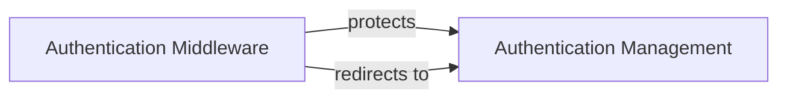

## Component Details

The shopify_django_app project implements a Django application that integrates with the Shopify platform. The primary function is to handle user authentication and manage interactions with the Shopify API. The application uses middleware to protect routes, views to manage login and authentication flows, and models to represent Shopify resources. The core flow involves authenticating users through Shopify's OAuth, storing user sessions, and allowing access to protected resources.

### Authentication Middleware
The Authentication Middleware component is responsible for protecting application views that require authentication. It checks if a user is logged in (has a valid Shopify session) and redirects them to the login page if they are not authenticated. This ensures that sensitive parts of the application are only accessible to authorized users.
- **Related Classes/Methods**: `shopify_django_app.shopify_app.middleware.LoginProtection`

### Authentication Management
This component encompasses the login, authentication, and finalization views, managing the entire authentication lifecycle. It handles the initial login request, interacts with the Shopify API to verify credentials, and sets session variables to maintain the user's logged-in state. This component ensures a secure and seamless authentication process for users accessing the Shopify application.
- **Related Classes/Methods**: `shopify_django_app.shopify_app.views:login`, `shopify_django_app.shopify_app.views:authenticate`, `shopify_django_app.shopify_app.views:finalize`