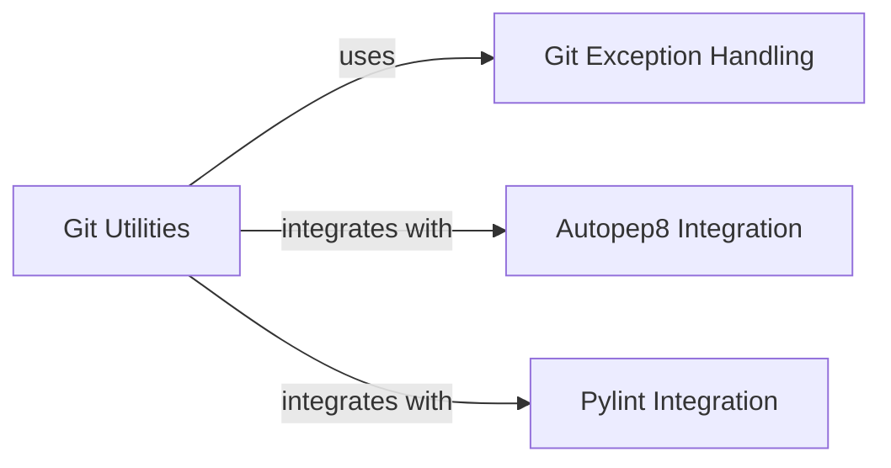

## Component Details

This system provides utilities for interacting with Git repositories to identify changed Python files and integrates with external code analysis tools like `autopep8` and `pylint`. The main flow involves identifying modified Python files in a Git branch, then optionally applying `autopep8` for code formatting and `pylint` for static code analysis to these files. It aims to automate code quality checks and formatting within a Git-based workflow.

### Git Utilities
This component provides core utility functions for interacting with Git repositories, including identifying changed Python files within a tree, and orchestrating the application of code formatting and static analysis tools. It manages repository operations and file filtering.

**Related Classes/Methods**:

- <a href="https://github.com/Shopify/shopify_python/blob/master/shopify_python/git_utils.py#L52-L60" target="_blank" rel="noopener noreferrer">`shopify_python.git_utils:changed_python_files_in_tree` (52:60)</a>
- <a href="https://github.com/Shopify/shopify_python/blob/master/shopify_python/git_utils.py#L86-L107" target="_blank" rel="noopener noreferrer">`shopify_python.git_utils:autopep_files` (86:107)</a>
- <a href="https://github.com/Shopify/shopify_python/blob/master/shopify_python/git_utils.py#L123-L135" target="_blank" rel="noopener noreferrer">`shopify_python.git_utils:pylint_files` (123:135)</a>
- <a href="https://github.com/Shopify/shopify_python/blob/master/shopify_python/git_utils.py#L17-L22" target="_blank" rel="noopener noreferrer">`shopify_python.git_utils._remote_origin_master` (17:22)</a>
- <a href="https://github.com/Shopify/shopify_python/blob/master/shopify_python/git_utils.py#L25-L33" target="_blank" rel="noopener noreferrer">`shopify_python.git_utils._modified_in_branch` (25:33)</a>
- <a href="https://github.com/Shopify/shopify_python/blob/master/shopify_python/git_utils.py#L36-L49" target="_blank" rel="noopener noreferrer">`shopify_python.git_utils._file_is_python` (36:49)</a>

### Autopep8 Integration
This component encapsulates the logic for integrating with the `autopep8` tool. It defines the configuration for `autopep8` and applies the formatting to a specified list of Python files.

**Related Classes/Methods**:

- <a href="https://github.com/Shopify/shopify_python/blob/master/shopify_python/git_utils.py#L86-L107" target="_blank" rel="noopener noreferrer">`shopify_python.git_utils:autopep_files` (86:107)</a>
- <a href="https://github.com/Shopify/shopify_python/blob/master/shopify_python/git_utils.py#L63-L83" target="_blank" rel="noopener noreferrer">`shopify_python.git_utils._AutopepOptions` (63:83)</a>

### Pylint Integration
This component manages the integration with the `Pylint` static code analysis tool. It includes a custom reporter for capturing Pylint messages and executes Pylint checks on given Python files with configurable arguments.

**Related Classes/Methods**:

- <a href="https://github.com/Shopify/shopify_python/blob/master/shopify_python/git_utils.py#L123-L135" target="_blank" rel="noopener noreferrer">`shopify_python.git_utils:pylint_files` (123:135)</a>
- <a href="https://github.com/Shopify/shopify_python/blob/master/shopify_python/git_utils.py#L110-L120" target="_blank" rel="noopener noreferrer">`shopify_python.git_utils._CustomPylintReporter` (110:120)</a>

### Git Exception Handling
This component defines a specific exception type, `GitUtilsException`, for handling errors that occur during Git operations within the `git_utils` module, providing a clear error reporting mechanism.

**Related Classes/Methods**:

- <a href="https://github.com/Shopify/shopify_python/blob/master/shopify_python/git_utils.py#L13-L14" target="_blank" rel="noopener noreferrer">`shopify_python.git_utils.GitUtilsException` (13:14)</a>

### [FAQ](https://github.com/CodeBoarding/GeneratedOnBoardings/tree/main?tab=readme-ov-file#faq)