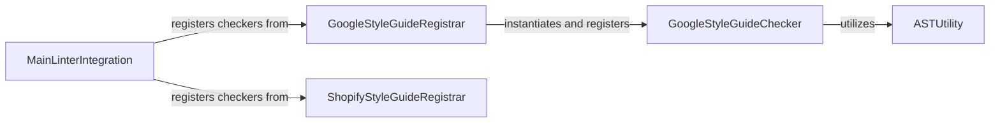

## Component Details

This subsystem focuses on enforcing the Google Python Style Guide within the `shopify_python` project using Pylint. It defines a Pylint checker that traverses the Abstract Syntax Tree (AST) to identify and report style violations. The system integrates this checker, along with other custom checkers, into the main Pylint linter to ensure consistent code style across the project.

### GoogleStyleGuideChecker
This component implements a Pylint checker that enforces various rules from the Google Python Style Guide. It traverses the Abstract Syntax Tree (AST) of Python code and identifies violations related to global variables, exception handling, lambda function complexity, list comprehensions, try/except/finally block sizes, import statements, raise syntax, conditional expressions, and class definitions.

**Related Classes/Methods**:

- <a href="https://github.com/Shopify/shopify_python/blob/master/shopify_python/google_styleguide.py#L20-L352" target="_blank" rel="noopener noreferrer">`shopify_python.google_styleguide.GoogleStyleGuideChecker` (20:352)</a>
- <a href="https://github.com/Shopify/shopify_python/blob/master/shopify_python/google_styleguide.py#L157-L158" target="_blank" rel="noopener noreferrer">`shopify_python.google_styleguide.GoogleStyleGuideChecker:visit_assign` (157:158)</a>
- <a href="https://github.com/Shopify/shopify_python/blob/master/shopify_python/google_styleguide.py#L160-L161" target="_blank" rel="noopener noreferrer">`shopify_python.google_styleguide.GoogleStyleGuideChecker:visit_excepthandler` (160:161)</a>
- <a href="https://github.com/Shopify/shopify_python/blob/master/shopify_python/google_styleguide.py#L163-L165" target="_blank" rel="noopener noreferrer">`shopify_python.google_styleguide.GoogleStyleGuideChecker:visit_lambda` (163:165)</a>
- <a href="https://github.com/Shopify/shopify_python/blob/master/shopify_python/google_styleguide.py#L167-L168" target="_blank" rel="noopener noreferrer">`shopify_python.google_styleguide.GoogleStyleGuideChecker:visit_listcomp` (167:168)</a>
- <a href="https://github.com/Shopify/shopify_python/blob/master/shopify_python/google_styleguide.py#L170-L171" target="_blank" rel="noopener noreferrer">`shopify_python.google_styleguide.GoogleStyleGuideChecker:visit_tryexcept` (170:171)</a>
- <a href="https://github.com/Shopify/shopify_python/blob/master/shopify_python/google_styleguide.py#L173-L174" target="_blank" rel="noopener noreferrer">`shopify_python.google_styleguide.GoogleStyleGuideChecker:visit_tryfinally` (173:174)</a>
- <a href="https://github.com/Shopify/shopify_python/blob/master/shopify_python/google_styleguide.py#L176-L179" target="_blank" rel="noopener noreferrer">`shopify_python.google_styleguide.GoogleStyleGuideChecker:visit_importfrom` (176:179)</a>
- <a href="https://github.com/Shopify/shopify_python/blob/master/shopify_python/google_styleguide.py#L181-L182" target="_blank" rel="noopener noreferrer">`shopify_python.google_styleguide.GoogleStyleGuideChecker:visit_raise` (181:182)</a>
- <a href="https://github.com/Shopify/shopify_python/blob/master/shopify_python/google_styleguide.py#L184-L185" target="_blank" rel="noopener noreferrer">`shopify_python.google_styleguide.GoogleStyleGuideChecker:visit_if` (184:185)</a>
- <a href="https://github.com/Shopify/shopify_python/blob/master/shopify_python/google_styleguide.py#L187-L188" target="_blank" rel="noopener noreferrer">`shopify_python.google_styleguide.GoogleStyleGuideChecker:visit_classdef` (187:188)</a>
- <a href="https://github.com/Shopify/shopify_python/blob/master/shopify_python/google_styleguide.py#L228-L249" target="_blank" rel="noopener noreferrer">`shopify_python.google_styleguide.GoogleStyleGuideChecker.__avoid_global_variables` (228:249)</a>
- <a href="https://github.com/Shopify/shopify_python/blob/master/shopify_python/google_styleguide.py#L260-L267" target="_blank" rel="noopener noreferrer">`shopify_python.google_styleguide.GoogleStyleGuideChecker.__dont_catch_standard_error` (260:267)</a>
- <a href="https://github.com/Shopify/shopify_python/blob/master/shopify_python/google_styleguide.py#L285-L288" target="_blank" rel="noopener noreferrer">`shopify_python.google_styleguide.GoogleStyleGuideChecker.__use_simple_lambdas` (285:288)</a>
- <a href="https://github.com/Shopify/shopify_python/blob/master/shopify_python/google_styleguide.py#L308-L338" target="_blank" rel="noopener noreferrer">`shopify_python.google_styleguide.GoogleStyleGuideChecker.__lambda_func` (308:338)</a>
- <a href="https://github.com/Shopify/shopify_python/blob/master/shopify_python/google_styleguide.py#L290-L293" target="_blank" rel="noopener noreferrer">`shopify_python.google_styleguide.GoogleStyleGuideChecker.__use_simple_list_comp` (290:293)</a>
- <a href="https://github.com/Shopify/shopify_python/blob/master/shopify_python/google_styleguide.py#L269-L277" target="_blank" rel="noopener noreferrer">`shopify_python.google_styleguide.GoogleStyleGuideChecker.__minimize_code_in_try_except` (269:277)</a>
- <a href="https://github.com/Shopify/shopify_python/blob/master/shopify_python/google_styleguide.py#L279-L283" target="_blank" rel="noopener noreferrer">`shopify_python.google_styleguide.GoogleStyleGuideChecker.__minimize_code_in_finally` (279:283)</a>
- <a href="https://github.com/Shopify/shopify_python/blob/master/shopify_python/google_styleguide.py#L196-L215" target="_blank" rel="noopener noreferrer">`shopify_python.google_styleguide.GoogleStyleGuideChecker.__import_modules_only` (196:215)</a>
- <a href="https://github.com/Shopify/shopify_python/blob/master/shopify_python/google_styleguide.py#L217-L221" target="_blank" rel="noopener noreferrer">`shopify_python.google_styleguide.GoogleStyleGuideChecker.__import_full_path_only` (217:221)</a>
- <a href="https://github.com/Shopify/shopify_python/blob/master/shopify_python/google_styleguide.py#L223-L226" target="_blank" rel="noopener noreferrer">`shopify_python.google_styleguide.GoogleStyleGuideChecker.__limit_one_import` (223:226)</a>
- <a href="https://github.com/Shopify/shopify_python/blob/master/shopify_python/google_styleguide.py#L251-L258" target="_blank" rel="noopener noreferrer">`shopify_python.google_styleguide.GoogleStyleGuideChecker.__dont_use_archaic_raise_syntax` (251:258)</a>
- <a href="https://github.com/Shopify/shopify_python/blob/master/shopify_python/google_styleguide.py#L295-L306" target="_blank" rel="noopener noreferrer">`shopify_python.google_styleguide.GoogleStyleGuideChecker.__use_cond_expr` (295:306)</a>
- <a href="https://github.com/Shopify/shopify_python/blob/master/shopify_python/google_styleguide.py#L340-L352" target="_blank" rel="noopener noreferrer">`shopify_python.google_styleguide.GoogleStyleGuideChecker.__class_def_check` (340:352)</a>
- <a href="https://github.com/Shopify/shopify_python/blob/master/shopify_python/google_styleguide.py#L191-L194" target="_blank" rel="noopener noreferrer">`shopify_python.google_styleguide.GoogleStyleGuideChecker.__get_module_names` (191:194)</a>

### ASTUtility
This component provides utility functions for analyzing Abstract Syntax Trees (ASTs). Its primary function, `count_tree_size`, recursively calculates the number of nodes within a given AST subtree, which is used by style checkers to assess code complexity.

**Related Classes/Methods**:

- <a href="https://github.com/Shopify/shopify_python/blob/master/shopify_python/ast.py#L4-L8" target="_blank" rel="noopener noreferrer">`shopify_python.ast.count_tree_size` (4:8)</a>

### GoogleStyleGuideRegistrar
This component is responsible for integrating the Google Style Guide checker into the Pylint linter. It contains the `register_checkers` function, which instantiates and registers the `GoogleStyleGuideChecker` with the provided Pylint linter instance.

**Related Classes/Methods**:

- <a href="https://github.com/Shopify/shopify_python/blob/master/shopify_python/google_styleguide.py#L15-L17" target="_blank" rel="noopener noreferrer">`shopify_python.google_styleguide:register_checkers` (15:17)</a>

### ShopifyStyleGuideRegistrar
This component is responsible for integrating the Shopify-specific style guide checker into the Pylint linter. It contains the `register_checkers` function, which instantiates and registers the `ShopifyStyleGuideChecker` with the provided Pylint linter instance.

**Related Classes/Methods**:

- <a href="https://github.com/Shopify/shopify_python/blob/master/shopify_python/shopify_styleguide.py#L12-L14" target="_blank" rel="noopener noreferrer">`shopify_python.shopify_styleguide.register_checkers` (12:14)</a>

### MainLinterIntegration
This component serves as the primary integration point for all custom Pylint checkers within the `shopify_python` project. Its `register` function orchestrates the registration of both the Google Style Guide and Shopify Style Guide checkers with the main Pylint linter, ensuring that all defined style checks are applied during linting.

**Related Classes/Methods**:

- `shopify_python.shopify_python:register` (full file reference)

### [FAQ](https://github.com/CodeBoarding/GeneratedOnBoardings/tree/main?tab=readme-ov-file#faq)