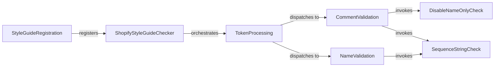

## Component Details

This subsystem implements a Pylint checker that enforces Shopify-specific coding style guidelines. It registers a custom Pylint checker, processes code tokens (names and comments), and validates them against rules such as using message names instead of codes for Pylint disables and discouraging the use of `typing.Sequence[str]` in favor of more specific collection types.

### StyleGuideRegistration
This component is responsible for registering the Shopify style guide checker with the Pylint linter, making it available for code analysis.

**Related Classes/Methods**:

- <a href="https://github.com/Shopify/shopify_python/blob/master/shopify_python/shopify_styleguide.py#L12-L14" target="_blank" rel="noopener noreferrer">`shopify_python.shopify_styleguide:register_checkers` (12:14)</a>

### ShopifyStyleGuideChecker
This is the central Pylint checker component that implements Shopify-specific code style rules. It processes code tokens and dispatches validation tasks to specialized sub-components.

**Related Classes/Methods**:

- <a href="https://github.com/Shopify/shopify_python/blob/master/shopify_python/shopify_styleguide.py#L17-L83" target="_blank" rel="noopener noreferrer">`shopify_python.shopify_styleguide.ShopifyStyleGuideChecker` (17:83)</a>

### TokenProcessing
This component iterates through the individual tokens (names and comments) of the source code and directs them to the appropriate validation logic based on the token type.

**Related Classes/Methods**:

- <a href="https://github.com/Shopify/shopify_python/blob/master/shopify_python/shopify_styleguide.py#L42-L48" target="_blank" rel="noopener noreferrer">`shopify_python.shopify_styleguide.ShopifyStyleGuideChecker:process_tokens` (42:48)</a>

### CommentValidation
This component focuses on validating comments within the code, specifically checking for the correct usage of Pylint disable directives and the presence of 'Sequence[str]' in type annotations.

**Related Classes/Methods**:

- <a href="https://github.com/Shopify/shopify_python/blob/master/shopify_python/shopify_styleguide.py#L50-L54" target="_blank" rel="noopener noreferrer">`shopify_python.shopify_styleguide.ShopifyStyleGuideChecker:__validate_comment` (50:54)</a>

### NameValidation
This component is responsible for validating token names, primarily to identify and flag instances where 'Sequence[str]' is used in a way that violates Shopify's style guidelines.

**Related Classes/Methods**:

- <a href="https://github.com/Shopify/shopify_python/blob/master/shopify_python/shopify_styleguide.py#L56-L59" target="_blank" rel="noopener noreferrer">`shopify_python.shopify_styleguide.ShopifyStyleGuideChecker:__validate_name` (56:59)</a>

### DisableNameOnlyCheck
This component ensures that Pylint disable comments use message names (e.g., 'unused-import') instead of message codes (e.g., 'W0611') for better readability and understanding.

**Related Classes/Methods**:

- <a href="https://github.com/Shopify/shopify_python/blob/master/shopify_python/shopify_styleguide.py#L61-L77" target="_blank" rel="noopener noreferrer">`shopify_python.shopify_styleguide.ShopifyStyleGuideChecker:__disable_name_only` (61:77)</a>

### SequenceStringCheck
This component identifies and reports the use of 'typing.Sequence[str]', promoting the use of more specific collection types like 'typing.List[str]' for clarity and type safety.

**Related Classes/Methods**:

- <a href="https://github.com/Shopify/shopify_python/blob/master/shopify_python/shopify_styleguide.py#L79-L83" target="_blank" rel="noopener noreferrer">`shopify_python.shopify_styleguide.ShopifyStyleGuideChecker:__sequence_str` (79:83)</a>

### [FAQ](https://github.com/CodeBoarding/GeneratedOnBoardings/tree/main?tab=readme-ov-file#faq)