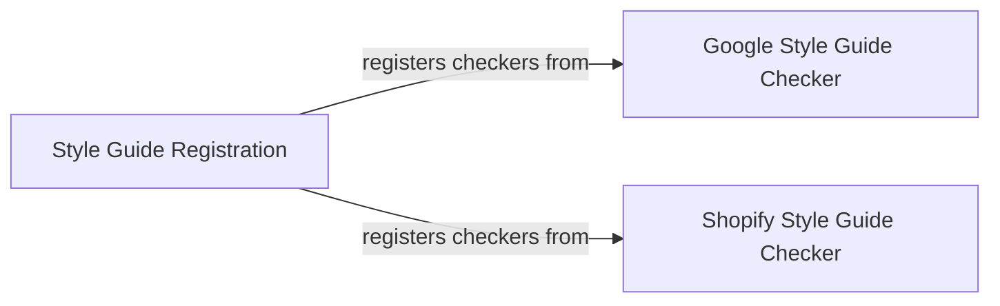

## Component Details

This system is responsible for integrating custom style guide checks (Google and Shopify) into the Pylint linter. The `Style Guide Registration` component acts as the central orchestrator, invoking the registration methods of the individual style guide checker components. Each style guide checker then registers its specific Pylint checker with the linter, enabling the enforcement of defined coding standards during code analysis.

### Style Guide Registration
Central entry point for registering various style checkers (Google and Shopify) with the Pylint linter, enabling the enforcement of coding standards. It orchestrates the registration process by calling the register_checkers methods of the specific style guide modules.

**Related Classes/Methods**:

- <a href="https://github.com/Shopify/shopify_python/blob/master/shopify_python/__init__.py#L13-L15" target="_blank" rel="noopener noreferrer">`shopify_python.__init__:register` (13:15)</a>

### Google Style Guide Checker
Implements a Pylint checker that enforces rules from the Google Python Style Guide. It contains various checks related to imports, global variables, exception handling, lambda functions, list comprehensions, and conditional expressions.

**Related Classes/Methods**:

- <a href="https://github.com/Shopify/shopify_python/blob/master/shopify_python/google_styleguide.py#L15-L17" target="_blank" rel="noopener noreferrer">`shopify_python.google_styleguide.register_checkers` (15:17)</a>
- <a href="https://github.com/Shopify/shopify_python/blob/master/shopify_python/google_styleguide.py#L20-L352" target="_blank" rel="noopener noreferrer">`shopify_python.google_styleguide.GoogleStyleGuideChecker` (20:352)</a>

### Shopify Style Guide Checker
Provides a Pylint checker for Shopify-specific code style rules. It focuses on checks related to disabling Pylint rules by name only and discouraging the use of typing.Sequence[str].

**Related Classes/Methods**:

- <a href="https://github.com/Shopify/shopify_python/blob/master/shopify_python/shopify_styleguide.py#L12-L14" target="_blank" rel="noopener noreferrer">`shopify_python.shopify_styleguide.register_checkers` (12:14)</a>
- <a href="https://github.com/Shopify/shopify_python/blob/master/shopify_python/shopify_styleguide.py#L17-L83" target="_blank" rel="noopener noreferrer">`shopify_python.shopify_styleguide.ShopifyStyleGuideChecker` (17:83)</a>

### [FAQ](https://github.com/CodeBoarding/GeneratedOnBoardings/tree/main?tab=readme-ov-file#faq)