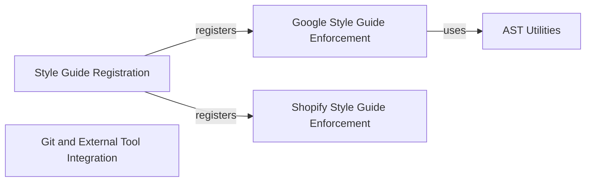

## Component Details

The `shopify_python` project serves as a comprehensive code quality and style enforcement system for Python. Its primary purpose is to ensure adherence to both Google Python Style Guide and Shopify-specific coding standards. It integrates with Pylint for static analysis, leverages AST utilities for code inspection, and provides utilities for interacting with Git repositories to process changed files and apply automated formatting with tools like autopep8.

### Style Guide Registration
Central entry point for registering various style checkers (Google and Shopify) with the Pylint linter, enabling the enforcement of coding standards.

**Related Classes/Methods**:

- <a href="https://github.com/Shopify/shopify_python/blob/master/shopify_python/__init__.py#L13-L15" target="_blank" rel="noopener noreferrer">`shopify_python.__init__:register` (13:15)</a>

### Google Style Guide Enforcement
Implements a Pylint checker that enforces the Google Python Style Guide, applying specific style rules by visiting AST nodes.

**Related Classes/Methods**:

- <a href="https://github.com/Shopify/shopify_python/blob/master/shopify_python/google_styleguide.py#L15-L17" target="_blank" rel="noopener noreferrer">`shopify_python.google_styleguide:register_checkers` (15:17)</a>
- <a href="https://github.com/Shopify/shopify_python/blob/master/shopify_python/google_styleguide.py#L20-L352" target="_blank" rel="noopener noreferrer">`shopify_python.google_styleguide.GoogleStyleGuideChecker` (20:352)</a>

### Shopify Style Guide Enforcement
Implements a Pylint checker that enforces Shopify-specific coding style guidelines, validating naming conventions and comment structures.

**Related Classes/Methods**:

- <a href="https://github.com/Shopify/shopify_python/blob/master/shopify_python/shopify_styleguide.py#L12-L14" target="_blank" rel="noopener noreferrer">`shopify_python.shopify_styleguide:register_checkers` (12:14)</a>
- <a href="https://github.com/Shopify/shopify_python/blob/master/shopify_python/shopify_styleguide.py#L17-L83" target="_blank" rel="noopener noreferrer">`shopify_python.shopify_styleguide.ShopifyStyleGuideChecker` (17:83)</a>

### AST Utilities
Provides utility functions for analyzing Abstract Syntax Trees (ASTs) of Python code, primarily for measuring code complexity or size.

**Related Classes/Methods**:

- <a href="https://github.com/Shopify/shopify_python/blob/master/shopify_python/ast.py#L4-L8" target="_blank" rel="noopener noreferrer">`shopify_python.ast:count_tree_size` (4:8)</a>

### Git and External Tool Integration
Provides utilities for interacting with Git repositories to identify changed Python files and integrates with external code analysis tools like `autopep8` and `pylint`.

**Related Classes/Methods**:

- <a href="https://github.com/Shopify/shopify_python/blob/master/shopify_python/git_utils.py#L52-L60" target="_blank" rel="noopener noreferrer">`shopify_python.git_utils:changed_python_files_in_tree` (52:60)</a>
- <a href="https://github.com/Shopify/shopify_python/blob/master/shopify_python/git_utils.py#L86-L107" target="_blank" rel="noopener noreferrer">`shopify_python.git_utils:autopep_files` (86:107)</a>
- <a href="https://github.com/Shopify/shopify_python/blob/master/shopify_python/git_utils.py#L123-L135" target="_blank" rel="noopener noreferrer">`shopify_python.git_utils:pylint_files` (123:135)</a>

### [FAQ](https://github.com/CodeBoarding/GeneratedOnBoardings/tree/main?tab=readme-ov-file#faq)