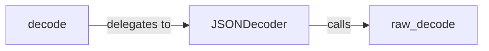

## Details

The `JSON Decoder` subsystem is primarily encapsulated within the `simplejson/decoder.py` file. Its core components include the `JSONDecoder` class, the high-level `decode` function, and the low-level `raw_decode` function.

### JSONDecoder
This is the primary and most central component of the JSON decoding subsystem. It acts as the configurable entry point for decoding, allowing users to specify various decoding options such as custom object hooks or specific parsers for different data types (float, int, constant). It orchestrates the overall flow of data transformation from a JSON string into Python objects.

**Related Classes/Methods**:

- <a href="https://github.com/simplejson/simplejson/blob/master/simplejson/decoder.py#L284-L416" target="_blank" rel="noopener noreferrer">`JSONDecoder`:284-416</a>

### decode
This component provides the high-level, user-facing interface for initiating JSON decoding. It simplifies the decoding process for common scenarios, often by internally creating or utilizing an instance of `JSONDecoder` and invoking its decoding method. It serves as the primary public API for users to convert JSON strings to Python objects.

**Related Classes/Methods**:

- <a href="https://github.com/simplejson/simplejson/blob/master/simplejson/decoder.py#L379-L390" target="_blank" rel="noopener noreferrer">`decode`:379-390</a>

### raw_decode
This component is the low-level workhorse of the decoding process. It is responsible for the granular, character-by-character or token-by-token parsing of the JSON string. It identifies and processes JSON primitives (strings, numbers, booleans, null) and recursively handles the structure of JSON objects and arrays, building the corresponding Python data structures.

**Related Classes/Methods**:

- <a href="https://github.com/simplejson/simplejson/blob/master/simplejson/decoder.py#L392-L416" target="_blank" rel="noopener noreferrer">`raw_decode`:392-416</a>

### [FAQ](https://github.com/CodeBoarding/GeneratedOnBoardings/tree/main?tab=readme-ov-file#faq)