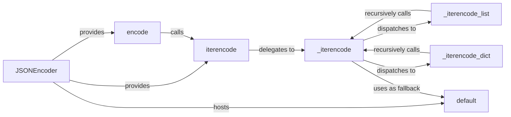

## Details

The simplejson.encoder subsystem is designed for efficient and customizable JSON serialization. At its core, the JSONEncoder class provides the primary interface, offering encode for direct string output and iterencode for streaming large datasets. Both public methods funnel into the internal _iterencode function, which serves as the central dispatcher for various Python data types. For lists and dictionaries, _iterencode delegates to specialized handlers, _iterencode_list and _iterencode_dict, respectively, which recursively invoke _iterencode to process nested elements. Crucially, for any unhandled or custom data types, _iterencode leverages the default method, an extensible hook allowing developers to define custom serialization logic, ensuring robust and flexible JSON encoding.

### JSONEncoder
The primary class for configuring and initiating the JSON encoding process. Configures the encoding process and provides public entry points (encode, iterencode). It also hosts the default method for extensibility.

**Related Classes/Methods**: _None_

### encode
A high-level public method of JSONEncoder for converting a Python object into a complete JSON string. Orchestrates the conversion of an object to a JSON string, internally calling iterencode.

**Related Classes/Methods**: _None_

### iterencode
A public method of JSONEncoder providing an iterable interface for streaming JSON string chunks. Provides an iterable interface for encoding, delegating the core logic to _iterencode for chunked output.

**Related Classes/Methods**: _None_

### _iterencode
The core recursive internal function responsible for dispatching encoding tasks based on object type. Acts as the central dispatcher. It identifies the type of the Python object and delegates to specific handlers (_iterencode_list, _iterencode_dict). For types it cannot handle directly, it attempts to use the default method. It is recursively called by its helper functions.

**Related Classes/Methods**: _None_

### _iterencode_list
An internal helper function for encoding Python list objects. Handles the encoding of list objects, recursively calling _iterencode for each element.

**Related Classes/Methods**: _None_

### _iterencode_dict
An internal helper function for encoding Python dictionary objects. Handles the encoding of dictionary objects, recursively calling _iterencode for both keys and values.

**Related Classes/Methods**: _None_

### default
An extensible method within JSONEncoder serving as a fallback for serializing custom or unsupported Python types. Provides a customizable fallback mechanism for _iterencode to handle objects that are not natively JSON serializable.

**Related Classes/Methods**: _None_

### [FAQ](https://github.com/CodeBoarding/GeneratedOnBoardings/tree/main?tab=readme-ov-file#faq)