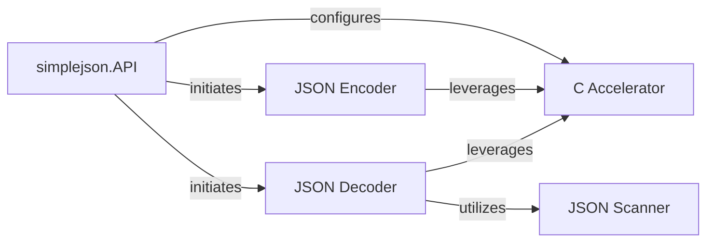

## Details

The `simplejson` library functions as a robust data serialization and deserialization tool, primarily facilitating the conversion between Python objects and JSON formatted strings. The core data flow begins with the `simplejson.API` component, which serves as the central orchestrator. For serialization, Python data is fed into the `JSON Encoder`, which transforms it into a JSON string. Conversely, for deserialization, a JSON string is processed by the `JSON Decoder`, which, in turn, relies on the `JSON Scanner` to tokenize the input before reconstructing Python data structures. A critical aspect of `simplejson`'s architecture is the optional `C Accelerator`, which can be leveraged by both the `JSON Encoder` and `JSON Decoder` to significantly boost performance by offloading computationally intensive tasks to optimized C routines. This modular design allows for efficient and flexible JSON processing, with clear separation of concerns for encoding, decoding, and performance optimization.

### simplejson.API [[Expand]](./simplejson_API.md)
The primary entry point for users, providing high-level functions for JSON serialization and deserialization. It orchestrates the use of other components and manages the C accelerator.

**Related Classes/Methods**:

- <a href="https://github.com/simplejson/simplejson/blob/master/simplejson/__init__.py" target="_blank" rel="noopener noreferrer">`simplejson.API`</a>

### JSON Encoder [[Expand]](./JSON_Encoder.md)
Converts Python data structures into JSON string representations, handling various encoding options and iterative output.

**Related Classes/Methods**:

- <a href="https://github.com/simplejson/simplejson/blob/master/simplejson/encoder.py" target="_blank" rel="noopener noreferrer">`JSON Encoder`</a>

### JSON Decoder [[Expand]](./JSON_Decoder.md)
Parses JSON strings and transforms them back into Python data structures, working with the JSON Scanner.

**Related Classes/Methods**:

- <a href="https://github.com/simplejson/simplejson/blob/master/simplejson/decoder.py" target="_blank" rel="noopener noreferrer">`JSON Decoder`</a>

### JSON Scanner
A low-level utility that tokenizes raw JSON input strings, used primarily by the JSON Decoder.

**Related Classes/Methods**:

- <a href="https://github.com/simplejson/simplejson/blob/master/simplejson/scanner.py" target="_blank" rel="noopener noreferrer">`JSON Scanner`</a>

### C Accelerator
An optional C extension providing highly optimized routines for core JSON encoding and decoding, significantly improving performance.

**Related Classes/Methods**:

- <a href="https://github.com/simplejson/simplejson/blob/master/simplejson/_speedups.c" target="_blank" rel="noopener noreferrer">`C Accelerator`</a>

### [FAQ](https://github.com/CodeBoarding/GeneratedOnBoardings/tree/main?tab=readme-ov-file#faq)