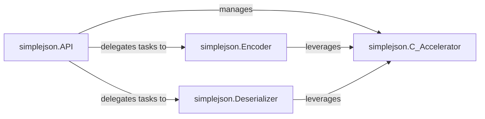

## Details

The simplejson library provides a robust and efficient solution for JSON serialization and deserialization in Python. At its core, the simplejson.API serves as the main interface, offering user-friendly functions like dump, dumps, load, and loads. These high-level functions delegate the actual data transformation to specialized components: simplejson.Encoder for converting Python objects to JSON strings, and simplejson.Deserializer for parsing JSON strings back into Python objects. To enhance performance, especially for computationally intensive tasks, the library optionally leverages simplejson.C_Accelerator, a C-implemented module that provides optimized versions of critical encoding and decoding routines. This architectural design ensures both ease of use through the API and high performance through the underlying encoder, deserializer, and C-accelerated components.

### simplejson.API [[Expand]](./simplejson_API.md)
The primary entry point for users, providing high-level functions for JSON serialization (dump, dumps) and deserialization (load, loads). It orchestrates the overall data transformation process.

**Related Classes/Methods**:

- <a href="https://github.com/simplejson/simplejson/blob/master/simplejson/__init__.py" target="_blank" rel="noopener noreferrer">`simplejson.load`</a>
- <a href="https://github.com/simplejson/simplejson/blob/master/simplejson/__init__.py" target="_blank" rel="noopener noreferrer">`simplejson.loads`</a>
- <a href="https://github.com/simplejson/simplejson/blob/master/simplejson/__init__.py" target="_blank" rel="noopener noreferrer">`simplejson.dump`</a>
- <a href="https://github.com/simplejson/simplejson/blob/master/simplejson/__init__.py" target="_blank" rel="noopener noreferrer">`simplejson.dumps`</a>

### simplejson.Encoder
Responsible for converting Python objects into JSON formatted strings. This component handles the intricate details of mapping Python data types to their JSON equivalents.

**Related Classes/Methods**:

- <a href="https://github.com/simplejson/simplejson/blob/master/simplejson/encoder.py#L110-L381" target="_blank" rel="noopener noreferrer">`simplejson.encoder.JSONEncoder`:110-381</a>

### simplejson.Deserializer
Responsible for parsing JSON formatted strings and converting them back into Python objects. This component interprets the JSON structure and reconstructs the corresponding Python data structures.

**Related Classes/Methods**:

- <a href="https://github.com/simplejson/simplejson/blob/master/simplejson/decoder.py#L284-L416" target="_blank" rel="noopener noreferrer">`simplejson.decoder.JSONDecoder`:284-416</a>

### simplejson.C_Accelerator
An optional performance layer implemented in C, designed to speed up the core serialization and deserialization processes. It provides optimized versions of critical functions used by the Encoder and Deserializer.

**Related Classes/Methods**:

### [FAQ](https://github.com/CodeBoarding/GeneratedOnBoardings/tree/main?tab=readme-ov-file#faq)