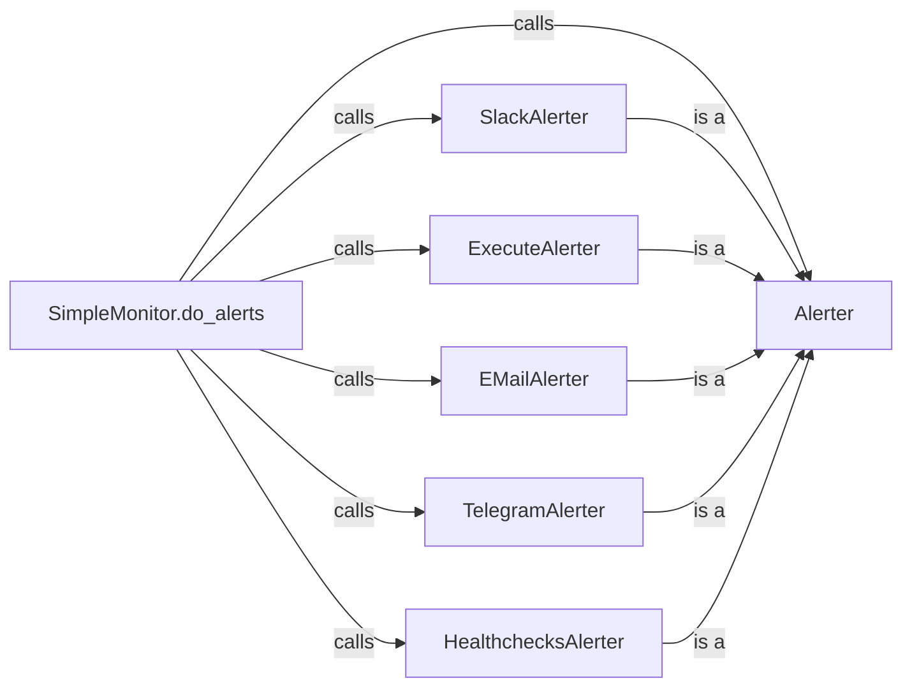

## Component Details

The Alerting Engine is responsible for sending notifications when a monitor detects an issue. The core component is the `Alerter` abstract class, which defines the interface for all concrete alerters. When a monitor's status changes, `SimpleMonitor.do_alerts` is called, which iterates through the configured alerters. Each alerter's `should_alert` method is called to determine if an alert should be sent. If so, the `build_message` method is called to create the alert message, and the `send_alert` method is called to dispatch the message via the appropriate notification channel. Concrete alerters, such as `SlackAlerter`, `EMailAlerter`, and `TelegramAlerter`, implement the `Alerter` interface to provide specific notification mechanisms.

### SimpleMonitor.do_alerts
This function is responsible for triggering alerts based on monitor status. It iterates through configured alerters and calls their `send_alert` methods if an alert is needed.
- **Related Classes/Methods**: `simplemonitor.simplemonitor.simplemonitor.SimpleMonitor:do_alerts`

### Alerter
This is an abstract base class for all alerters. It defines the basic interface that all alerters must implement, including methods for initialization, configuration, determining if an alert should be sent, building the alert message, and describing the alerter.
- **Related Classes/Methods**: `simplemonitor.simplemonitor.Alerters.alerter.Alerter:__init__`, `simplemonitor.simplemonitor.Alerters.alerter.Alerter:get_config_option`, `simplemonitor.simplemonitor.Alerters.alerter.Alerter:should_alert`, `simplemonitor.simplemonitor.Alerters.alerter.Alerter:build_message`, `simplemonitor.simplemonitor.Alerters.alerter.Alerter:describe`

### SlackAlerter
This class implements the Alerter interface for sending alerts via Slack. It handles the specific details of authenticating with the Slack API and sending messages to a specified channel.
- **Related Classes/Methods**: `simplemonitor.simplemonitor.Alerters.slack.SlackAlerter:__init__`, `simplemonitor.simplemonitor.Alerters.slack.SlackAlerter:send_alert`

### ExecuteAlerter
This class implements the Alerter interface by executing a command.
- **Related Classes/Methods**: `simplemonitor.simplemonitor.Alerters.execute.ExecuteAlerter:__init__`, `simplemonitor.simplemonitor.Alerters.execute.ExecuteAlerter:send_alert`

### EMailAlerter
This class implements the Alerter interface for sending alerts via email.
- **Related Classes/Methods**: `simplemonitor.simplemonitor.Alerters.mail.EMailAlerter:__init__`, `simplemonitor.simplemonitor.Alerters.mail.EMailAlerter:send_alert`

### TelegramAlerter
This class implements the Alerter interface for sending alerts via Telegram.
- **Related Classes/Methods**: `simplemonitor.simplemonitor.Alerters.telegram.TelegramAlerter:__init__`, `simplemonitor.simplemonitor.Alerters.telegram.TelegramAlerter:send_alert`

### HealthchecksAlerter
This class implements the Alerter interface for sending alerts to Healthchecks.io.
- **Related Classes/Methods**: `simplemonitor.simplemonitor.Alerters.healthchecks.HealthchecksAlerter:__init__`, `simplemonitor.simplemonitor.Alerters.healthchecks.HealthchecksAlerter:send_alert`
