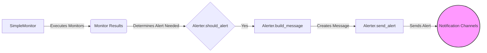

## Alerting System Overview

The Alerting System is responsible for sending notifications based on the results of monitor executions. It uses a base `Alerter` class and several implementations for different notification methods like email, SMS, and more.

Here's a data flow diagram illustrating the alerting process:

### Component Descriptions:

*   **SimpleMonitor:** This component is the core of the monitoring system. It executes the defined monitors and passes the results to the alerting system to determine if any alerts need to be sent.
    *   Relevant source files: `repos.simplemonitor.simplemonitor.simplemonitor.SimpleMonitor`

*   **Monitor Results:** Represents the outcome of the monitor executions. This data is used to determine if an alert should be triggered.

*   **Alerter.should_alert:** This is a method within the `Alerter` class that determines whether an alert should be sent based on the monitor results and configuration. It checks conditions like alert intervals and alert suppression.
    *   Relevant source files: `repos.simplemonitor.simplemonitor.Alerters.alerter.Alerter`

*   **Alerter.build_message:** This method constructs the message that will be sent in the alert. It formats the monitor results and other relevant information into a human-readable message.
    *   Relevant source files: `repos.simplemonitor.simplemonitor.Alerters.alerter.Alerter`

*   **Alerter.send_alert:** This method is responsible for actually sending the alert via the configured notification channel. Each alerter implementation (e.g., `EMailAlerter`, `SlackAlerter`) overrides this method to use the appropriate API or protocol.
    *   Relevant source files: `repos.simplemonitor.simplemonitor.Alerters.alerter.Alerter`

*   **Notification Channels:** This represents the various channels through which alerts can be sent, such as email, SMS, Slack, etc. Each alerter implementation corresponds to a specific notification channel.
