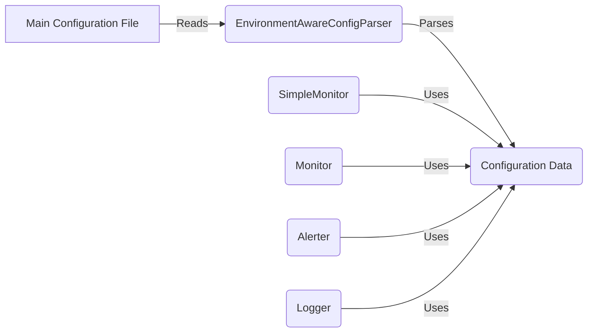

## Configuration Management Component Overview

This component is responsible for managing the application's configuration, including loading, parsing, and providing configuration data to other components. It uses the `EnvironmentAwareConfigParser` to handle environment variable substitution within the configuration files.

**Data Flow Diagram**

**Component Descriptions**

*   **Main Configuration File**: This represents the primary configuration file (e.g., `config.ini`) that stores the application's settings. It is the starting point for the configuration loading process.
    *   **Source Files**: `simplemonitor.ini` (example)
*   **EnvironmentAwareConfigParser**: This component extends the standard `ConfigParser` to support environment variable substitution. It reads the configuration file and replaces placeholders with the corresponding environment variable values.
    *   **Responsibility**: Loading and parsing configuration files, handling environment variable substitution.
    *   **Interaction**: Reads the Main Configuration File and provides parsed Configuration Data.
    *   **Source Files**: `repos.simplemonitor.simplemonitor.util.envconfig.EnvironmentAwareConfigParser`
*   **Configuration Data**: This represents the structured configuration data after parsing. It is a dictionary-like object that provides access to the configuration settings.
    *   **Responsibility**: Holding the configuration data.
    *   **Interaction**: Used by `SimpleMonitor`, `Monitor`, `Alerter`, and `Logger` to retrieve configuration values.
*   **SimpleMonitor**: The main class that uses the configuration data to initialize and manage monitors, loggers, and alerters.
    *   **Responsibility**: Coordinating the monitoring process and managing other components.
    *   **Interaction**: Uses Configuration Data to load monitors, loggers, and alerters.
    *   **Source Files**: `repos.simplemonitor.simplemonitor.simplemonitor.SimpleMonitor`
*   **Monitor**: Base class for monitors, uses configuration data to set up monitor-specific settings.
    *   **Responsibility**: Defining the interface and common functionalities for specific monitor implementations.
    *   **Interaction**: Uses Configuration Data to initialize monitor settings.
    *   **Source Files**: `repos.simplemonitor.simplemonitor.Monitors.monitor.Monitor`
*   **Alerter**: Base class for alerters, uses configuration data to set up alerter-specific settings.
    *   **Responsibility**: Defining the interface and common functionalities for specific alerter implementations.
    *   **Interaction**: Uses Configuration Data to initialize alerter settings.
    *   **Source Files**: `repos.simplemonitor.simplemonitor.Alerters.alerter.Alerter`
*   **Logger**: Base class for loggers, uses configuration data to set up logger-specific settings.
    *   **Responsibility**: Defining the interface and common functionalities for specific logger implementations.
    *   **Interaction**: Uses Configuration Data to initialize logger settings.
    *   **Source Files**: `repos.simplemonitor.simplemonitor.Loggers.logger.Logger`