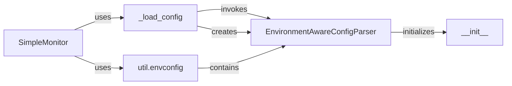

## Component Details

The configuration loading process in SimpleMonitor involves the main SimpleMonitor class utilizing an EnvironmentAwareConfigParser to read and parse configuration files. The EnvironmentAwareConfigParser extends the standard ConfigParser to allow for environment variables within the configuration, providing flexibility. The _load_config method within SimpleMonitor orchestrates this process, creating and using the EnvironmentAwareConfigParser to load settings.

### SimpleMonitor
The main class responsible for orchestrating the monitoring process, including loading configurations and running checks.
- **Related Classes/Methods**: `simplemonitor.simplemonitor.simplemonitor.SimpleMonitor`

### _load_config
A method within the SimpleMonitor class that handles the loading of configuration settings using the EnvironmentAwareConfigParser.
- **Related Classes/Methods**: `simplemonitor.simplemonitor.simplemonitor.SimpleMonitor:_load_config`

### EnvironmentAwareConfigParser
A custom configuration parser that extends ConfigParser to be aware of environment variables, allowing their use within configuration files.
- **Related Classes/Methods**: `simplemonitor.simplemonitor.util.envconfig.EnvironmentAwareConfigParser`

### __init__
The constructor for the EnvironmentAwareConfigParser, responsible for initializing the parser.
- **Related Classes/Methods**: `simplemonitor.simplemonitor.util.envconfig.EnvironmentAwareConfigParser:__init__`

### util.envconfig
This module encapsulates the EnvironmentAwareConfigParser class, providing environment variable aware configuration parsing.
- **Related Classes/Methods**: `simplemonitor.simplemonitor.util.envconfig`
