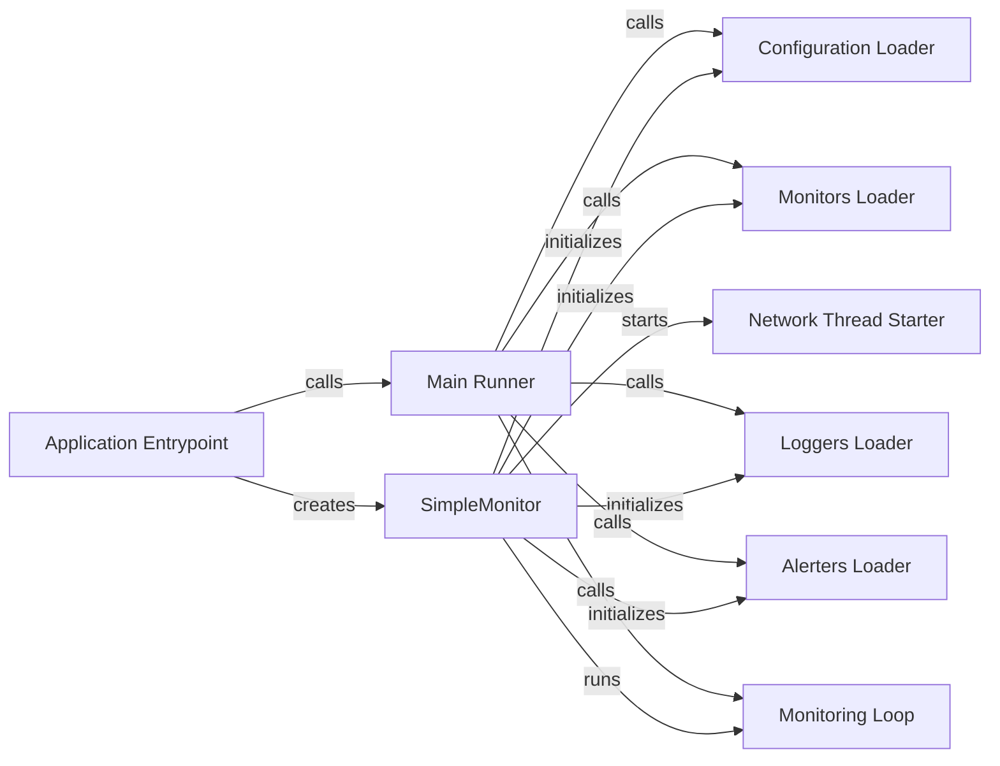

## Component Details

The SimpleMonitor class acts as the core controller, orchestrating the entire monitoring process. It initializes the system by loading configurations for monitors, loggers, and alerters. The controller then manages the main monitoring loop, continuously running the monitors and checking for alerts. It also handles the starting of a network thread for network-related monitoring functionalities. The main function serves as the entry point, creating an instance of SimpleMonitor and initiating the monitoring process.

### SimpleMonitor
The main class that orchestrates the monitoring process. It loads configurations, initializes monitors, loggers, and alerters, and runs the main monitoring loop.
- **Related Classes/Methods**: `simplemonitor.simplemonitor.simplemonitor.SimpleMonitor`

### Configuration Loader
Loads the configuration settings for the monitor from a file, parsing and storing them for later use.
- **Related Classes/Methods**: `simplemonitor.simplemonitor.simplemonitor.SimpleMonitor:_load_config`

### Monitors Loader
Loads and initializes the individual monitors from the configuration, making them ready for execution. These monitors perform the actual checks.
- **Related Classes/Methods**: `simplemonitor.simplemonitor.simplemonitor.SimpleMonitor:_load_monitors`

### Loggers Loader
Loads and configures the loggers to be used by the monitor, setting up the logging system. This determines where and how the monitoring results are logged.
- **Related Classes/Methods**: `simplemonitor.simplemonitor.simplemonitor.SimpleMonitor:_load_loggers`

### Alerters Loader
Loads and configures the alerters to be used for sending notifications when issues are detected. These alerters handle the alerting logic.
- **Related Classes/Methods**: `simplemonitor.simplemonitor.simplemonitor.SimpleMonitor:_load_alerters`

### Monitoring Loop
The main loop that continuously runs the monitors, checks for alerts, and manages the monitoring cycle. This is the heart of the monitoring process.
- **Related Classes/Methods**: `simplemonitor.simplemonitor.simplemonitor.SimpleMonitor:run_loop`

### Network Thread Starter
Starts the network thread, enabling network-related monitoring functionalities. This allows for asynchronous network operations.
- **Related Classes/Methods**: `simplemonitor.simplemonitor.simplemonitor.SimpleMonitor:_start_network_thread`

### Main Runner
Starts the monitoring process, including loading configurations and running the main loop. This is the entry point for the monitoring execution.
- **Related Classes/Methods**: `simplemonitor.simplemonitor.simplemonitor.SimpleMonitor:run`

### Application Entrypoint
The entry point of the application, responsible for creating the SimpleMonitor instance and initiating the monitoring process.
- **Related Classes/Methods**: `simplemonitor.simplemonitor.simplemonitor.SimpleMonitor:main`
