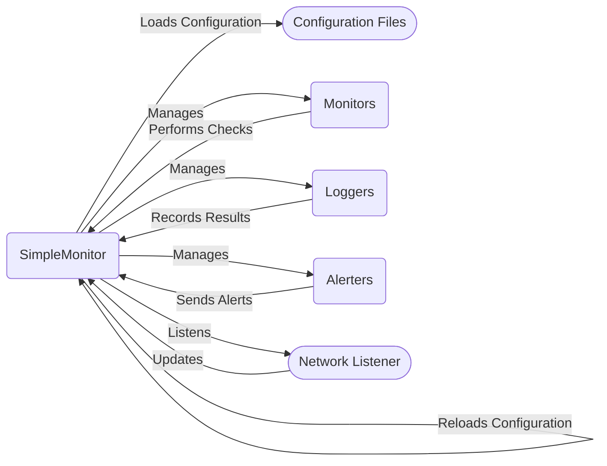

## Core Orchestration Component Overview

This component, centered around the `SimpleMonitor` class, orchestrates the entire monitoring process. It's responsible for loading configurations, managing monitors, loggers, and alerters, running checks, and triggering alerts and logs based on the results. The component also handles reloading configurations upon receiving a SIGHUP signal or detecting changes in a specified HUP file. It manages the main control flow of the application.

Here's a data flow diagram illustrating the component's interactions:

### Component Descriptions:

- **SimpleMonitor**: The central orchestrator. It loads the configuration, initializes and manages monitors, loggers, and alerters. It runs the main loop, executes checks, and triggers alerts and logs. It also handles configuration reloads. **Relevant source files:** `repos.simplemonitor.simplemonitor.simplemonitor.SimpleMonitor`

- **Configuration Files**: Contains the configuration for monitors, loggers, alerters, and global settings. The `SimpleMonitor` loads this configuration using `EnvironmentAwareConfigParser`. **Relevant source files:** `repos.simplemonitor.simplemonitor.util.envconfig.EnvironmentAwareConfigParser`

- **Monitors**: Individual checks that are performed to determine the status of services. Managed by `SimpleMonitor`, which executes these checks and updates their status. **Relevant source files:** `repos.simplemonitor.simplemonitor.Monitors.monitor.Monitor`

- **Loggers**: Components responsible for recording the results of monitor checks and system events. `SimpleMonitor` manages and invokes loggers to record the state of the system. **Relevant source files:** `repos.simplemonitor.simplemonitor.Loggers.logger.Logger`

- **Alerters**: Components that send notifications based on monitor status changes. `SimpleMonitor` manages and triggers alerters when monitors fail or recover. **Relevant source files:** `repos.simplemonitor.simplemonitor.Alerters.alerter.Alerter`

- **Network Listener**: Listens for network connections to receive updates from remote monitors. `SimpleMonitor` can listen for network connections, enabling remote control and monitoring. **Relevant source files:** `repos.simplemonitor.simplemonitor.Loggers.network.Listener`
