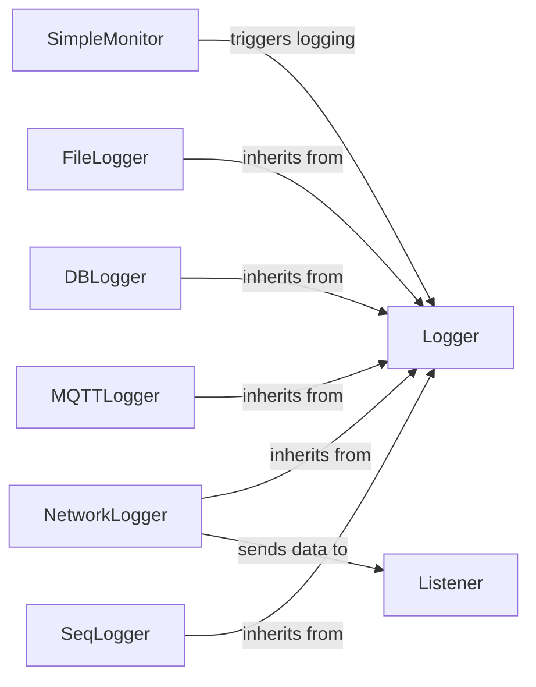

## Component Details

The Logging Hub in SimpleMonitor is responsible for managing the logging of monitor results to various outputs. The central component, SimpleMonitor, triggers the logging process by calling the log_result method, which then calls do_logs to distribute the results to the configured loggers. The Logger abstract class defines the interface for all loggers, and concrete implementations like FileLogger, DBLogger, NetworkLogger, MQTTLogger, and SeqLogger handle the actual writing or sending of log data to their respective destinations. The Listener component receives network logs sent by NetworkLogger.

### SimpleMonitor
The main monitor class responsible for orchestrating the monitoring process and triggering the logging of results. It interacts with the logging subsystem by calling the `log_result` method, which in turn calls `do_logs` to distribute the results to the configured loggers.
- **Related Classes/Methods**: `simplemonitor.simplemonitor.simplemonitor.SimpleMonitor`

### Logger
Abstract base class for all loggers. Defines common methods for initialization, configuration, and data formatting. It provides a foundation for specific logger implementations like FileLogger, DBLogger, and NetworkLogger.
- **Related Classes/Methods**: `simplemonitor.simplemonitor.Loggers.logger.Logger`

### FileLogger
A logger that saves monitor results to a file. It inherits from the base Logger class and implements the save_result2 method to format and write the result to a file. There are several variations of FileLogger, such as FileLoggerNG, HTMLLogger, and JsonLogger, each with its own specific formatting and output.
- **Related Classes/Methods**: `simplemonitor.simplemonitor.Loggers.file.FileLogger`, `simplemonitor.simplemonitor.Loggers.file.FileLoggerNG`, `simplemonitor.simplemonitor.Loggers.file.HTMLLogger`, `simplemonitor.simplemonitor.Loggers.file.JsonLogger`

### DBLogger
A logger that saves monitor results to a database. It inherits from the base Logger class and implements the save_result2 method to insert the result into a database table. There are variations such as DBFullLogger and DBStatusLogger.
- **Related Classes/Methods**: `simplemonitor.simplemonitor.Loggers.db.DBLogger`, `simplemonitor.simplemonitor.Loggers.db.DBFullLogger`, `simplemonitor.simplemonitor.Loggers.db.DBStatusLogger`

### NetworkLogger
A logger that sends monitor results over the network. It inherits from the base Logger class and implements the process_batch method to send the result to a network listener.
- **Related Classes/Methods**: `simplemonitor.simplemonitor.Loggers.network.NetworkLogger`

### Listener
A network listener that receives monitor results from NetworkLogger. It runs in a separate thread and listens for incoming connections.
- **Related Classes/Methods**: `simplemonitor.simplemonitor.Loggers.network.Listener`

### MQTTLogger
A logger that publishes monitor results to an MQTT broker. It inherits from the base Logger class.
- **Related Classes/Methods**: `simplemonitor.simplemonitor.Loggers.mqtt.MQTTLogger`

### SeqLogger
A logger that sends monitor results to a Seq server. It inherits from the base Logger class.
- **Related Classes/Methods**: `simplemonitor.simplemonitor.Loggers.seq.SeqLogger`
