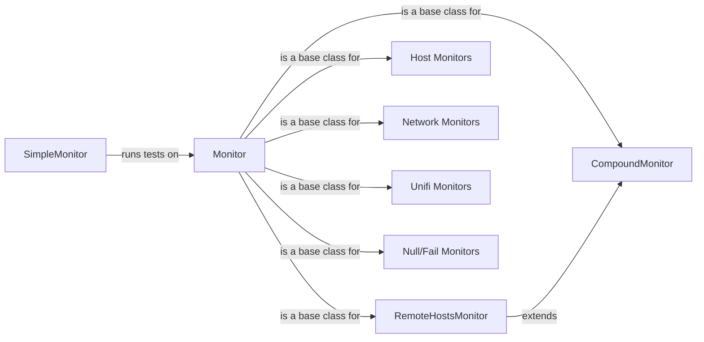

## Component Details

The Monitor Suite in SimpleMonitor provides a flexible and extensible framework for defining and executing various types of monitoring checks. It revolves around the `Monitor` base class, which defines the core interface for all monitors, including methods for running tests, recording results, and managing dependencies. Specialized monitor types, such as `CompoundMonitor` and `RemoteHostsMonitor`, extend the base class to provide more complex monitoring scenarios. The suite also includes monitors for host resources, network services, and application health, allowing for comprehensive system monitoring.

### SimpleMonitor
The main class responsible for running the configured monitors and managing the overall monitoring process. It orchestrates the execution of monitors, handles configuration loading, and manages the overall monitoring lifecycle.
- **Related Classes/Methods**: `simplemonitor.simplemonitor.simplemonitor.SimpleMonitor`

### Monitor
The base class for all monitors. It defines the common interface for running tests, recording results, and managing dependencies. It also provides methods for managing the monitor's state (success, fail, skip) and attempting recovery actions.
- **Related Classes/Methods**: `simplemonitor.simplemonitor.Monitors.monitor.Monitor`, `simplemonitor.simplemonitor.Monitors.monitor.Monitor:__init__`, `simplemonitor.simplemonitor.Monitors.monitor.Monitor:get_config_option`, `simplemonitor.simplemonitor.Monitors.monitor.Monitor:dependencies`, `simplemonitor.simplemonitor.Monitors.monitor.Monitor:is_remote`, `simplemonitor.simplemonitor.Monitors.monitor.Monitor:test_success`, `simplemonitor.simplemonitor.Monitors.monitor.Monitor:record_fail`, `simplemonitor.simplemonitor.Monitors.monitor.Monitor:record_success`, `simplemonitor.simplemonitor.Monitors.monitor.Monitor:record_skip`, `simplemonitor.simplemonitor.Monitors.monitor.Monitor:all_better_now`, `simplemonitor.simplemonitor.Monitors.monitor.Monitor:attempt_recover`, `simplemonitor.simplemonitor.Monitors.monitor.Monitor:run_recovered`

### CompoundMonitor
A monitor that aggregates the results of other monitors. It allows for creating more complex monitoring scenarios by combining the results of multiple individual monitors.
- **Related Classes/Methods**: `simplemonitor.simplemonitor.Monitors.compound.CompoundMonitor`, `simplemonitor.simplemonitor.Monitors.compound.CompoundMonitor:__init__`, `simplemonitor.simplemonitor.Monitors.compound.CompoundMonitor:run_test`, `simplemonitor.simplemonitor.Monitors.compound.CompoundMonitor:get_result`

### RemoteHostsMonitor
A monitor that checks the status of remote hosts. It extends the CompoundMonitor and is specifically designed for monitoring multiple remote hosts.
- **Related Classes/Methods**: `simplemonitor.simplemonitor.Monitors.compound.RemoteHostsMonitor`, `simplemonitor.simplemonitor.Monitors.compound.RemoteHostsMonitor:__init__`, `simplemonitor.simplemonitor.Monitors.compound.RemoteHostsMonitor:run_test`

### Host Monitors
A collection of monitors that check the status of host resources, such as disk space and file attributes.
- **Related Classes/Methods**: `simplemonitor.simplemonitor.Monitors.host.*`, `simplemonitor.simplemonitor.Monitors.host.MonitorDiskSpace`, `simplemonitor.simplemonitor.Monitors.host.MonitorFileStat`

### Network Monitors
A collection of monitors that check the status of network services, such as HTTP endpoints, TCP ports, and DNS servers.
- **Related Classes/Methods**: `simplemonitor.simplemonitor.Monitors.network.*`, `simplemonitor.simplemonitor.Monitors.network.MonitorHTTP`, `simplemonitor.simplemonitor.Monitors.network.MonitorTCP`, `simplemonitor.simplemonitor.Monitors.network.MonitorHost`, `simplemonitor.simplemonitor.Monitors.network.MonitorDNS`, `simplemonitor.simplemonitor.Monitors.network.MonitorPing`, `simplemonitor.simplemonitor.Monitors.network.MonitorTLSCert`

### Unifi Monitors
A collection of monitors that check the status of Unifi network controllers, such as failover status and watchdog status.
- **Related Classes/Methods**: `simplemonitor.simplemonitor.Monitors.unifi.MonitorUnifiFailover`, `simplemonitor.simplemonitor.Monitors.unifi.MonitorUnifiFailoverWatchdog`

### Null/Fail Monitors
Special monitors for testing and placeholder purposes. `MonitorNull` does nothing, while `MonitorFail` always fails.
- **Related Classes/Methods**: `simplemonitor.simplemonitor.Monitors.monitor.MonitorFail`, `simplemonitor.simplemonitor.Monitors.monitor.MonitorNull`
