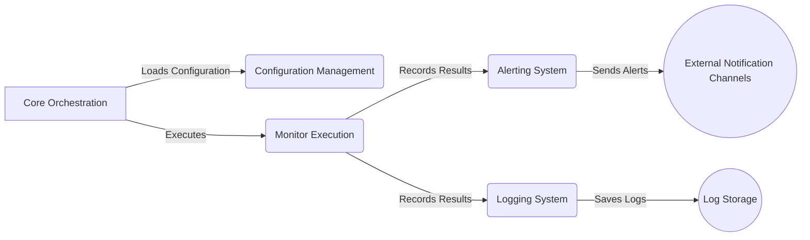

```markdown
## SimpleMonitor Data Flow Overview

SimpleMonitor is a versatile monitoring tool designed to periodically execute tests and checks on various systems and services. It provides alerting and logging capabilities to notify users of any issues or failures detected during the monitoring process.



### Component Descriptions:

**Core Orchestration:** This component serves as the central control point of the application. It initializes and coordinates all other components, loads the configuration, triggers monitor execution, and manages alerting and logging processes. It relates to `Configuration Management` by loading the configuration, to `Monitor Execution` by triggering the execution of monitors, and to `Alerting System` and `Logging System` by triggering alerts and logs based on monitor results.

**Configuration Management:** This component is responsible for loading, parsing, and managing the application's configuration from files and environment variables. It provides configuration data to the `Core Orchestration` component, which uses it to set up the monitors, loggers, and alerters. It relates to `Core Orchestration` by providing the configuration data.

**Monitor Execution:** This component defines and executes individual monitors, which perform specific tests and record their results. It manages dependencies between monitors and handles skipping or delaying monitors based on dependencies. It relates to `Core Orchestration` by being triggered to execute monitors, and to `Alerting System` and `Logging System` by recording the results of the monitor executions.

**Alerting System:** This component handles sending alerts based on the results of monitor executions. It supports various alerting methods and manages the sending of notifications based on monitor status. It relates to `Monitor Execution` by receiving the results of the monitor executions, and to `External Notification Channels` by sending alerts through them.

**Logging System:** This component handles logging monitor results and application events to various destinations. It provides a consistent interface for recording and storing information about the system's operation. It relates to `Monitor Execution` by receiving the results of the monitor executions, and to `Log Storage` by saving the logs to it.
```