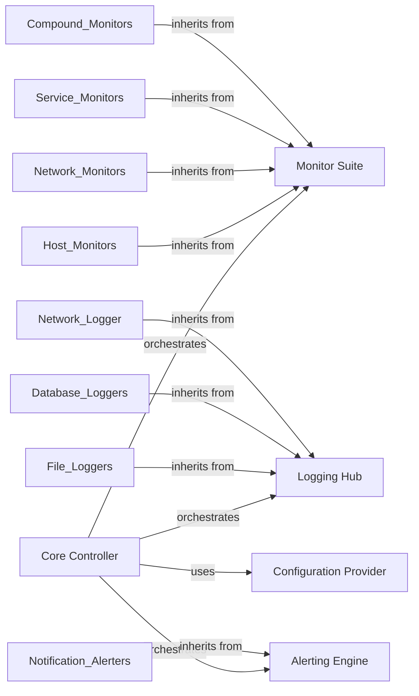

## Component Details

The simplemonitor project provides a framework for monitoring various aspects of a system, including host resources, network services, and application health. It consists of components for configuring monitors, executing tests, logging results, and sending alerts when issues are detected. The core flow involves loading configurations, running monitors in a loop, logging the results of these monitors, and triggering alerts based on those results.

### Core Controller
The Core Controller orchestrates the entire monitoring process. It initializes the system, loads configurations, manages the monitoring loop, and coordinates logging and alerting activities. It serves as the central point of control for the application.
- **Related Classes/Methods**: `simplemonitor.simplemonitor.simplemonitor.SimpleMonitor`, `simplemonitor.simplemonitor.simplemonitor.SimpleMonitor:main`, `simplemonitor.simplemonitor.simplemonitor.SimpleMonitor:__init__`, `simplemonitor.simplemonitor.simplemonitor.SimpleMonitor:_load_config`, `simplemonitor.simplemonitor.simplemonitor.SimpleMonitor:_start_network_thread`, `simplemonitor.simplemonitor.simplemonitor.SimpleMonitor:_load_monitors`, `simplemonitor.simplemonitor.simplemonitor.SimpleMonitor:_load_loggers`, `simplemonitor.simplemonitor.simplemonitor.SimpleMonitor:_load_alerters`, `simplemonitor.simplemonitor.simplemonitor.SimpleMonitor:run_loop`, `simplemonitor.simplemonitor.simplemonitor.SimpleMonitor:run`

### Monitor Suite
The Monitor Suite defines the structure and behavior of individual monitors. It includes a base class and specialized monitor types for host resources, network services, and application health. It is responsible for executing tests and recording results, providing a flexible framework for creating custom checks.
- **Related Classes/Methods**: `simplemonitor.simplemonitor.Monitors.monitor.Monitor`, `simplemonitor.simplemonitor.Monitors.monitor.Monitor:__init__`, `simplemonitor.simplemonitor.Monitors.monitor.Monitor:get_config_option`, `simplemonitor.simplemonitor.Monitors.monitor.Monitor:dependencies`, `simplemonitor.simplemonitor.Monitors.monitor.Monitor:is_remote`, `simplemonitor.simplemonitor.Monitors.monitor.Monitor:test_success`, `simplemonitor.simplemonitor.Monitors.monitor.Monitor:record_fail`, `simplemonitor.simplemonitor.Monitors.monitor.Monitor:record_success`, `simplemonitor.simplemonitor.Monitors.monitor.Monitor:record_skip`, `simplemonitor.simplemonitor.Monitors.monitor.Monitor:all_better_now`, `simplemonitor.simplemonitor.Monitors.monitor.Monitor:attempt_recover`, `simplemonitor.simplemonitor.Monitors.monitor.Monitor:run_recovered`, `simplemonitor.simplemonitor.Monitors.compound.CompoundMonitor`, `simplemonitor.simplemonitor.Monitors.compound.CompoundMonitor:__init__`, `simplemonitor.simplemonitor.Monitors.compound.CompoundMonitor:run_test`, `simplemonitor.simplemonitor.Monitors.compound.CompoundMonitor:get_result`, `simplemonitor.simplemonitor.Monitors.compound.RemoteHostsMonitor`, `simplemonitor.simplemonitor.Monitors.compound.RemoteHostsMonitor:__init__`, `simplemonitor.simplemonitor.Monitors.compound.RemoteHostsMonitor:run_test`, `simplemonitor.simplemonitor.Monitors.host.*`, `simplemonitor.simplemonitor.Monitors.network.*`, `simplemonitor.simplemonitor.Monitors.service.*`

### Logging Hub
The Logging Hub manages the configuration and execution of logging results to various outputs. It provides a consistent interface for recording monitor results and ensures that data is stored and transmitted according to configured settings, supporting file, database, and network destinations.
- **Related Classes/Methods**: `simplemonitor.simplemonitor.simplemonitor.SimpleMonitor:log_result`, `simplemonitor.simplemonitor.simplemonitor.SimpleMonitor:do_logs`, `simplemonitor.simplemonitor.Loggers.logger.Logger`, `simplemonitor.simplemonitor.Loggers.logger.Logger:__init__`, `simplemonitor.simplemonitor.Loggers.logger.Logger:__enter__`, `simplemonitor.simplemonitor.Loggers.logger.Logger:__exit__`, `simplemonitor.simplemonitor.Loggers.logger.Logger:get_config_option`, `simplemonitor.simplemonitor.Loggers.logger.Logger:_get_datestring`, `simplemonitor.simplemonitor.Loggers.logger.Logger:end_batch`, `simplemonitor.simplemonitor.Loggers.logger.Logger:__str__`, `simplemonitor.simplemonitor.Loggers.file.*`, `simplemonitor.simplemonitor.Loggers.db.*`, `simplemonitor.simplemonitor.Loggers.network.*`

### Alerting Engine
The Alerting Engine handles the configuration and execution of alerts based on monitor results. It determines when alerts should be triggered, builds alert messages, and dispatches them via various notification channels, such as Slack, Telegram, and email, ensuring timely notification of detected issues.
- **Related Classes/Methods**: `simplemonitor.simplemonitor.simplemonitor.SimpleMonitor:do_alerts`, `simplemonitor.simplemonitor.Alerters.alerter.Alerter`, `simplemonitor.simplemonitor.Alerters.alerter.Alerter:__init__`, `simplemonitor.simplemonitor.Alerters.alerter.Alerter:get_config_option`, `simplemonitor.simplemonitor.Alerters.alerter.Alerter:should_alert`, `simplemonitor.simplemonitor.Alerters.alerter.Alerter:build_message`, `simplemonitor.simplemonitor.Alerters.alerter.Alerter:describe`, `simplemonitor.simplemonitor.Alerters.*`

### Configuration Provider
The Configuration Provider is responsible for loading configurations from files and environment variables. It parses configuration data and makes it available to other components, ensuring that the application is configured according to user-defined settings.
- **Related Classes/Methods**: `simplemonitor.simplemonitor.util.envconfig.EnvironmentAwareConfigParser`, `simplemonitor.simplemonitor.util.envconfig.EnvironmentAwareConfigParser:__init__`