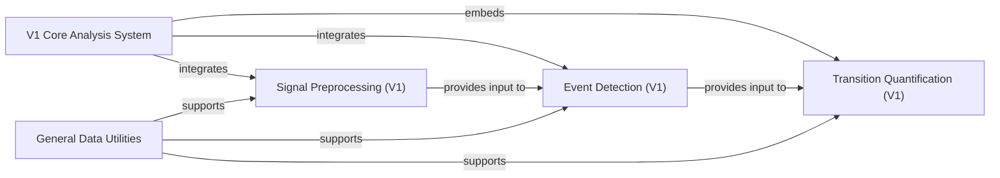

## Details

The `V1 Core Analysis System` represents the original, integrated approach to sit-to-stand analysis within the `sit2standpy` library. Unlike the more modular V2 pipeline, this system consolidates various processing steps into a cohesive unit, primarily orchestrated by the `sit2standpy.core.Sit2Stand` class. Its design reflects a tightly coupled architecture where data processing, event detection, and quantification are deeply embedded.

### V1 Core Analysis System [[Expand]](./V1_Core_Analysis_System.md)
This is the central orchestrator and primary entry point for the V1 API. It integrates and manages the entire sit-to-stand analysis workflow, from initial data handling and filtering to event detection and the final quantification of transitions. Its design emphasizes a single, cohesive unit for analysis.

**Related Classes/Methods**:

- <a href="https://github.com/pfizer-opensource/sit2standpy/blob/master/sit2standpy/core.py" target="_blank" rel="noopener noreferrer">`sit2standpy.core.Sit2Stand`</a>

### Signal Preprocessing (V1)
Responsible for the initial preparation and filtering of raw sensor data specifically for the V1 system. This includes applying acceleration filters and processing timestamps to ensure data quality and readiness for subsequent analysis steps.

**Related Classes/Methods**:

- <a href="https://github.com/pfizer-opensource/sit2standpy/blob/master/sit2standpy/processing.py" target="_blank" rel="noopener noreferrer">`sit2standpy.processing.AccelerationFilter`</a>
- <a href="https://github.com/pfizer-opensource/sit2standpy/blob/master/sit2standpy/processing.py" target="_blank" rel="noopener noreferrer">`sit2standpy.processing.process_timestamps`</a>

### Event Detection (V1)
Implements the core algorithms for identifying specific events, such as sit-to-stand and stand-to-sit transitions, within the preprocessed sensor data. It pinpoints the exact moments of interest for further analysis.

**Related Classes/Methods**:

- <a href="https://github.com/pfizer-opensource/sit2standpy/blob/master/sit2standpy/detectors/detectors.py" target="_blank" rel="noopener noreferrer">`sit2standpy.detectors.detectors.Stillness`</a>
- <a href="https://github.com/pfizer-opensource/sit2standpy/blob/master/sit2standpy/detectors/detectors.py" target="_blank" rel="noopener noreferrer">`sit2standpy.detectors.detectors.Displacement`</a>

### Transition Quantification (V1)
Extracts and calculates meaningful metrics and features from the identified sit-to-stand transitions. This component is tightly integrated with the V1 core and its detectors, as evidenced by the sit2standpy.core.Sit2Stand, sit2standpy.detectors.detectors.Displacement, and sit2standpy.detectors.detectors.Stillness classes inheriting from sit2standpy.quantify.TransitionQuantifier.

**Related Classes/Methods**:

- <a href="https://github.com/pfizer-opensource/sit2standpy/blob/master/sit2standpy/quantify.py" target="_blank" rel="noopener noreferrer">`sit2standpy.quantify.TransitionQuantifier`</a>
- <a href="https://github.com/pfizer-opensource/sit2standpy/blob/master/sit2standpy/utility.py" target="_blank" rel="noopener noreferrer">`sit2standpy.utility.Transition`</a>
- <a href="https://github.com/pfizer-opensource/sit2standpy/blob/master/sit2standpy/core.py" target="_blank" rel="noopener noreferrer">`sit2standpy.core.Sit2Stand`</a>
- <a href="https://github.com/pfizer-opensource/sit2standpy/blob/master/sit2standpy/detectors/detectors.py" target="_blank" rel="noopener noreferrer">`sit2standpy.detectors.detectors.Displacement`</a>
- <a href="https://github.com/pfizer-opensource/sit2standpy/blob/master/sit2standpy/detectors/detectors.py" target="_blank" rel="noopener noreferrer">`sit2standpy.detectors.detectors.Stillness`</a>

### General Data Utilities
Provides a collection of fundamental utility functions for common data manipulations, basic statistical operations (e.g., moving averages), and helper functions that are broadly used across various components of the sit2standpy library, including the V1 system.

**Related Classes/Methods**:

- <a href="https://github.com/pfizer-opensource/sit2standpy/blob/master/sit2standpy/utility.py" target="_blank" rel="noopener noreferrer">`sit2standpy.utility.mov_stats`</a>
- <a href="https://github.com/pfizer-opensource/sit2standpy/blob/master/sit2standpy/utility.py" target="_blank" rel="noopener noreferrer">`sit2standpy.utility.get_stillness`</a>

### [FAQ](https://github.com/CodeBoarding/GeneratedOnBoardings/tree/main?tab=readme-ov-file#faq)