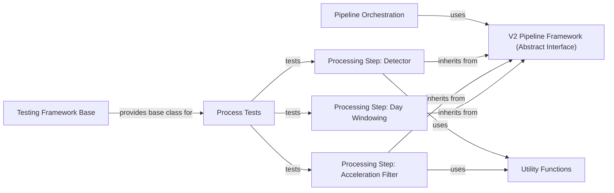

## Details

The `V2 Pipeline Framework` subsystem in `sit2standpy` is designed to provide a modular and extensible structure for building signal processing pipelines. It adheres to the Pipeline/Chain of Responsibility and Strategy architectural patterns, promoting reusability and consistency across different processing steps.

### V2 Pipeline Framework (Abstract Interface)
This is the foundational component, defining the abstract interface (`_BaseProcess`) that all individual processing steps must implement. It establishes the contract for how each step processes data, ensuring consistency and enabling seamless integration into a pipeline. It embodies the "Strategy Pattern" by providing a common interface for interchangeable algorithms.

**Related Classes/Methods**:

- `_BaseProcess` (1:1000)

### Pipeline Orchestration
This component is responsible for orchestrating the execution of individual processing steps in a defined sequence. It acts as the central control flow for the V2 pipeline, chaining together various `_BaseProcess` implementations to form a complete processing workflow. This embodies the "Sequential orchestration" aspect of the pipeline pattern.

**Related Classes/Methods**:

- `Pipeline Orchestration` (1:1000)

### Processing Step: Detector
This component encapsulates the core algorithms for identifying specific events or features within processed signals, such as sit-to-stand transitions. It represents a concrete implementation of a processing step within the pipeline, adhering to the `_BaseProcess` interface.

**Related Classes/Methods**:

- `Detector` (1:1000)

### Processing Step: Acceleration Filter
This component provides various methods for filtering acceleration data, a crucial pre-processing step in signal processing to remove noise or isolate specific frequency components. It's another concrete processing step within the pipeline, implementing `_BaseProcess`.

**Related Classes/Methods**:

- `AccelerationFilter` (1:1000)

### Processing Step: Day Windowing
This component is responsible for segmenting continuous data streams into discrete time windows, such as daily segments. This is vital for contextual analysis or batch processing of time-series data within the pipeline, implementing `_BaseProcess`.

**Related Classes/Methods**:

- `Day Windowing` (1:1000)

### Utility Functions
This component comprises a collection of reusable helper functions that support various processing steps across the library. These functions perform common signal processing operations like calculating stillness, integration, or moving statistics, which are often used by concrete `_BaseProcess` implementations.

**Related Classes/Methods**:

- `Utility Functions` (1:1000)

### Testing Framework Base
This component provides a foundational class (`BaseProcessTester`) for creating consistent and robust tests for all processing components within the V2 pipeline. It likely sets up common testing environments and provides helper methods for asserting expected behaviors, ensuring the reliability of the pipeline steps.

**Related Classes/Methods**:

- `BaseProcessTester` (1:1000)

### Process Tests
This component contains concrete test implementations for individual processing steps, such as `AccelerationFilter`, `Detector`, and `WindowDays`. These tests verify the correct functionality and output of each algorithm, ensuring they behave as expected within the pipeline context.

**Related Classes/Methods**:

- `Process Tests` (1:1000)

### [FAQ](https://github.com/CodeBoarding/GeneratedOnBoardings/tree/main?tab=readme-ov-file#faq)