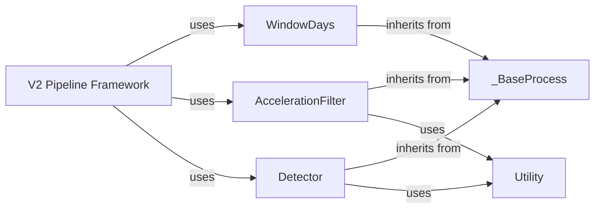

## Details

The `V2 Processing Steps` component is central to the `sit2standpy` library's signal processing capabilities, embodying the Strategy Pattern within a Pipeline/Chain of Responsibility architectural style. It provides concrete, interchangeable implementations for individual stages of the V2 pipeline, allowing for flexible and sequential pipeline construction.

### _BaseProcess
This abstract base class serves as the foundational interface for all individual processing steps within the `sit2standpy.v2` pipeline. It defines a common `process` method that all concrete steps must implement, ensuring a consistent API for pipeline orchestration. It embodies the Strategy Pattern, allowing different algorithms to be plugged into a consistent pipeline structure.

**Related Classes/Methods**:

- <a href="https://github.com/pfizer-opensource/sit2standpy/blob/master/sit2standpy/v2/base.py#L1-L1" target="_blank" rel="noopener noreferrer">`sit2standpy.v2.base._BaseProcess` (1:1)</a>

### WindowDays
This component is a concrete implementation of a `_BaseProcess` step. Its primary responsibility is to segment continuous data streams into discrete, manageable time windows, typically daily segments. This segmentation is crucial for analyzing data in specific contexts or for batch processing within the V2 pipeline.

**Related Classes/Methods**:

- <a href="https://github.com/pfizer-opensource/sit2standpy/blob/master/sit2standpy/v2/day_window.py#L1-L1" target="_blank" rel="noopener noreferrer">`sit2standpy.v2.day_window.WindowDays` (1:1)</a>

### AccelerationFilter
This concrete `_BaseProcess` component provides various methods for filtering acceleration data. Filtering is a critical pre-processing step in signal processing, used to remove noise, smooth data, or isolate specific frequency components, thereby preparing the data for more accurate detection and analysis within the V2 pipeline.

**Related Classes/Methods**:

- <a href="https://github.com/pfizer-opensource/sit2standpy/blob/master/sit2standpy/v2/filters.py#L1-L1" target="_blank" rel="noopener noreferrer">`sit2standpy.v2.filters.AccelerationFilter` (1:1)</a>

### Detector
As another concrete `_BaseProcess` implementation, this component encapsulates the core algorithms responsible for identifying specific events or features within the processed signals, such as sit-to-stand transitions. It leverages general utility functions for pre-processing steps like stillness detection and signal integration.

**Related Classes/Methods**:

- <a href="https://github.com/pfizer-opensource/sit2standpy/blob/master/sit2standpy/v2/detectors.py#L1-L1" target="_blank" rel="noopener noreferrer">`sit2standpy.v2.detectors.Detector` (1:1)</a>

### Utility
This component comprises a collection of reusable helper functions specifically designed to support various processing steps within the `sit2standpy.v2` pipeline. Examples include functions for calculating stillness or moving statistics, which are common operations in signal processing and are utilized by `Detector` and `AccelerationFilter`.

**Related Classes/Methods**:

- <a href="https://github.com/pfizer-opensource/sit2standpy/blob/master/sit2standpy/utility.py#L1-L1" target="_blank" rel="noopener noreferrer">`sit2standpy.utility` (1:1)</a>

### V2 Pipeline Framework [[Expand]](./V2_Pipeline_Framework.md)
While not a single "processing step" itself, this represents the overarching framework (`sit2standpy.v2.pipeline`) that orchestrates the sequential execution of the individual `_BaseProcess` components. It embodies the Pipeline/Chain of Responsibility pattern, allowing users to construct flexible processing workflows by chaining together `WindowDays`, `AccelerationFilter`, `Detector`, and other future `_BaseProcess` implementations.

**Related Classes/Methods**:

- <a href="https://github.com/pfizer-opensource/sit2standpy/blob/master/sit2standpy/v2/pipeline.py#L1-L1" target="_blank" rel="noopener noreferrer">`sit2standpy.v2.pipeline` (1:1)</a>

### [FAQ](https://github.com/CodeBoarding/GeneratedOnBoardings/tree/main?tab=readme-ov-file#faq)