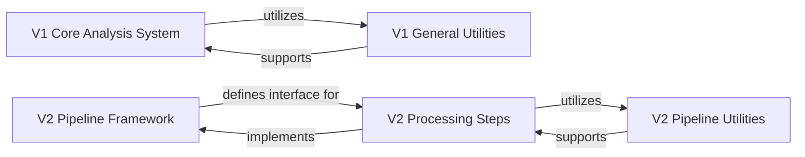

## Details

The `sit2standpy` library exhibits a dual-architecture design, featuring an original (V1) monolithic system and a newer (V2) modular, pipeline-based approach. Both versions aim to perform sit-to-stand analysis, but they achieve this through different structural patterns.

### V1 Core Analysis System [[Expand]](./V1_Core_Analysis_System.md)
This component represents the original, integrated system for performing sit-to-stand analysis. It orchestrates the entire process, from initial data processing and filtering to event detection and the final quantification of transitions. It serves as the primary entry point for users interacting with the V1 API.

**Related Classes/Methods**:

- <a href="https://github.com/pfizer-opensource/sit2standpy/blob/master/sit2standpy/core.py" target="_blank" rel="noopener noreferrer">`sit2standpy.core.Sit2Stand`</a>
- <a href="https://github.com/pfizer-opensource/sit2standpy/blob/master/sit2standpy/processing.py" target="_blank" rel="noopener noreferrer">`sit2standpy.processing.AccelerationFilter`</a>
- <a href="https://github.com/pfizer-opensource/sit2standpy/blob/master/sit2standpy/processing.py" target="_blank" rel="noopener noreferrer">`sit2standpy.processing.process_timestamps`</a>
- <a href="https://github.com/pfizer-opensource/sit2standpy/blob/master/sit2standpy/detectors/detectors.py" target="_blank" rel="noopener noreferrer">`sit2standpy.detectors.detectors.Stillness`</a>
- <a href="https://github.com/pfizer-opensource/sit2standpy/blob/master/sit2standpy/detectors/detectors.py" target="_blank" rel="noopener noreferrer">`sit2standpy.detectors.detectors.Displacement`</a>
- <a href="https://github.com/pfizer-opensource/sit2standpy/blob/master/sit2standpy/quantify.py" target="_blank" rel="noopener noreferrer">`sit2standpy.quantify.TransitionQuantifier`</a>
- <a href="https://github.com/pfizer-opensource/sit2standpy/blob/master/sit2standpy/utility.py" target="_blank" rel="noopener noreferrer">`sit2standpy.utility.Transition`</a>

### V1 General Utilities
A collection of foundational helper functions and data structures that support various operations within the V1 Core Analysis System. These utilities provide common functionalities such as moving statistics calculations and basic data management for transitions.

**Related Classes/Methods**:

- <a href="https://github.com/pfizer-opensource/sit2standpy/blob/master/sit2standpy/utility.py" target="_blank" rel="noopener noreferrer">`sit2standpy.utility.mov_stats`</a>
- <a href="https://github.com/pfizer-opensource/sit2standpy/blob/master/sit2standpy/utility.py" target="_blank" rel="noopener noreferrer">`sit2standpy.utility.get_stillness`</a>

### V2 Pipeline Framework [[Expand]](./V2_Pipeline_Framework.md)
This component defines the abstract interface and foundational structure for building modular and extensible processing pipelines in the V2 architecture. It establishes the contract (`_BaseProcess`) that all individual processing steps must adhere to, promoting consistency and reusability.

**Related Classes/Methods**:

- <a href="https://github.com/pfizer-opensource/sit2standpy/blob/master/sit2standpy/v2/base.py" target="_blank" rel="noopener noreferrer">`sit2standpy.v2.base._BaseProcess`</a>

### V2 Processing Steps [[Expand]](./V2_Processing_Steps.md)
This component comprises the concrete implementations of individual stages within the V2 pipeline. These steps, including data windowing, signal filtering, and event detection, are designed as independent, interchangeable modules that conform to the V2 Pipeline Framework, allowing for flexible and sequential pipeline construction.

**Related Classes/Methods**:

- <a href="https://github.com/pfizer-opensource/sit2standpy/blob/master/sit2standpy/v2/day_window.py" target="_blank" rel="noopener noreferrer">`sit2standpy.v2.day_window.WindowDays`</a>
- <a href="https://github.com/pfizer-opensource/sit2standpy/blob/master/sit2standpy/v2/detectors.py" target="_blank" rel="noopener noreferrer">`sit2standpy.v2.detectors.Detector`</a>
- <a href="https://github.com/pfizer-opensource/sit2standpy/blob/master/sit2standpy/v2/filters.py" target="_blank" rel="noopener noreferrer">`sit2standpy.v2.filters.AccelerationFilter`</a>

### V2 Pipeline Utilities
Provides specialized helper functions and common utilities specifically tailored to support the operations of the V2 Processing Steps. These utilities ensure efficient data manipulation and calculations within the modular pipeline environment.

**Related Classes/Methods**:

- <a href="https://github.com/pfizer-opensource/sit2standpy/blob/master/sit2standpy/v2/utility.py" target="_blank" rel="noopener noreferrer">`sit2standpy.v2.utility.mov_stats`</a>
- <a href="https://github.com/pfizer-opensource/sit2standpy/blob/master/sit2standpy/v2/utility.py" target="_blank" rel="noopener noreferrer">`sit2standpy.v2.utility.get_stillness`</a>

### [FAQ](https://github.com/CodeBoarding/GeneratedOnBoardings/tree/main?tab=readme-ov-file#faq)