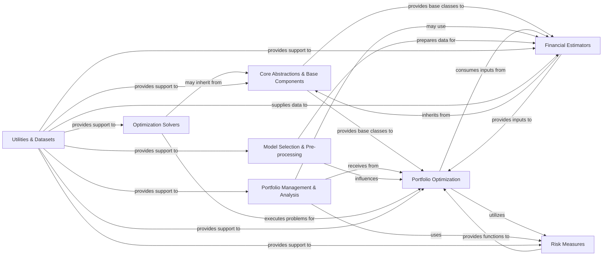

## Details

Overview of skfolio's abstract components and their relationships.

### Core Abstractions & Base Components [[Expand]](./Core_Abstractions_Base_Components.md)
This foundational component defines the abstract base classes and interfaces that ensure skfolio's compatibility with the Scikit-learn API and establish a consistent framework for all financial models, estimators, and optimization algorithms. It provides the architectural backbone for extensibility and modularity.

**Related Classes/Methods**:

- `skfolio.optimization._base`
- <a href="https://github.com/skfolio/skfolio/blob/main/src/skfolio/prior/_base.py#L1-L1" target="_blank" rel="noopener noreferrer">`skfolio.prior._base` (1:1)</a>
- `skfolio.distribution._base`
- `skfolio.moments.covariance._base`
- <a href="https://github.com/skfolio/skfolio/blob/main/src/skfolio/moments/expected_returns/_base.py#L1-L1" target="_blank" rel="noopener noreferrer">`skfolio.moments.expected_returns._base` (1:1)</a>
- `skfolio.portfolio._base`
- `skfolio.uncertainty_set._base`
- <a href="https://github.com/skfolio/skfolio/blob/main/src/skfolio/distance/_base.py#L1-L1" target="_blank" rel="noopener noreferrer">`skfolio.distance._base` (1:1)</a>
- `skfolio.typing`

### Portfolio Optimization
This component implements various portfolio optimization algorithms, allowing users to construct optimal portfolios based on different objectives and constraints. It leverages financial estimators and risk measures to achieve its goals.

**Related Classes/Methods**:

- `skfolio.optimization` (1:1)

### Financial Estimators [[Expand]](./Financial_Estimators.md)
This component provides a suite of Scikit-learn compatible estimators for various financial quantities, including expected returns, covariance matrices, distributions, priors, uncertainty sets, and distance metrics. These estimators are crucial for generating inputs for portfolio optimization.

**Related Classes/Methods**:

- `skfolio.moments.covariance` (1:1)
- `skfolio.moments.expected_returns` (1:1)
- `skfolio.prior` (1:1)
- `skfolio.distribution` (1:1)
- `skfolio.uncertainty_set` (1:1)
- `skfolio.distance` (1:1)

### Risk Measures
This component defines and implements various financial risk measures (e.g., VaR, CVaR, volatility) that can be incorporated into portfolio optimization problems or used for standalone risk assessment.

**Related Classes/Methods**:

- `skfolio.risk_measures` (1:1)

### Portfolio Management & Analysis
This component handles the representation, manipulation, and performance evaluation of financial portfolios. It includes classes for portfolio objects and metrics for assessing portfolio performance.

**Related Classes/Methods**:

- `skfolio.portfolio` (1:1)
- `skfolio.metrics` (1:1)

### Model Selection & Pre-processing
This component provides utilities for model selection, such as custom cross-validation strategies, and pre-processing transformers for financial data, ensuring robust and reliable model training and evaluation.

**Related Classes/Methods**:

- `skfolio.model_selection` (1:1)
- `skfolio.pre_selection` (1:1)

### Optimization Solvers
This component encapsulates the interfaces and logic for interacting with underlying numerical optimization solvers (e.g., CVXPY, Clarabel). It provides an abstraction layer for different solver backends, promoting flexibility.

**Related Classes/Methods**:

- `skfolio.solvers` (1:1)

### Utilities & Datasets
This component provides general utility functions, data validation routines, and example financial datasets to facilitate development, testing, and demonstration of the skfolio library.

**Related Classes/Methods**:

- `skfolio.utils` (1:1)
- `skfolio.datasets` (1:1)

### [FAQ](https://github.com/CodeBoarding/GeneratedOnBoardings/tree/main?tab=readme-ov-file#faq)