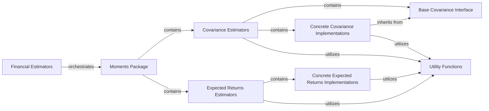

## Details

The `Financial Estimators` subsystem in `skfolio` is designed to provide robust and Scikit-learn compatible tools for estimating statistical moments of financial data, which are crucial inputs for portfolio optimization. The architecture emphasizes modularity, reusability, and adherence to the `sklearn` API.

### Financial Estimators [[Expand]](./Financial_Estimators.md)
The overarching conceptual component responsible for all financial data estimation, serving as fundamental inputs for subsequent portfolio construction processes. It acts as an umbrella for various moment and distribution estimators, adhering to the Scikit-learn API by providing `fit` methods.

**Related Classes/Methods**:

- `skfolio.moments` (1:1)
- `skfolio.moments.covariance` (1:1)
- `skfolio.moments.expected_returns` (1:1)

### Moments Package
The primary package within the `Financial Estimators` subsystem that groups various statistical moment estimators, including covariance and expected returns. It serves as a logical container for related estimation functionalities.

**Related Classes/Methods**:

- `skfolio.moments` (1:1)

### Covariance Estimators
A dedicated sub-package focusing specifically on the estimation of covariance matrices, providing various algorithms for this purpose. It adheres to the Scikit-learn API, offering `fit` methods for estimation.

**Related Classes/Methods**:

- `skfolio.moments.covariance` (1:1)

### Expected Returns Estimators
A dedicated sub-package managing the estimation of expected returns, offering different methodologies to calculate this crucial input for portfolio optimization. It also adheres to the Scikit-learn API.

**Related Classes/Methods**:

- `skfolio.moments.expected_returns` (1:1)

### Base Covariance Interface
An abstract base class defining the common interface and foundational functionalities (e.g., input validation, setting covariance) for all concrete covariance estimators. It ensures adherence to the Scikit-learn `fit` method.

**Related Classes/Methods**:

- `skfolio.moments.covariance.BaseCovariance` (1:1)

### Concrete Covariance Implementations
Specific algorithms (e.g., `EmpiricalCovariance`, `LedoitWolf`, `OAS`) that implement the actual covariance matrix estimation logic. These classes inherit from `BaseCovariance` and override the `fit` method.

**Related Classes/Methods**:

- `skfolio.moments.covariance.EmpiricalCovariance` (1:1)
- `skfolio.moments.covariance.LedoitWolf` (1:1)
- `skfolio.moments.covariance.OAS` (1:1)

### Concrete Expected Returns Implementations
Specific algorithms (e.g., `EquilibriumMu`, `ShrunkMu`) that implement the expected returns estimation logic. These classes provide the concrete methods for calculating expected returns.

**Related Classes/Methods**:

- `skfolio.moments.expected_returns.EquilibriumMu` (1:1)
- `skfolio.moments.expected_returns.ShrunkMu` (1:1)

### Utility Functions
Provides shared helper functions for common data manipulation, statistical operations, and general utilities that are leveraged across various estimators within the `Financial Estimators` subsystem. This includes functionalities from `skfolio.utils.stats` and `skfolio.utils.tools`.

**Related Classes/Methods**:

- `skfolio.utils.stats`
- `skfolio.utils.tools`

### [FAQ](https://github.com/CodeBoarding/GeneratedOnBoardings/tree/main?tab=readme-ov-file#faq)