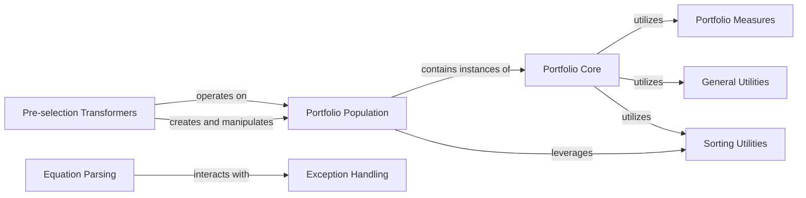

## Details

Portfolio Management & Utilities subsystem

### Portfolio Core
Encapsulates the fundamental definitions and behaviors of investment portfolios, including abstract base classes and concrete implementations for single and multi-period portfolios. It ensures a consistent interface for all portfolio objects.

**Related Classes/Methods**:

- <a href="https://github.com/skfolio/skfolio/blob/main/src/skfolio/portfolio/_base.py#L73-L1206" target="_blank" rel="noopener noreferrer">`skfolio.portfolio._base.BasePortfolio` (73:1206)</a>
- <a href="https://github.com/skfolio/skfolio/blob/main/src/skfolio/portfolio/_portfolio.py#L1-L1" target="_blank" rel="noopener noreferrer">`skfolio.portfolio._portfolio.Portfolio` (1:1)</a>
- <a href="https://github.com/skfolio/skfolio/blob/main/src/skfolio/portfolio/_multi_period_portfolio.py#L1-L1" target="_blank" rel="noopener noreferrer">`skfolio.portfolio._multi_period_portfolio.MultiPeriodPortfolio` (1:1)</a>

### Portfolio Population
Manages collections of `Portfolio` objects, serving as a container for groups of portfolios, particularly relevant for pre-selection and analysis of multiple portfolio candidates.

**Related Classes/Methods**:

- <a href="https://github.com/skfolio/skfolio/blob/main/src/skfolio/population/_population.py#L1-L1" target="_blank" rel="noopener noreferrer">`skfolio.population._population.Population` (1:1)</a>

### Pre-selection Transformers
Provides Scikit-learn compatible transformers that implement various strategies for filtering and selecting portfolios from a `Portfolio Population` based on defined criteria (e.g., selecting extremes or non-dominated portfolios).

**Related Classes/Methods**:

- `skfolio.pre_selection.SelectKExtremes` (1:1)
- `skfolio.pre_selection.SelectNonDominated` (1:1)

### General Utilities
A module offering a collection of general-purpose utility functions for data validation, argument handling, formatting, and Scikit-learn-compatible helpers, promoting code reusability across the library.

**Related Classes/Methods**:

- `skfolio.utils.tools`

### Sorting Utilities
Implements specialized sorting algorithms, particularly those relevant to multi-objective optimization concepts such as Pareto dominance, used for ordering and ranking portfolios.

**Related Classes/Methods**:

- `skfolio.utils.sorting`

### Equation Parsing
Responsible for parsing and converting string-based equations and group cardinalities into matrix representations, primarily used for defining and handling constraints in optimization problems.

**Related Classes/Methods**:

- `skfolio.utils.equations`

### Portfolio Measures
Provides a suite of functions for calculating various quantitative measures and metrics associated with portfolios, such as risk, return, and performance indicators.

**Related Classes/Methods**:

- `skfolio.utils.measures` (1:1)

### Exception Handling
Manages and defines custom exception types and error handling mechanisms specific to the `skfolio` library, ensuring robust error reporting and system stability.

**Related Classes/Methods**:

- `skfolio.utils.exceptions` (1:1)

### [FAQ](https://github.com/CodeBoarding/GeneratedOnBoardings/tree/main?tab=readme-ov-file#faq)