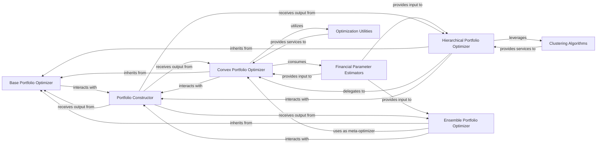

## Details

The Portfolio Optimization Engine subsystem is the core decision-making unit, implementing diverse algorithms and strategies to construct optimal portfolios. It processes refined financial parameters from various estimators and models to solve complex optimization problems.

### Base Portfolio Optimizer
The abstract base class defining the common interface and ensuring Scikit-learn API compliance for all portfolio optimization algorithms. It serves as the foundational contract for the entire optimization engine, promoting extensibility and reusability.

**Related Classes/Methods**:

- `skfolio.optimization` (1:1)

### Convex Portfolio Optimizer
Implements and manages various convex optimization problems, including handling constraints and specific algorithms like Mean-Risk optimization. It consumes financial parameters to solve for optimal portfolio weights, forming a central part of the engine's algorithmic capabilities.

**Related Classes/Methods**:

- `skfolio.optimization.convex` (1:1)

### Hierarchical Portfolio Optimizer
Focuses on optimization strategies that leverage hierarchical clustering to structure the portfolio problem, often delegating sub-problems to other optimizers. This component enables more complex, structured approaches to portfolio construction.

**Related Classes/Methods**:

- `skfolio.optimization.cluster` (1:1)

### Ensemble Portfolio Optimizer
Implements ensemble methods for portfolio optimization, combining the outputs of multiple base optimizers using a meta-optimizer to achieve more robust or diversified results. This represents an advanced strategy for enhancing optimization outcomes.

**Related Classes/Methods**:

- `skfolio.optimization.ensemble` (1:1)

### Financial Parameter Estimators
Provides refined financial parameters (e.g., expected returns, covariance matrices, prior beliefs) that are essential inputs for the various portfolio optimization algorithms. This component acts as the data provider for the optimization engine.

**Related Classes/Methods**:

- `skfolio.estimators` (1:1)

### Clustering Algorithms
Offers functionalities for hierarchical clustering and distance metric calculations, which are crucial for structuring problems within hierarchical portfolio optimization strategies. This component supports specialized optimization approaches.

**Related Classes/Methods**:

- `skfolio.cluster` (1:1)
- `skfolio.utils.cluster` (1:1)

### Optimization Utilities
A collection of helper functions and tools for data preparation, constraint formulation, and other common tasks required by the various optimization algorithms. This centralizes common logic and promotes code reusability across optimizers.

**Related Classes/Methods**:

- `skfolio.utils` (1:1)

### Portfolio Constructor
Responsible for taking the optimized weights from the portfolio optimization algorithms and constructing the final portfolio object. This component represents the output interface of the optimization engine, enabling subsequent evaluation and analysis.

**Related Classes/Methods**:

- `skfolio.portfolio` (1:1)

### [FAQ](https://github.com/CodeBoarding/GeneratedOnBoardings/tree/main?tab=readme-ov-file#faq)