```mermaid
graph LR
    skfolio_prior_BasePrior["skfolio.prior.BasePrior"]
    skfolio_prior_BlackLitterman["skfolio.prior.BlackLitterman"]
    skfolio_uncertainty_set_UncertaintySet["skfolio.uncertainty_set.UncertaintySet"]
    skfolio_uncertainty_set_BootstrapMuUncertaintySet["skfolio.uncertainty_set.BootstrapMuUncertaintySet"]
    skfolio_uncertainty_set_EmpiricalCovarianceUncertaintySet["skfolio.uncertainty_set.EmpiricalCovarianceUncertaintySet"]
    Financial_Estimators["Financial Estimators"]
    skfolio_optimization["skfolio.optimization"]
    skfolio_optimization_convex__base_ConvexOptimization["skfolio.optimization.convex._base.ConvexOptimization"]
    skfolio_prior_BlackLitterman -- "inherits from" --> skfolio_prior_BasePrior
    skfolio_prior_BlackLitterman -- "receives input from" --> Financial_Estimators
    skfolio_uncertainty_set_BootstrapMuUncertaintySet -- "inherits from (indirectly)" --> skfolio_uncertainty_set_UncertaintySet
    skfolio_uncertainty_set_BootstrapMuUncertaintySet -- "receives input from" --> Financial_Estimators
    skfolio_uncertainty_set_EmpiricalCovarianceUncertaintySet -- "inherits from (indirectly)" --> skfolio_uncertainty_set_UncertaintySet
    skfolio_uncertainty_set_EmpiricalCovarianceUncertaintySet -- "receives input from" --> Financial_Estimators
    skfolio_optimization -- "receives input from" --> skfolio_prior_BlackLitterman
    skfolio_optimization_convex__base_ConvexOptimization -- "receives input from" --> skfolio_uncertainty_set_BootstrapMuUncertaintySet
    skfolio_optimization_convex__base_ConvexOptimization -- "receives input from" --> skfolio_uncertainty_set_EmpiricalCovarianceUncertaintySet
    skfolio_optimization_convex__base_ConvexOptimization -- "contained within" --> skfolio_optimization
    click Financial_Estimators href "https://github.com/CodeBoarding/GeneratedOnBoardings/blob/main/skfolio/Financial_Estimators.md" "Details"
```

## Details

Abstract Components Overview for skfolio prior and uncertainty models.

### skfolio.prior.BasePrior
Serves as the abstract base class for all prior models, establishing a standardized interface for incorporating diverse prior beliefs into financial estimations. Its architectural importance lies in enforcing consistency and extensibility for all concrete prior implementations.

**Related Classes/Methods**:

- `skfolio.prior.BasePrior` (1:1)

### skfolio.prior.BlackLitterman
A concrete implementation of a prior model, specifically the Black-Litterman model, which allows for the integration of market views into expected returns. It's a central component due to its widespread use in quantitative finance for refining initial estimates.

**Related Classes/Methods**:

- `skfolio.prior.BlackLitterman` (1:1)

### skfolio.uncertainty_set.UncertaintySet
The high-level abstract base class for all uncertainty set models. It defines the common interface for constructing sets that quantify the uncertainty around estimated parameters (e.g., expected returns, covariance matrices). Architecturally, it ensures a unified approach to handling estimation risk.

**Related Classes/Methods**:

- `skfolio.uncertainty_set.UncertaintySet` (1:1)

### skfolio.uncertainty_set.BootstrapMuUncertaintySet
A concrete implementation for generating uncertainty sets specifically for expected returns using bootstrap methods. This component is vital for robust portfolio optimization by providing a range of possible expected return values rather than a single point estimate.

**Related Classes/Methods**:

- `skfolio.uncertainty_set.BootstrapMuUncertaintySet` (1:1)

### skfolio.uncertainty_set.EmpiricalCovarianceUncertaintySet
A concrete implementation for constructing empirical uncertainty sets for covariance matrices. This component is critical for accounting for the uncertainty in asset relationships, directly impacting risk assessment in portfolio construction.

**Related Classes/Methods**:

- `skfolio.uncertainty_set.EmpiricalCovarianceUncertaintySet` (1:1)

### Financial Estimators [[Expand]](./Financial_Estimators.md)
An external component responsible for generating initial financial estimations (e.g., expected returns, covariance matrices). It acts as the primary data source for the Prior & Uncertainty Models subsystem.

**Related Classes/Methods**:

- `skfolio.estimators` (1:1)

### skfolio.optimization
An external subsystem responsible for portfolio optimization. It consumes the refined estimations and uncertainty sets produced by the Prior & Uncertainty Models subsystem to construct optimal portfolios.

**Related Classes/Methods**:

- `skfolio.optimization` (1:1)

### skfolio.optimization.convex._base.ConvexOptimization
A base class within the skfolio.optimization subsystem that specifically handles convex optimization problems. It's a key interaction point where uncertainty sets are utilized to formulate robust optimization problems.

**Related Classes/Methods**:

- <a href="https://github.com/skfolio/skfolio/blob/main/src/skfolio/optimization/convex/_base.py#L61-L2238" target="_blank" rel="noopener noreferrer">`skfolio.optimization.convex._base.ConvexOptimization` (61:2238)</a>

### [FAQ](https://github.com/CodeBoarding/GeneratedOnBoardings/tree/main?tab=readme-ov-file#faq)