```mermaid
graph LR
    Core_Abstractions_Base_Components["Core Abstractions & Base Components"]
    Financial_Estimators["Financial Estimators"]
    Prior_Uncertainty_Models["Prior & Uncertainty Models"]
    Portfolio_Optimization_Engine["Portfolio Optimization Engine"]
    Portfolio_Management_Utilities["Portfolio Management & Utilities"]
    Core_Abstractions_Base_Components -- "provides foundational interfaces for" --> Financial_Estimators
    Core_Abstractions_Base_Components -- "provides foundational interfaces for" --> Prior_Uncertainty_Models
    Core_Abstractions_Base_Components -- "provides foundational interfaces for" --> Portfolio_Optimization_Engine
    Core_Abstractions_Base_Components -- "provides foundational interfaces for" --> Portfolio_Management_Utilities
    Financial_Estimators -- "produces inputs for" --> Prior_Uncertainty_Models
    Financial_Estimators -- "provides inputs to" --> Portfolio_Optimization_Engine
    Prior_Uncertainty_Models -- "refines inputs from" --> Financial_Estimators
    Prior_Uncertainty_Models -- "provides refined inputs to" --> Portfolio_Optimization_Engine
    Portfolio_Optimization_Engine -- "consumes inputs from" --> Financial_Estimators
    Portfolio_Optimization_Engine -- "consumes refined inputs from" --> Prior_Uncertainty_Models
    Portfolio_Optimization_Engine -- "outputs portfolios to" --> Portfolio_Management_Utilities
    Portfolio_Management_Utilities -- "receives outputs from" --> Portfolio_Optimization_Engine
    Portfolio_Management_Utilities -- "utilizes estimation functionalities from" --> Financial_Estimators
    click Core_Abstractions_Base_Components href "https://github.com/CodeBoarding/GeneratedOnBoardings/blob/main/skfolio/Core_Abstractions_Base_Components.md" "Details"
    click Financial_Estimators href "https://github.com/CodeBoarding/GeneratedOnBoardings/blob/main/skfolio/Financial_Estimators.md" "Details"
    click Prior_Uncertainty_Models href "https://github.com/CodeBoarding/GeneratedOnBoardings/blob/main/skfolio/Prior_Uncertainty_Models.md" "Details"
    click Portfolio_Optimization_Engine href "https://github.com/CodeBoarding/GeneratedOnBoardings/blob/main/skfolio/Portfolio_Optimization_Engine.md" "Details"
    click Portfolio_Management_Utilities href "https://github.com/CodeBoarding/GeneratedOnBoardings/blob/main/skfolio/Portfolio_Management_Utilities.md" "Details"
```

## Details

One paragraph explaining the functionality which is represented by this graph. What the main flow is and what is its purpose.

### Core Abstractions & Base Components [[Expand]](./Core_Abstractions_Base_Components.md)
This foundational component defines the abstract base classes and interfaces that ensure `skfolio`'s compatibility with the Scikit-learn API and establish a consistent framework for all financial models, estimators, and optimization algorithms. It provides the architectural backbone for extensibility and modularity.

**Related Classes/Methods**:

- `skfolio.optimization._base`
- <a href="https://github.com/skfolio/skfolio/blob/main/src/skfolio/prior/_base.py#L1-L1" target="_blank" rel="noopener noreferrer">`skfolio.prior._base` (1:1)</a>
- `skfolio.distribution._base`
- `skfolio.moments.covariance._base`
- <a href="https://github.com/skfolio/skfolio/blob/main/src/skfolio/moments/expected_returns/_base.py#L1-L1" target="_blank" rel="noopener noreferrer">`skfolio.moments.expected_returns._base` (1:1)</a>
- `skfolio.portfolio._base`
- `skfolio.uncertainty_set._base`
- <a href="https://github.com/skfolio/skfolio/blob/main/src/skfolio/distance/_base.py#L1-L1" target="_blank" rel="noopener noreferrer">`skfolio.distance._base` (1:1)</a>
- `skfolio.typing`

### Financial Estimators [[Expand]](./Financial_Estimators.md)
Responsible for estimating statistical moments (expected returns, covariance matrices) and modeling data distributions, which serve as fundamental inputs for subsequent portfolio construction processes.

**Related Classes/Methods**:

- `skfolio.moments` (1:1)
- `skfolio.moments.covariance` (1:1)
- `skfolio.moments.expected_returns` (1:1)

### Prior & Uncertainty Models [[Expand]](./Prior_Uncertainty_Models.md)
Enhances the robustness of financial estimations by incorporating prior beliefs (e.g., Black-Litterman model) and constructing uncertainty sets around estimated parameters, refining the outputs from `Financial Estimators` to account for estimation risk.

**Related Classes/Methods**:

- `skfolio.prior` (1:1)
- `skfolio.uncertainty_set` (1:1)

### Portfolio Optimization Engine [[Expand]](./Portfolio_Optimization_Engine.md)
The central decision-making component, implementing a wide array of algorithms and strategies for constructing optimal portfolios. It consumes the refined financial parameters from `Financial Estimators` and `Prior & Uncertainty Models` to solve various optimization problems.

**Related Classes/Methods**:

- `skfolio.optimization` (1:1)
- `skfolio.optimization.convex` (1:1)
- `skfolio.optimization.cluster` (1:1)
- `skfolio.optimization.ensemble` (1:1)
- `skfolio.optimization.naive` (1:1)

### Portfolio Management & Utilities [[Expand]](./Portfolio_Management_Utilities.md)
Handles the representation and management of portfolios, provides functionalities for pre-selecting assets or portfolios, and includes general utility functions for data validation, composition, and model selection. It processes and presents the outputs from the `Portfolio Optimization Engine`.

**Related Classes/Methods**:

- `skfolio.portfolio` (1:1)
- `skfolio.pre_selection` (1:1)
- `skfolio.utils` (1:1)

### [FAQ](https://github.com/CodeBoarding/GeneratedOnBoardings/tree/main?tab=readme-ov-file#faq)