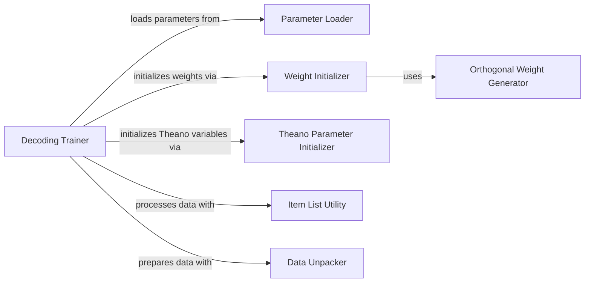

## Details

The `decoding` subsystem is centered around the `Decoding Trainer`, which orchestrates the entire model training lifecycle. This trainer component is responsible for loading and initializing model parameters, managing data flow, and executing the training loop. It interacts with the `Parameter Loader` to retrieve pre-existing model states and utilizes the `Weight Initializer` for setting up initial model weights, which can, in turn, delegate to the `Orthogonal Weight Generator` for specialized orthogonal initialization. The `Theano Parameter Initializer` is crucial for converting parameters into Theano's computational graph format. Additionally, the `Decoding Trainer` leverages general utilities like the `Item List Utility` for data manipulation and the `Data Unpacker` for preparing input data batches, ensuring efficient and structured processing throughout the training regimen.

### Decoding Trainer
The central orchestrator of the entire decoding model training process. It manages the training loop, handles data flow, and coordinates with various utility functions for specific tasks like parameter loading, weight initialization, and data preparation.

**Related Classes/Methods**:

- <a href="https://github.com/ryankiros/skip-thoughts/blob/master/decoding/train.py#L29-L234" target="_blank" rel="noopener noreferrer">`decoding.train.trainer`:29-234</a>

### Parameter Loader
Responsible for loading pre-trained or previously saved model parameters, enabling the resumption of training or the utilization of existing models.

**Related Classes/Methods**:

- <a href="https://github.com/ryankiros/skip-thoughts/blob/master/decoding/utils.py#L48-L58" target="_blank" rel="noopener noreferrer">`decoding.utils.load_params`:48-58</a>

### Weight Initializer
Provides functionality for initializing model weights, potentially using uniform distribution or orthogonal initialization based on specific conditions. This is crucial for setting up the initial state of neural network weights.

**Related Classes/Methods**:

- <a href="https://github.com/ryankiros/skip-thoughts/blob/master/decoding/utils.py#L68-L79" target="_blank" rel="noopener noreferrer">`decoding.utils.norm_weight`:68-79</a>

### Theano Parameter Initializer
Initializes Theano shared variables, which are fundamental for efficient computation and memory management within Theano-based models, preparing the computational graph.

**Related Classes/Methods**:

- <a href="https://github.com/ryankiros/skip-thoughts/blob/master/decoding/utils.py#L39-L46" target="_blank" rel="noopener noreferrer">`decoding.utils.init_tparams`:39-46</a>

### Item List Utility
A general-purpose utility function likely involved in processing or managing collections of items, potentially related to model configurations, data structures, or batch processing.

**Related Classes/Methods**:

- <a href="https://github.com/ryankiros/skip-thoughts/blob/master/decoding/utils.py#L26-L31" target="_blank" rel="noopener noreferrer">`decoding.utils.itemlist`:26-31</a>

### Data Unpacker
A utility function for unpacking or decompressing data structures, often used for preparing data batches or configurations before they are fed into the model.

**Related Classes/Methods**:

- <a href="https://github.com/ryankiros/skip-thoughts/blob/master/decoding/utils.py#L17-L24" target="_blank" rel="noopener noreferrer">`decoding.utils.unzip`:17-24</a>

### Orthogonal Weight Generator
Generates orthogonal weight matrices, a specific initialization strategy often employed in recurrent neural networks to mitigate issues like vanishing or exploding gradients, particularly when dealing with long sequences.

**Related Classes/Methods**:

- <a href="https://github.com/ryankiros/skip-thoughts/blob/master/decoding/utils.py#L60-L66" target="_blank" rel="noopener noreferrer">`decoding.utils.ortho_weight`:60-66</a>

### [FAQ](https://github.com/CodeBoarding/GeneratedOnBoardings/tree/main?tab=readme-ov-file#faq)