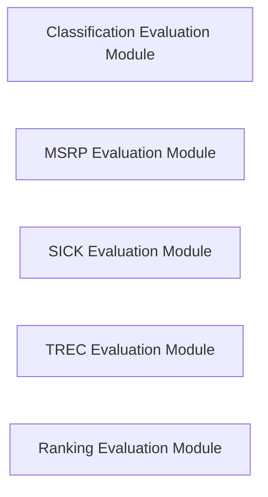

## Details

The Evaluation System subsystem is a comprehensive suite designed to assess the Skip-Thoughts model's performance across various NLP downstream tasks. Its boundaries are defined by the distinct evaluation workflows for classification, paraphrase detection (MSRP), compositional knowledge (SICK), question classification (TREC), and ranking tasks.

### Classification Evaluation Module
Orchestrates the complete evaluation workflow for classification tasks, including robust nested k-fold cross-validation. It handles the loading of classification-specific datasets and the execution of the evaluation process.

**Related Classes/Methods**:

- <a href="https://github.com/ryankiros/skip-thoughts/blob/master/eval_classification.py#L14-L95" target="_blank" rel="noopener noreferrer">`eval_classification.eval_nested_kfold`:14-95</a>
- <a href="https://github.com/ryankiros/skip-thoughts/blob/master/dataset_handler.py#L8-L28" target="_blank" rel="noopener noreferrer">`dataset_handler.load_data`:8-28</a>

### MSRP Evaluation Module
Manages the entire evaluation process for paraphrase detection on the MSRP dataset. This includes loading the MSRP-specific data and performing k-fold statistical evaluation to assess model performance.

**Related Classes/Methods**:

- <a href="https://github.com/ryankiros/skip-thoughts/blob/master/eval_msrp.py#L14-L51" target="_blank" rel="noopener noreferrer">`eval_msrp.evaluate`:14-51</a>
- <a href="https://github.com/ryankiros/skip-thoughts/blob/master/eval_msrp.py#L54-L82" target="_blank" rel="noopener noreferrer">`eval_msrp.load_data`:54-82</a>
- <a href="https://github.com/ryankiros/skip-thoughts/blob/master/eval_msrp.py#L136-L181" target="_blank" rel="noopener noreferrer">`eval_msrp.eval_kfold`:136-181</a>

### SICK Evaluation Module
Directs the evaluation of compositional knowledge using the SICK dataset. This module is responsible for preparing the model for SICK-specific tasks and overseeing its training process before evaluation.

**Related Classes/Methods**:

- <a href="https://github.com/ryankiros/skip-thoughts/blob/master/eval_sick.py#L16-L64" target="_blank" rel="noopener noreferrer">`eval_sick.evaluate`:16-64</a>
- <a href="https://github.com/ryankiros/skip-thoughts/blob/master/eval_sick.py#L78-L102" target="_blank" rel="noopener noreferrer">`eval_sick.train_model`:78-102</a>
- <a href="https://github.com/ryankiros/skip-thoughts/blob/master/eval_sick.py#L67-L75" target="_blank" rel="noopener noreferrer">`eval_sick.prepare_model`:67-75</a>

### TREC Evaluation Module
Oversees the evaluation of question classification on the TREC dataset. It handles the loading of TREC-specific data and executes k-fold cross-validation to measure the model's accuracy in classifying questions.

**Related Classes/Methods**:

- <a href="https://github.com/ryankiros/skip-thoughts/blob/master/eval_trec.py#L11-L44" target="_blank" rel="noopener noreferrer">`eval_trec.evaluate`:11-44</a>
- <a href="https://github.com/ryankiros/skip-thoughts/blob/master/eval_trec.py#L47-L58" target="_blank" rel="noopener noreferrer">`eval_trec.load_data`:47-58</a>
- <a href="https://github.com/ryankiros/skip-thoughts/blob/master/eval_trec.py#L86-L121" target="_blank" rel="noopener noreferrer">`eval_trec.eval_kfold`:86-121</a>

### Ranking Evaluation Module
Coordinates the evaluation of ranking tasks, which involves building the encoder, performing text-to-image (t2i) and image-to-text (i2t) retrieval operations, and managing model parameters.

**Related Classes/Methods**:

- <a href="https://github.com/ryankiros/skip-thoughts/blob/master/eval_rank.py" target="_blank" rel="noopener noreferrer">`eval_rank.evaluate`</a>
- <a href="https://github.com/ryankiros/skip-thoughts/blob/master/eval_rank.py#L158-L174" target="_blank" rel="noopener noreferrer">`eval_rank.build_encoder`:158-174</a>
- <a href="https://github.com/ryankiros/skip-thoughts/blob/master/eval_rank.py#L421-L456" target="_blank" rel="noopener noreferrer">`eval_rank.t2i`:421-456</a>
- <a href="https://github.com/ryankiros/skip-thoughts/blob/master/eval_rank.py#L380-L418" target="_blank" rel="noopener noreferrer">`eval_rank.i2t`:380-418</a>
- <a href="https://github.com/ryankiros/skip-thoughts/blob/master/eval_rank.py#L45-L55" target="_blank" rel="noopener noreferrer">`eval_rank.init_params`:45-55</a>
- <a href="https://github.com/ryankiros/skip-thoughts/blob/master/eval_rank.py#L65-L71" target="_blank" rel="noopener noreferrer">`eval_rank.load_params`:65-71</a>

### [FAQ](https://github.com/CodeBoarding/GeneratedOnBoardings/tree/main?tab=readme-ov-file#faq)