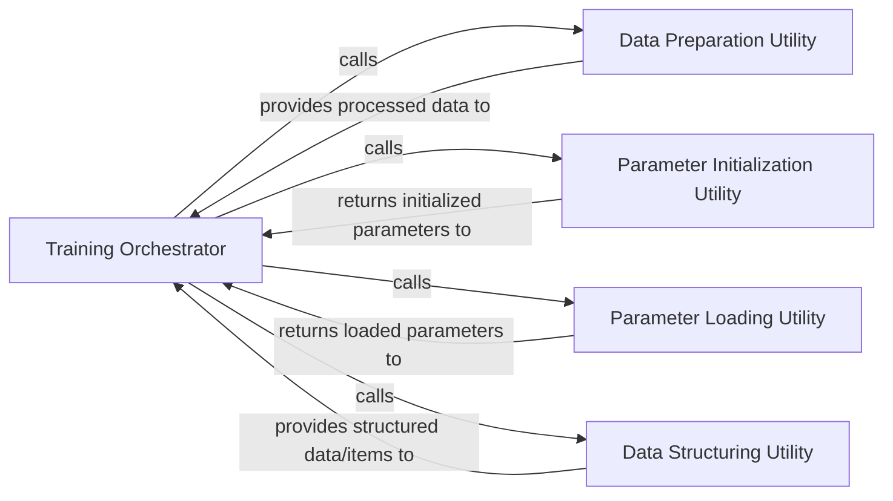

## Details

The `Training System` subsystem is responsible for managing the entire training process of the Skip-Thoughts model. Its boundaries are primarily defined by the `training` package, encompassing the core training logic and various utility functions essential for data and parameter handling.

### Training Orchestrator
This is the core component of the Training System. It manages the entire training lifecycle, including the main training loop, loss function application, optimization strategy, and iterative parameter updates. It acts as the central coordinator for data flow and parameter management during training.

**Related Classes/Methods**:

- <a href="https://github.com/ryankiros/skip-thoughts/blob/master/training/train.py#L27-L182" target="_blank" rel="noopener noreferrer">`training.train.trainer`:27-182</a>

### Data Preparation Utility
Responsible for decompressing and preparing raw data files, making them accessible for the training process. This component ensures data is in a usable format before being fed into the model.

**Related Classes/Methods**:

- <a href="https://github.com/ryankiros/skip-thoughts/blob/master/training/utils.py#L17-L24" target="_blank" rel="noopener noreferrer">`training.utils.unzip`:17-24</a>

### Parameter Initialization Utility
Handles the initial setup and allocation of model parameters (e.g., weights, biases) before the training process begins. This ensures the model starts with a defined set of parameters.

**Related Classes/Methods**:

- <a href="https://github.com/ryankiros/skip-thoughts/blob/master/training/utils.py#L39-L46" target="_blank" rel="noopener noreferrer">`training.utils.init_tparams`:39-46</a>

### Parameter Loading Utility
Manages the loading of pre-existing or saved model parameters. This enables the continuation of training from a checkpoint or fine-tuning a pre-trained model.

**Related Classes/Methods**:

- <a href="https://github.com/ryankiros/skip-thoughts/blob/master/training/utils.py#L48-L58" target="_blank" rel="noopener noreferrer">`training.utils.load_params`:48-58</a>

### Data Structuring Utility
Processes and structures lists of data items, likely for batching, formatting, or other specific data requirements of the model during training. This component ensures data is correctly organized for model input.

**Related Classes/Methods**:

- <a href="https://github.com/ryankiros/skip-thoughts/blob/master/training/utils.py#L26-L31" target="_blank" rel="noopener noreferrer">`training.utils.itemlist`:26-31</a>

### [FAQ](https://github.com/CodeBoarding/GeneratedOnBoardings/tree/main?tab=readme-ov-file#faq)