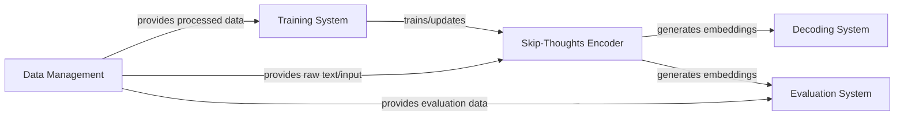

## Details

The `skip-thoughts` project is architected as a modular ML toolkit, primarily designed for generating and utilizing universal sentence embeddings. At its core, the **Skip-Thoughts Encoder** transforms raw text into dense vector representations. This encoder is trained by the **Training System**, which consumes preprocessed data supplied by the **Data Management** component. Once trained, the generated embeddings from the **Skip-Thoughts Encoder** serve as input for downstream applications, specifically the **Decoding System** for text generation and the **Evaluation System** for comprehensive performance assessment across various NLP tasks. This design emphasizes a clear pipeline from data ingestion and model training to embedding generation and subsequent application/evaluation, making it suitable for both research and integration into larger NLP workflows.

### Data Management
Handles the loading, preprocessing, and batching of textual datasets for training, encoding, and evaluation. Ensures data quality and efficient delivery.

**Related Classes/Methods**:

- <a href="https://github.com/ryankiros/skip-thoughts/blob/master/dataset_handler.py#L8-L28" target="_blank" rel="noopener noreferrer">`dataset_handler.load_data`:8-28</a>

### Skip-Thoughts Encoder
The core component responsible for generating fixed-dimensional vector representations (embeddings) of sentences. It encapsulates the model loading and encoding logic.

**Related Classes/Methods**:

- <a href="https://github.com/ryankiros/skip-thoughts/blob/master/skipthoughts.py#L31-L71" target="_blank" rel="noopener noreferrer">`skipthoughts.load_model`:31-71</a>
- <a href="https://github.com/ryankiros/skip-thoughts/blob/master/skipthoughts.py#L105-L166" target="_blank" rel="noopener noreferrer">`skipthoughts.encode`:105-166</a>

### Training System [[Expand]](./Training_System.md)
Manages the training process of the Skip-Thoughts model, including defining loss functions, optimization strategies, and iterative parameter updates.

**Related Classes/Methods**:

- <a href="https://github.com/ryankiros/skip-thoughts/blob/master/training/train.py#L27-L182" target="_blank" rel="noopener noreferrer">`training.train.trainer`:27-182</a>

### Decoding System [[Expand]](./Decoding_System.md)
Responsible for generating sequences (e.g., text) from the sentence embeddings produced by the Skip-Thoughts Encoder, used in tasks like text generation.

**Related Classes/Methods**:

- <a href="https://github.com/ryankiros/skip-thoughts/blob/master/decoding/train.py#L29-L234" target="_blank" rel="noopener noreferrer">`decoding.train.trainer`:29-234</a>

### Evaluation System [[Expand]](./Evaluation_System.md)
A comprehensive suite for assessing the performance of the Skip-Thoughts model across various NLP downstream tasks using different metrics and benchmarks.

**Related Classes/Methods**:

- <a href="https://github.com/ryankiros/skip-thoughts/blob/master/eval_classification.py#L14-L95" target="_blank" rel="noopener noreferrer">`eval_classification.eval_nested_kfold`:14-95</a>
- <a href="https://github.com/ryankiros/skip-thoughts/blob/master/eval_msrp.py#L14-L51" target="_blank" rel="noopener noreferrer">`eval_msrp.evaluate`:14-51</a>
- <a href="https://github.com/ryankiros/skip-thoughts/blob/master/eval_sick.py#L16-L64" target="_blank" rel="noopener noreferrer">`eval_sick.evaluate`:16-64</a>
- <a href="https://github.com/ryankiros/skip-thoughts/blob/master/eval_trec.py#L11-L44" target="_blank" rel="noopener noreferrer">`eval_trec.evaluate`:11-44</a>
- <a href="https://github.com/ryankiros/skip-thoughts/blob/master/eval_rank.py" target="_blank" rel="noopener noreferrer">`eval_rank.evaluate`</a>

### [FAQ](https://github.com/CodeBoarding/GeneratedOnBoardings/tree/main?tab=readme-ov-file#faq)