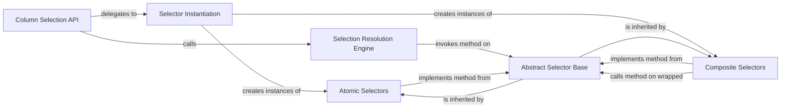

## Details

The skrub column selection subsystem is designed around a flexible and extensible selector pattern. The Column Selection API serves as the entry point, delegating initial input processing to the Selector Instantiation component, which standardizes diverse user inputs into a unified Selector object. The core logic resides within the Selection Resolution Engine, responsible for expanding these abstract Selector expressions into concrete column lists against a DataFrame. All selectors, whether Atomic Selectors (like All or Cols) or Composite Selectors (like Inv, Or, and And), adhere to the contract defined by the Abstract Selector Base, ensuring consistent behavior and enabling complex selection logic through composition and inheritance.

### Column Selection API
Serves as the primary user-facing function, orchestrating the column selection process from initial user input to the final list of selected columns.

**Related Classes/Methods**:

- <a href="https://github.com/skrub-data/skrub/blob/main/skrub/selectors/_base.py#L176-L219" target="_blank" rel="noopener noreferrer">`select`:176-219</a>

### Selector Instantiation
Acts as a factory, standardizing diverse user inputs (e.g., strings, lists, existing selector objects) into a consistent Selector object, ensuring robustness and uniformity across the system.

**Related Classes/Methods**:

- <a href="https://github.com/skrub-data/skrub/blob/main/skrub/selectors/_base.py#L135-L158" target="_blank" rel="noopener noreferrer">`make_selector`:135-158</a>

### Selection Resolution Engine
Contains the core execution logic for column selection. It takes a Selector object and a DataFrame, then resolves the abstract selector expression into a concrete list of column names present in the DataFrame.

**Related Classes/Methods**:

- <a href="https://github.com/skrub-data/skrub/blob/main/skrub/selectors/_base.py#L295-L302" target="_blank" rel="noopener noreferrer">`expand`:295-302</a>

### Abstract Selector Base
Defines the fundamental interface and contract for all column selectors. It provides an abstract base class with the _matches method, which concrete selectors must implement to define how a single column name is evaluated against their criteria. This is key for extensibility.

**Related Classes/Methods**:

- <a href="https://github.com/skrub-data/skrub/blob/main/skrub/selectors/_base.py#L397-L446" target="_blank" rel="noopener noreferrer">`Filter`:397-446</a>

### Atomic Selectors
Represents the simplest, indivisible units of column selection. All selects all columns, while Cols selects columns based on explicitly provided names. These are concrete implementations of the Abstract Selector Base.

**Related Classes/Methods**:

- <a href="https://github.com/skrub-data/skrub/blob/main/benchmarks/utils/join.py" target="_blank" rel="noopener noreferrer">`All`</a>
- <a href="https://github.com/skrub-data/skrub/blob/main/benchmarks/bench_fuzzy_join_sparse_vs_dense.py" target="_blank" rel="noopener noreferrer">`Cols`</a>

### Composite Selectors
Enables the construction of complex selection logic by combining or modifying the results of other selectors. Inv inverts a selection, Or performs a union, and And performs an intersection. These selectors typically wrap other Selector instances.

**Related Classes/Methods**:

- <a href="https://github.com/skrub-data/skrub/blob/main/skrub/selectors/_base.py#L308-L316" target="_blank" rel="noopener noreferrer">`Inv`:308-316</a>
- <a href="https://github.com/skrub-data/skrub/blob/main/benchmarks/bench_gap_divergence.py" target="_blank" rel="noopener noreferrer">`Or`</a>
- <a href="https://github.com/skrub-data/skrub/blob/main/skrub/selectors/_base.py#L295-L302" target="_blank" rel="noopener noreferrer">`And`:295-302</a>

### [FAQ](https://github.com/CodeBoarding/GeneratedOnBoardings/tree/main?tab=readme-ov-file#faq)