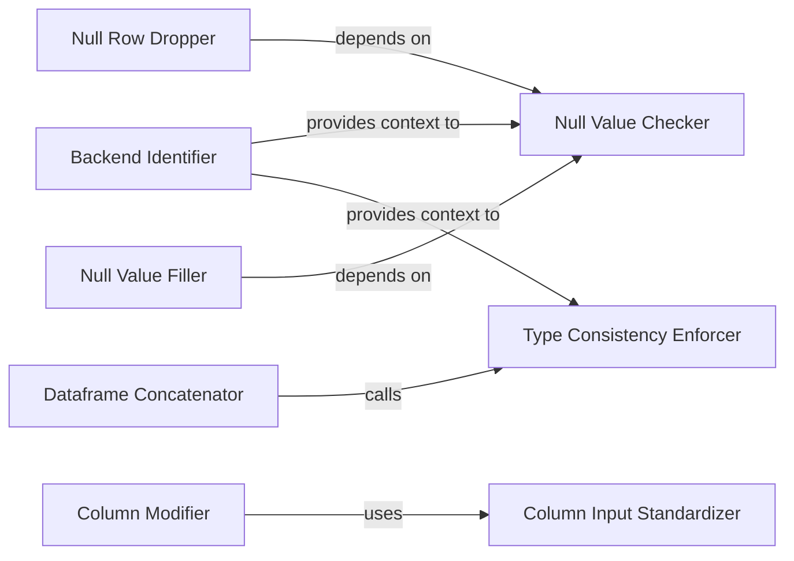

## Details

The Data Abstraction Layer in skrub serves as a crucial interface, unifying interactions with various dataframe backends. Its design emphasizes consistency and seamless data processing, aligning with the project's focus on extensibility and integration within the Python data science ecosystem.

### Backend Identifier
This component is responsible for identifying and managing the active dataframe backend (e.g., Pandas, Polars). It acts as the central point for providing backend-specific context to other operations within the abstraction layer, ensuring that subsequent data manipulations are performed correctly for the chosen backend.

**Related Classes/Methods**:

- <a href="https://github.com/skrub-data/skrub/blob/main/skrub/_dataframe/_common.py#L128-L131" target="_blank" rel="noopener noreferrer">`dataframe_module_name`:128-131</a>

### Column Input Standardizer
Standardizes various input formats for column references into a consistent list format. This ensures that functions operating on columns can receive inputs uniformly, regardless of how they were initially provided (e.g., single string, list of strings, integer index).

**Related Classes/Methods**:

- <a href="https://github.com/skrub-data/skrub/blob/main/skrub/_dataframe/_common.py#L430-L437" target="_blank" rel="noopener noreferrer">`to_column_list`:430-437</a>

### Dataframe Concatenator
Provides a unified method for concatenating dataframes or columns. This component abstracts away the specific concatenation logic of different dataframe backends, allowing skrub components to combine data seamlessly.

**Related Classes/Methods**:

- <a href="https://github.com/skrub-data/skrub/blob/main/skrub/_data_ops/_data_ops.py#L1667-L1716" target="_blank" rel="noopener noreferrer">`concat`:1667-1716</a>

### Null Value Checker
Offers a consistent API for checking for null values within dataframe columns. This component ensures that missing data can be identified uniformly, regardless of the underlying dataframe's representation of nulls.

**Related Classes/Methods**:

- <a href="https://github.com/skrub-data/skrub/blob/main/skrub/_minhash_encoder.py" target="_blank" rel="noopener noreferrer">`is_null`</a>

### Null Row Dropper
Removes rows containing null values from a dataframe. This component leverages the abstracted null-checking mechanism to provide a unified interface for handling rows with missing data.

**Related Classes/Methods**:

- <a href="https://github.com/skrub-data/skrub/blob/main/skrub/_dataframe/_common.py#L1180-L1182" target="_blank" rel="noopener noreferrer">`drop_nulls`:1180-1182</a>

### Null Value Filler
Fills null values in specified columns of a dataframe. This component provides a unified interface for imputing or replacing missing data, abstracting backend-specific filling methods.

**Related Classes/Methods**:

- <a href="https://github.com/skrub-data/skrub/blob/main/skrub/_datetime_encoder.py#L468-L473" target="_blank" rel="noopener noreferrer">`fill_nulls`:468-473</a>

### Column Modifier
Adds new columns or modifies existing ones in a dataframe. This component abstracts the underlying dataframe's column manipulation methods, allowing for consistent data transformation operations.

**Related Classes/Methods**:

- <a href="https://github.com/skrub-data/skrub/blob/main/skrub/_dataframe/_common.py#L1367-L1370" target="_blank" rel="noopener noreferrer">`with_columns`:1367-1370</a>

### Type Consistency Enforcer
An internal helper component responsible for ensuring type consistency across dataframe operations. This is crucial for maintaining data integrity and preventing unexpected behavior when interacting with different dataframe backends.

**Related Classes/Methods**:

- <a href="https://github.com/skrub-data/skrub/blob/main/skrub/_dataframe/_common.py#L346-L373" target="_blank" rel="noopener noreferrer">`_check_same_type`:346-373</a>

### [FAQ](https://github.com/CodeBoarding/GeneratedOnBoardings/tree/main?tab=readme-ov-file#faq)