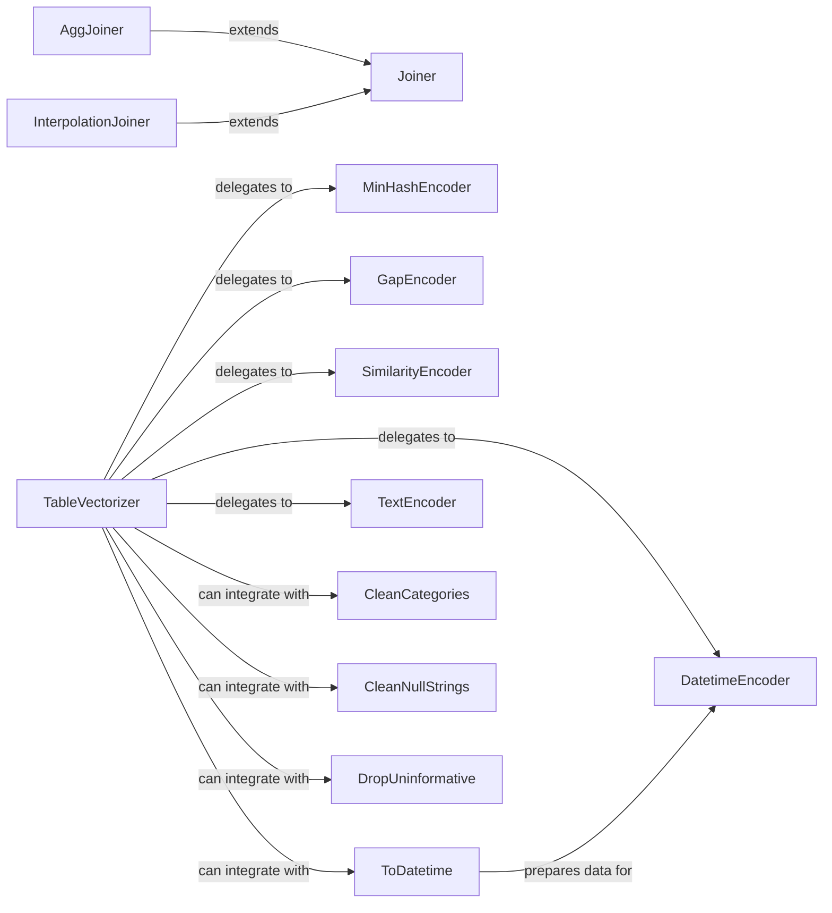

## Details

The Data Transformation & Encoding subsystem in skrub provides a comprehensive set of scikit-learn compatible transformers and encoders for data preprocessing, feature engineering, and data cleaning.

### TableVectorizer
Acts as a high-level orchestrator, intelligently applying various encoders and transformers to appropriate columns within a DataFrame based on column types and user configuration. It embodies the pipeline pattern by delegating specific encoding tasks.

**Related Classes/Methods**:

- <a href="https://github.com/skrub-data/skrub/blob/main/skrub/_table_vectorizer.py#L392-L1000" target="_blank" rel="noopener noreferrer">`skrub._table_vectorizer.TableVectorizer`:392-1000</a>

### MinHashEncoder
Encodes string columns into MinHash signatures, enabling approximate similarity comparisons. This is particularly useful for handling high-cardinality string features and fuzzy matching.

**Related Classes/Methods**:

- <a href="https://github.com/skrub-data/skrub/blob/main/skrub/_minhash_encoder.py#L23-L299" target="_blank" rel="noopener noreferrer">`skrub._minhash_encoder.MinHashEncoder`:23-299</a>
- <a href="https://github.com/skrub-data/skrub/blob/main/skrub/_fast_hash.py" target="_blank" rel="noopener noreferrer">`skrub._fast_hash`</a>

### GapEncoder
Transforms high-cardinality categorical features into dense numerical representations. It is designed to handle unseen categories and reduce dimensionality effectively.

**Related Classes/Methods**:

- <a href="https://github.com/skrub-data/skrub/blob/main/skrub/_gap_encoder.py#L26-L780" target="_blank" rel="noopener noreferrer">`skrub._gap_encoder.GapEncoder`:26-780</a>

### SimilarityEncoder
Encodes string columns by measuring their similarity to learned prototypes. This component is robust to noisy or inconsistent string data, providing a more meaningful numerical representation.

**Related Classes/Methods**:

- <a href="https://github.com/skrub-data/skrub/blob/main/skrub/_similarity_encoder.py#L134-L572" target="_blank" rel="noopener noreferrer">`skrub._similarity_encoder.SimilarityEncoder`:134-572</a>
- <a href="https://github.com/skrub-data/skrub/blob/main/skrub/_string_distances.py" target="_blank" rel="noopener noreferrer">`skrub._string_distances`</a>

### DatetimeEncoder
Extracts and encodes various temporal features (e.g., year, month, day of week, hour) from datetime columns, making time-series information readily available for machine learning models.

**Related Classes/Methods**:

- <a href="https://github.com/skrub-data/skrub/blob/main/skrub/_datetime_encoder.py#L96-L493" target="_blank" rel="noopener noreferrer">`skrub._datetime_encoder.DatetimeEncoder`:96-493</a>

### TextEncoder
Provides a generic mechanism for encoding free-form text data, often leveraging underlying text processing techniques or pre-trained models to convert text into numerical features.

**Related Classes/Methods**:

- <a href="https://github.com/skrub-data/skrub/blob/main/skrub/_text_encoder.py#L23-L415" target="_blank" rel="noopener noreferrer">`skrub._text_encoder.TextEncoder`:23-415</a>

### Joiner
A family of components designed for performing various types of fuzzy joins between two tables. This enables data enrichment and integration even when exact matches are not available.

**Related Classes/Methods**:

- <a href="https://github.com/skrub-data/skrub/blob/main/skrub/_joiner.py#L92-L389" target="_blank" rel="noopener noreferrer">`skrub._joiner.Joiner`:92-389</a>
- <a href="https://github.com/skrub-data/skrub/blob/main/skrub/_join_utils.py" target="_blank" rel="noopener noreferrer">`skrub._join_utils`</a>

### AggJoiner
Extends Joiner functionality with aggregation capabilities.

**Related Classes/Methods**:

- <a href="https://github.com/skrub-data/skrub/blob/main/skrub/_agg_joiner.py#L172-L394" target="_blank" rel="noopener noreferrer">`skrub._agg_joiner.AggJoiner`:172-394</a>

### InterpolationJoiner
Extends Joiner functionality, focusing on filling missing values based on joined data.

**Related Classes/Methods**:

- <a href="https://github.com/skrub-data/skrub/blob/main/skrub/_interpolation_joiner.py#L23-L374" target="_blank" rel="noopener noreferrer">`skrub._interpolation_joiner.InterpolationJoiner`:23-374</a>

### CleanCategories
Standardizes categorical data.

**Related Classes/Methods**:

- <a href="https://github.com/skrub-data/skrub/blob/main/skrub/_clean_categories.py#L39-L204" target="_blank" rel="noopener noreferrer">`skrub._clean_categories.CleanCategories`:39-204</a>

### CleanNullStrings
Handles null-like string values.

**Related Classes/Methods**:

- <a href="https://github.com/skrub-data/skrub/blob/main/skrub/_clean_null_strings.py#L49-L247" target="_blank" rel="noopener noreferrer">`skrub._clean_null_strings.CleanNullStrings`:49-247</a>

### DropUninformative
Identifies and removes uninformative columns.

**Related Classes/Methods**:

- <a href="https://github.com/skrub-data/skrub/blob/main/skrub/_drop_uninformative.py#L11-L182" target="_blank" rel="noopener noreferrer">`skrub._drop_uninformative.DropUninformative`:11-182</a>

### ToDatetime
Converts columns to datetime objects.

**Related Classes/Methods**:

- <a href="https://github.com/skrub-data/skrub/blob/main/skrub/_to_datetime.py#L85-L436" target="_blank" rel="noopener noreferrer">`skrub._to_datetime.ToDatetime`:85-436</a>

### [FAQ](https://github.com/CodeBoarding/GeneratedOnBoardings/tree/main?tab=readme-ov-file#faq)