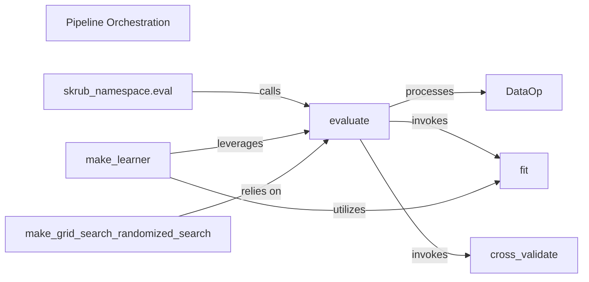

## Details

The `Pipeline Orchestration` subsystem in `skrub` serves as the central control unit for defining, evaluating, and executing complex data processing and machine learning workflows. It provides the high-level API for users to construct and manage pipelines, integrating various `skrub` transformers and utilities.

### Pipeline Orchestration [[Expand]](./Pipeline_Orchestration.md)
The overarching control unit for defining, evaluating, and executing complex data processing and machine learning workflows. It provides the high-level API for users to construct and manage pipelines, integrating various `skrub` transformers and utilities.

**Related Classes/Methods**:

- <a href="https://github.com/skrub-data/skrub/blob/main/skrub/_data_ops/_data_ops.py" target="_blank" rel="noopener noreferrer">`skrub._data_ops._data_ops`</a>
- <a href="https://github.com/skrub-data/skrub/blob/main/skrub/_data_ops/_evaluation.py" target="_blank" rel="noopener noreferrer">`skrub._data_ops._evaluation`</a>
- <a href="https://github.com/skrub-data/skrub/blob/main/skrub/_data_ops/_estimator.py" target="_blank" rel="noopener noreferrer">`skrub._data_ops._estimator`</a>
- <a href="https://github.com/skrub-data/skrub/blob/main/skrub/_data_ops/_skrub_namespace.py" target="_blank" rel="noopener noreferrer">`skrub._data_ops._skrub_namespace`</a>

### DataOp
The foundational abstract class for all data transformation and operation nodes within a `skrub` pipeline. It defines the interface for chaining operations and initiating deferred evaluation, forming the structural backbone of any `skrub` pipeline.

**Related Classes/Methods**:

- <a href="https://github.com/skrub-data/skrub/blob/main/skrub/_data_ops/_data_ops.py#L472-L669" target="_blank" rel="noopener noreferrer">`skrub._data_ops._data_ops.DataOp`:472-669</a>

### evaluate
The core evaluation engine. It orchestrates the execution of the entire data operation graph, managing computation, caching, and data flow. It is the central point for triggering pipeline execution, receiving a `DataOp` graph and orchestrating its traversal and computation.

**Related Classes/Methods**:

- <a href="https://github.com/skrub-data/skrub/blob/main/skrub/_data_ops/_evaluation.py#L359-L400" target="_blank" rel="noopener noreferrer">`skrub._data_ops._evaluation.evaluate`:359-400</a>

### skrub_namespace.eval
The high-level, user-facing API method to trigger the evaluation of a defined data pipeline, providing the final computed result. It acts as the primary entry point for users to execute their pipelines, internally invoking `evaluate`.

**Related Classes/Methods**:

- <a href="https://github.com/skrub-data/skrub/blob/main/skrub/_data_ops/_skrub_namespace.py#L889-L958" target="_blank" rel="noopener noreferrer">`skrub._data_ops._skrub_namespace.eval`:889-958</a>

### fit
Integrates scikit-learn estimators into the `skrub` pipeline, handling the training process within the deferred execution context. When `evaluate` encounters a scikit-learn estimator, `fit` manages its training phase, ensuring correct fitting within `skrub`'s deferred execution.

**Related Classes/Methods**:

- <a href="https://github.com/skrub-data/skrub/blob/main/skrub/_data_ops/_estimator.py#L879-L881" target="_blank" rel="noopener noreferrer">`skrub._data_ops._estimator.fit`:879-881</a>

### cross_validate
Provides functionality for performing cross-validation on estimators embedded within the `skrub` data pipeline, leveraging the pipeline's execution capabilities. It works in conjunction with `evaluate` to perform robust model evaluation by setting up and executing cross-validation folds.

**Related Classes/Methods**:

- <a href="https://github.com/skrub-data/skrub/blob/main/skrub/_data_ops/_estimator.py#L548-L627" target="_blank" rel="noopener noreferrer">`skrub._data_ops._estimator.cross_validate`:548-627</a>

### make_learner
Converts a `skrub` data operation pipeline into a scikit-learn compatible learner (e.g., an `Estimator` or `Transformer`), enabling its seamless use in standard ML workflows. It encapsulates a `skrub` pipeline into a scikit-learn compatible object, allowing `skrub` pipelines to be used as steps in larger scikit-learn `Pipelines` or with scikit-learn utilities.

**Related Classes/Methods**:

- <a href="https://github.com/skrub-data/skrub/blob/main/skrub/_data_ops/_skrub_namespace.py#L1378-L1462" target="_blank" rel="noopener noreferrer">`skrub._data_ops._skrub_namespace.make_learner`:1378-1462</a>

### make_grid_search_randomized_search
Provides methods for integrating hyperparameter optimization (Grid Search, Randomized Search) directly into the `skrub` pipeline, leveraging the `evaluate` mechanism. These components define how different parameter combinations are tested across the pipeline, relying on `evaluate` to execute the pipeline for each combination.

**Related Classes/Methods**:

- <a href="https://github.com/skrub-data/skrub/blob/main/skrub/_data_ops/_skrub_namespace.py#L1547-L1656" target="_blank" rel="noopener noreferrer">`skrub._data_ops._skrub_namespace.make_grid_search`:1547-1656</a>
- <a href="https://github.com/skrub-data/skrub/blob/main/skrub/_data_ops/_skrub_namespace.py#L1658-L1756" target="_blank" rel="noopener noreferrer">`skrub._data_ops._skrub_namespace.make_randomized_search`:1658-1756</a>

### [FAQ](https://github.com/CodeBoarding/GeneratedOnBoardings/tree/main?tab=readme-ov-file#faq)