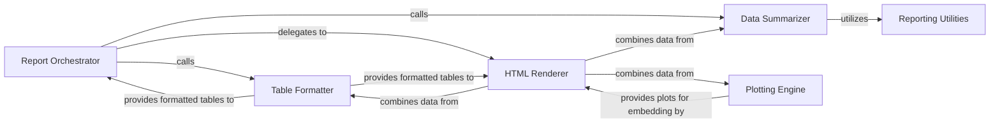

## Details

The `Reporting & Diagnostics` subsystem in `skrub` is designed to provide comprehensive tools for generating insightful summaries, interactive HTML reports, and visualizations of dataframes and pipeline results. It aids users in understanding data characteristics and evaluating pipeline performance.

### Report Orchestrator
Acts as the primary entry point for generating comprehensive data reports. It orchestrates the collection of data insights from various sub-components and prepares them for presentation. This component is crucial for integrating different reporting aspects into a cohesive output, often in HTML format. Its role as an orchestrator is fundamental for a modular reporting system.

**Related Classes/Methods**:

- <a href="https://github.com/skrub-data/skrub/blob/main/skrub/_reporting/_table_report.py" target="_blank" rel="noopener noreferrer">`skrub._reporting._table_report`</a>

### Data Summarizer
Focuses on generating statistical summaries of dataframes and individual columns. It computes descriptive statistics, value counts, and other data characteristics essential for understanding data distributions and quality. This component is vital for the "diagnostics" aspect, providing the raw analytical insights.

**Related Classes/Methods**:

- <a href="https://github.com/skrub-data/skrub/blob/main/skrub/_reporting/_summarize.py" target="_blank" rel="noopener noreferrer">`skrub._reporting._summarize`</a>

### Table Formatter
Manages the creation and intelligent formatting of sample tables for display within reports. This includes handling multi-index headers and slicing data effectively to present representative samples. This component ensures that tabular data is presented clearly and concisely, which is critical for data exploration.

**Related Classes/Methods**:

- <a href="https://github.com/skrub-data/skrub/blob/main/skrub/_reporting/_sample_table.py" target="_blank" rel="noopener noreferrer">`skrub._reporting._sample_table`</a>

### Plotting Engine
Provides core plotting functionalities for visualizing data. It generates various plot types (e.g., histograms, line plots, value counts) that can be embedded into reports to offer visual insights into data characteristics and distributions. Visualizations are a cornerstone of effective data reporting in ML/data processing libraries.

**Related Classes/Methods**:

- <a href="https://github.com/skrub-data/skrub/blob/main/skrub/_reporting/_plotting.py" target="_blank" rel="noopener noreferrer">`skrub._reporting._plotting`</a>

### HTML Renderer
Responsible for generating the final HTML output of reports. It integrates summarized data, sampled tables, and plots into a cohesive, interactive web-based view, ensuring a user-friendly presentation. This component is the final output layer, essential for delivering user-consumable reports.

**Related Classes/Methods**:

- <a href="https://github.com/skrub-data/skrub/blob/main/skrub/_reporting/_html.py" target="_blank" rel="noopener noreferrer">`skrub._reporting._html`</a>

### Reporting Utilities
Provides general utility functions that support the overall reporting process, such as common data manipulation tasks, helper functions for formatting, or data type conversions specific to reporting needs. This component encapsulates common helper logic, promoting code reusability and maintainability across the reporting subsystem.

**Related Classes/Methods**:

- <a href="https://github.com/skrub-data/skrub/blob/main/skrub/_reporting/_utils.py" target="_blank" rel="noopener noreferrer">`skrub._reporting._utils`</a>

### [FAQ](https://github.com/CodeBoarding/GeneratedOnBoardings/tree/main?tab=readme-ov-file#faq)