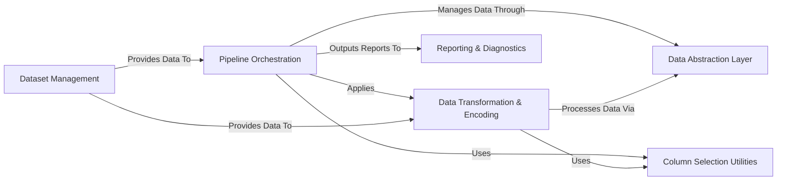

## Details

The `skrub` library is designed as a robust and extensible data processing and machine learning framework, deeply embedded within the Python data science ecosystem. Its architecture is centered around a `Pipeline Orchestration` component that orchestrates complex data workflows by applying various `Data Transformation & Encoding` modules. A crucial `Data Abstraction Layer` ensures seamless data handling across different dataframe backends, while `Column Selection Utilities` provide precise control over data subsets. For analytical insights, `Reporting & Diagnostics` tools visualize pipeline outcomes. The entire system is supported by `Dataset Management` utilities, which supply data for development and testing. This modular design facilitates clear data flow, reusability, and strong compatibility with scikit-learn, making `skrub` an effective tool for data preprocessing and feature engineering.

### Pipeline Orchestration [[Expand]](./Pipeline_Orchestration.md)
The central control unit for defining, evaluating, and executing complex data processing and machine learning workflows. It provides the high-level API for users to construct and manage pipelines, integrating various `skrub` transformers and utilities.

**Related Classes/Methods**:

- <a href="https://github.com/skrub-data/skrub/blob/main/skrub/_data_ops/_data_ops.py#L1-L1000" target="_blank" rel="noopener noreferrer">`skrub/_data_ops/_data_ops.py`:1-1000</a>
- <a href="https://github.com/skrub-data/skrub/blob/main/skrub/_data_ops/_evaluation.py#L1-L1000" target="_blank" rel="noopener noreferrer">`skrub/_data_ops/_evaluation.py`:1-1000</a>
- <a href="https://github.com/skrub-data/skrub/blob/main/skrub/_data_ops/_estimator.py#L1-L1000" target="_blank" rel="noopener noreferrer">`skrub/_data_ops/_estimator.py`:1-1000</a>
- <a href="https://github.com/skrub-data/skrub/blob/main/skrub/_data_ops/_skrub_namespace.py#L1-L1000" target="_blank" rel="noopener noreferrer">`skrub/_data_ops/_skrub_namespace.py`:1-1000</a>

### Data Abstraction Layer [[Expand]](./Data_Abstraction_Layer.md)
A foundational layer that provides a unified and consistent API for interacting with different dataframe backends (e.g., Pandas, Polars). This ensures that `skrub` components can process data uniformly, regardless of the underlying data structure.

**Related Classes/Methods**:

- <a href="https://github.com/skrub-data/skrub/blob/main/skrub/_dataframe/_common.py#L1-L1000" target="_blank" rel="noopener noreferrer">`skrub/_dataframe/_common.py`:1-1000</a>

### Data Transformation & Encoding [[Expand]](./Data_Transformation_Encoding.md)
A comprehensive suite of scikit-learn compatible transformers and encoders. These are the modular building blocks for various data preprocessing, feature engineering, and data cleaning tasks within `skrub` pipelines.

**Related Classes/Methods**:

- <a href="https://github.com/skrub-data/skrub/blob/main/skrub/_table_vectorizer.py#L1-L1000" target="_blank" rel="noopener noreferrer">`skrub/_table_vectorizer.py`:1-1000</a>
- <a href="https://github.com/skrub-data/skrub/blob/main/skrub/_joiner.py#L1-L1000" target="_blank" rel="noopener noreferrer">`skrub/_joiner.py`:1-1000</a>
- <a href="https://github.com/skrub-data/skrub/blob/main/skrub/_agg_joiner.py#L1-L1000" target="_blank" rel="noopener noreferrer">`skrub/_agg_joiner.py`:1-1000</a>
- <a href="https://github.com/skrub-data/skrub/blob/main/skrub/_interpolation_joiner.py#L1-L1000" target="_blank" rel="noopener noreferrer">`skrub/_interpolation_joiner.py`:1-1000</a>
- <a href="https://github.com/skrub-data/skrub/blob/main/skrub/_minhash_encoder.py#L1-L1000" target="_blank" rel="noopener noreferrer">`skrub/_minhash_encoder.py`:1-1000</a>
- <a href="https://github.com/skrub-data/skrub/blob/main/skrub/_gap_encoder.py#L1-L1000" target="_blank" rel="noopener noreferrer">`skrub/_gap_encoder.py`:1-1000</a>
- <a href="https://github.com/skrub-data/skrub/blob/main/skrub/_similarity_encoder.py#L1-L1000" target="_blank" rel="noopener noreferrer">`skrub/_similarity_encoder.py`:1-1000</a>
- <a href="https://github.com/skrub-data/skrub/blob/main/skrub/_datetime_encoder.py#L1-L1000" target="_blank" rel="noopener noreferrer">`skrub/_datetime_encoder.py`:1-1000</a>
- <a href="https://github.com/skrub-data/skrub/blob/main/skrub/_clean_categories.py#L1-L1000" target="_blank" rel="noopener noreferrer">`skrub/_clean_categories.py`:1-1000</a>
- <a href="https://github.com/skrub-data/skrub/blob/main/skrub/_clean_null_strings.py#L1-L1000" target="_blank" rel="noopener noreferrer">`skrub/_clean_null_strings.py`:1-1000</a>
- <a href="https://github.com/skrub-data/skrub/blob/main/skrub/_drop_uninformative.py#L1-L1000" target="_blank" rel="noopener noreferrer">`skrub/_drop_uninformative.py`:1-1000</a>
- <a href="https://github.com/skrub-data/skrub/blob/main/skrub/_to_datetime.py#L1-L1000" target="_blank" rel="noopener noreferrer">`skrub/_to_datetime.py`:1-1000</a>
- <a href="https://github.com/skrub-data/skrub/blob/main/skrub/_text_encoder.py#L1-L1000" target="_blank" rel="noopener noreferrer">`skrub/_text_encoder.py`:1-1000</a>
- <a href="https://github.com/skrub-data/skrub/blob/main/skrub/_string_encoder.py#L1-L1000" target="_blank" rel="noopener noreferrer">`skrub/_string_encoder.py`:1-1000</a>

### Column Selection Utilities [[Expand]](./Column_Selection_Utilities.md)
Provides a flexible and expressive domain-specific language (DSL) for selecting columns within dataframes. This component enables users to specify columns based on various criteria, enhancing the reusability and configurability of transformers.

**Related Classes/Methods**:

- <a href="https://github.com/skrub-data/skrub/blob/main/skrub/selectors/_base.py#L1-L1000" target="_blank" rel="noopener noreferrer">`skrub/selectors/_base.py`:1-1000</a>

### Reporting & Diagnostics [[Expand]](./Reporting_Diagnostics.md)
Tools for generating insightful summaries, interactive HTML reports, and visualizations of dataframes and pipeline results. This component aids in understanding data characteristics and evaluating pipeline performance.

**Related Classes/Methods**:

- <a href="https://github.com/skrub-data/skrub/blob/main/skrub/_reporting/_html.py#L1-L1000" target="_blank" rel="noopener noreferrer">`skrub/_reporting/_html.py`:1-1000</a>
- <a href="https://github.com/skrub-data/skrub/blob/main/skrub/_reporting/_plotting.py#L1-L1000" target="_blank" rel="noopener noreferrer">`skrub/_reporting/_plotting.py`:1-1000</a>
- <a href="https://github.com/skrub-data/skrub/blob/main/skrub/_reporting/_summarize.py#L1-L1000" target="_blank" rel="noopener noreferrer">`skrub/_reporting/_summarize.py`:1-1000</a>
- <a href="https://github.com/skrub-data/skrub/blob/main/skrub/_reporting/_sample_table.py#L1-L1000" target="_blank" rel="noopener noreferrer">`skrub/_reporting/_sample_table.py`:1-1000</a>
- <a href="https://github.com/skrub-data/skrub/blob/main/skrub/_reporting/_table_report.py#L1-L1000" target="_blank" rel="noopener noreferrer">`skrub/_reporting/_table_report.py`:1-1000</a>

### Dataset Management
Utilities for fetching, loading, and managing various datasets. These datasets are primarily used for examples, benchmarks, and testing within the `skrub` ecosystem, facilitating quick setup and reproducible experiments.

**Related Classes/Methods**:

- <a href="https://github.com/skrub-data/skrub/blob/main/skrub/datasets/_utils.py#L1-L1000" target="_blank" rel="noopener noreferrer">`skrub/datasets/_utils.py`:1-1000</a>
- <a href="https://github.com/skrub-data/skrub/blob/main/skrub/datasets/_ken_embeddings.py#L1-L1000" target="_blank" rel="noopener noreferrer">`skrub/datasets/_ken_embeddings.py`:1-1000</a>

### [FAQ](https://github.com/CodeBoarding/GeneratedOnBoardings/tree/main?tab=readme-ov-file#faq)