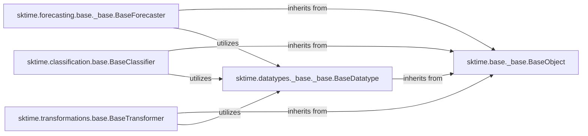

## Details

One paragraph explaining the functionality which is represented by this graph. What the main flow is and what is its purpose.

### sktime.base._base.BaseObject
The ultimate abstract base class for all objects within `sktime`. It provides common utilities, enforces a consistent API, and serves as the root of the inheritance hierarchy for all estimators and data structures, ensuring fundamental consistency across the library.

**Related Classes/Methods**:

- <a href="https://github.com/sktime/sktime/blob/main/sktime/base/_base.py#L74-L348" target="_blank" rel="noopener noreferrer">`sktime.base._base.BaseObject` (74:348)</a>

### sktime.forecasting.base._base.BaseForecaster
Defines the abstract interface and core contract for all time series forecasting estimators. It specifies the fundamental methods (e.g., `fit`, `predict`, `update`) that concrete forecasting models must implement, standardizing the forecasting workflow.

**Related Classes/Methods**:

- <a href="https://github.com/sktime/sktime/blob/main/sktime/forecasting/base/_base.py#L75-L2383" target="_blank" rel="noopener noreferrer">`sktime.forecasting.base._base.BaseForecaster` (75:2383)</a>

### sktime.classification.base.BaseClassifier
Defines the abstract interface and core contract for all time series classification estimators. It specifies the fundamental methods (e.g., `fit`, `predict_proba`) that concrete classification models must implement, standardizing the classification workflow.

**Related Classes/Methods**:

- <a href="https://github.com/sktime/sktime/blob/main/sktime/classification/base.py#L35-L706" target="_blank" rel="noopener noreferrer">`sktime.classification.base.BaseClassifier` (35:706)</a>

### sktime.transformations.base.BaseTransformer
Defines the abstract interface and core contract for all time series transformation estimators. It specifies the fundamental methods (e.g., `fit`, `transform`, `inverse_transform`) that concrete transformation models must implement, standardizing data preprocessing and feature engineering.

**Related Classes/Methods**:

- <a href="https://github.com/sktime/sktime/blob/main/sktime/transformations/base.py#L100-L1626" target="_blank" rel="noopener noreferrer">`sktime.transformations.base.BaseTransformer` (100:1626)</a>

### sktime.datatypes._base._base.BaseDatatype
Provides the foundational abstract base class and utilities for defining, validating, and standardizing various time series data formats used throughout `sktime`. It is crucial for ensuring data consistency and interoperability across different estimators and modules.

**Related Classes/Methods**:

- <a href="https://github.com/sktime/sktime/blob/main/sktime/datatypes/_base/_base.py#L11-L297" target="_blank" rel="noopener noreferrer">`sktime.datatypes._base._base.BaseDatatype` (11:297)</a>

### [FAQ](https://github.com/CodeBoarding/GeneratedOnBoardings/tree/main?tab=readme-ov-file#faq)