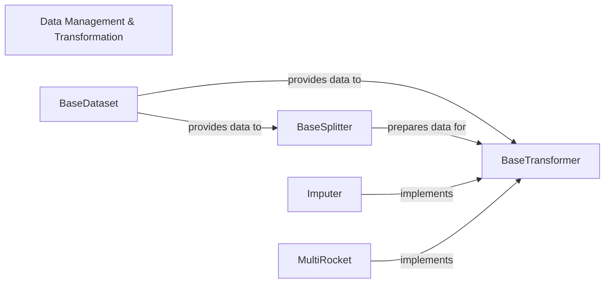

## Details

This core component is responsible for all aspects of handling time series data within the `sktime` library. It encompasses the loading, internal representation, splitting, preprocessing, and feature engineering of time series datasets. It provides foundational interfaces for datasets, flexible strategies for dividing time series data for tasks like cross-validation, and a comprehensive set of tools for transforming and preparing data for machine learning models. This component is fundamental for ensuring data quality and preparing it for various time series analysis tasks.

### Data Management & Transformation [[Expand]](./Data_Management_Transformation.md)
This core component is responsible for all aspects of handling time series data within the `sktime` library. It encompasses the loading, internal representation, splitting, preprocessing, and feature engineering of time series datasets. It provides foundational interfaces for datasets, flexible strategies for dividing time series data for tasks like cross-validation, and a comprehensive set of tools for transforming and preparing data for machine learning models. This component is fundamental for ensuring data quality and preparing it for various time series analysis tasks.

**Related Classes/Methods**:

- <a href="https://github.com/sktime/sktime/blob/main/sktime/datasets/base/_base.py#L26-L132" target="_blank" rel="noopener noreferrer">`sktime.datasets.base._base.BaseDataset` (26:132)</a>
- <a href="https://github.com/sktime/sktime/blob/main/sktime/split/base/_base_splitter.py#L28-L477" target="_blank" rel="noopener noreferrer">`sktime.split.base._base_splitter.BaseSplitter` (28:477)</a>
- <a href="https://github.com/sktime/sktime/blob/main/sktime/transformations/base.py#L100-L1626" target="_blank" rel="noopener noreferrer">`sktime.transformations.base.BaseTransformer` (100:1626)</a>
- <a href="https://github.com/sktime/sktime/blob/main/sktime/transformations/series/impute.py#L16-L410" target="_blank" rel="noopener noreferrer">`sktime.transformations.series.impute.Imputer` (16:410)</a>
- <a href="https://github.com/sktime/sktime/blob/main/sktime/transformations/panel/rocket/_multirocket.py#L13-L233" target="_blank" rel="noopener noreferrer">`sktime.transformations.panel.rocket._multirocket.MultiRocket` (13:233)</a>

### BaseDataset
Defines the standardized interface and base functionality for loading and representing various time series datasets. It acts as the primary entry point for data into the system, ensuring consistency in how data is accessed and handled across the library.

**Related Classes/Methods**:

- <a href="https://github.com/sktime/sktime/blob/main/sktime/datasets/base/_base.py#L26-L132" target="_blank" rel="noopener noreferrer">`sktime.datasets.base._base.BaseDataset` (26:132)</a>

### BaseSplitter
Establishes the abstract interface for all time series splitting strategies. It enables the division of time series data into training and testing sets, crucial for robust model evaluation and validation while respecting the inherent temporal order of the data.

**Related Classes/Methods**:

- <a href="https://github.com/sktime/sktime/blob/main/sktime/split/base/_base_splitter.py#L28-L477" target="_blank" rel="noopener noreferrer">`sktime.split.base._base_splitter.BaseSplitter` (28:477)</a>

### BaseTransformer
Serves as the abstract base class for all data transformation operations within the library. It defines the `fit` and `transform` methods, providing a unified API for preprocessing, feature extraction, and other data manipulations, ensuring extensibility for new transformers.

**Related Classes/Methods**:

- <a href="https://github.com/sktime/sktime/blob/main/sktime/transformations/base.py#L100-L1626" target="_blank" rel="noopener noreferrer">`sktime.transformations.base.BaseTransformer` (100:1626)</a>

### Imputer
A concrete implementation of `BaseTransformer` specifically designed for handling missing values in time series data. It provides various imputation strategies to ensure data completeness and integrity for subsequent analysis and modeling.

**Related Classes/Methods**:

- <a href="https://github.com/sktime/sktime/blob/main/sktime/transformations/series/impute.py#L16-L410" target="_blank" rel="noopener noreferrer">`sktime.transformations.series.impute.Imputer` (16:410)</a>

### MultiRocket
A concrete implementation of `BaseTransformer` focused on advanced feature engineering for time series classification and regression tasks. It extracts a diverse set of features from time series data, significantly enhancing its suitability for traditional machine learning models.

**Related Classes/Methods**:

- <a href="https://github.com/sktime/sktime/blob/main/sktime/transformations/panel/rocket/_multirocket.py#L13-L233" target="_blank" rel="noopener noreferrer">`sktime.transformations.panel.rocket._multirocket.MultiRocket` (13:233)</a>

### [FAQ](https://github.com/CodeBoarding/GeneratedOnBoardings/tree/main?tab=readme-ov-file#faq)