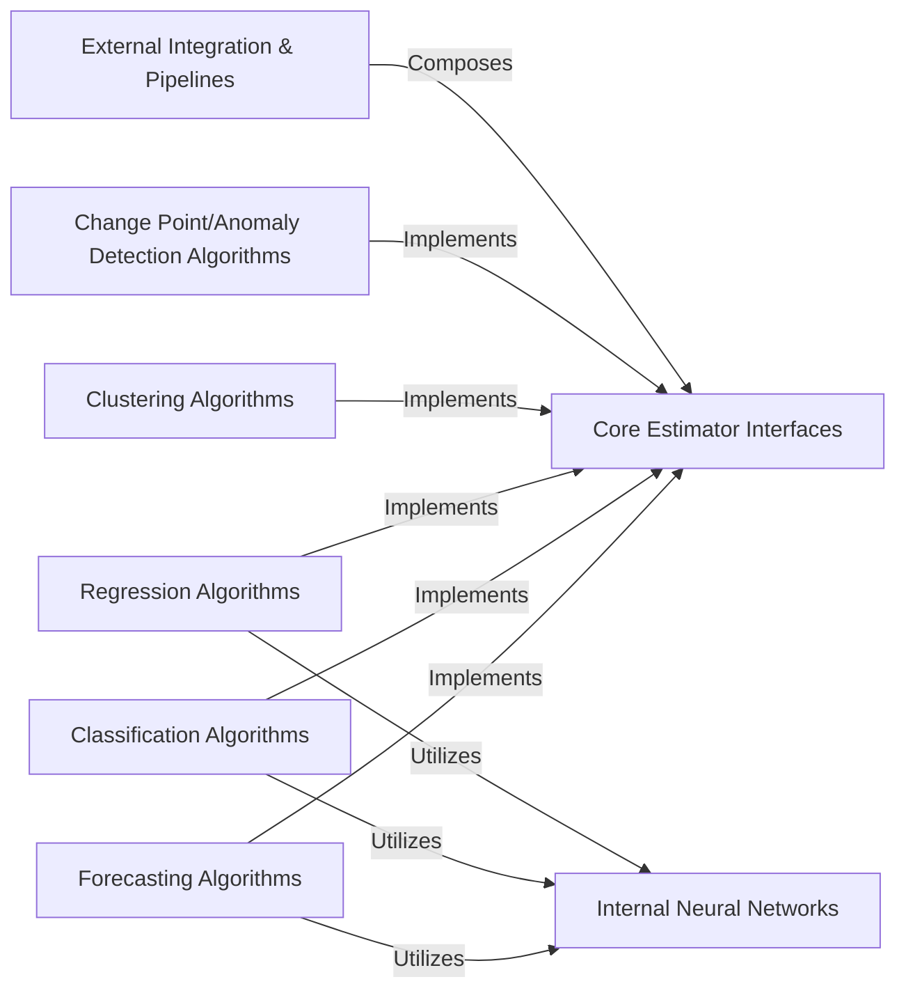

## Details

One paragraph explaining the functionality which is represented by this graph. What the main flow is and what is its purpose.

### Core Estimator Interfaces
Defines the fundamental abstract base classes and interfaces for all machine learning tasks within sktime. This component establishes the common API and contract that all specific algorithm implementations must adhere to, ensuring consistency and extensibility across the library.

**Related Classes/Methods**:

- <a href="https://github.com/sktime/sktime/blob/main/sktime/forecasting/base/_base.py#L75-L2383" target="_blank" rel="noopener noreferrer">`sktime.forecasting.base._base.BaseForecaster` (75:2383)</a>
- <a href="https://github.com/sktime/sktime/blob/main/sktime/classification/base.py#L35-L35" target="_blank" rel="noopener noreferrer">`sktime.classification.base.BaseClassifier` (35:35)</a>
- <a href="https://github.com/sktime/sktime/blob/main/sktime/regression/base.py#L33-L398" target="_blank" rel="noopener noreferrer">`sktime.regression.base.BaseRegressor` (33:398)</a>
- <a href="https://github.com/sktime/sktime/blob/main/sktime/clustering/base.py#L17-L503" target="_blank" rel="noopener noreferrer">`sktime.clustering.base.BaseClusterer` (17:503)</a>
- <a href="https://github.com/sktime/sktime/blob/main/sktime/detection/base/_base.py#L33-L1139" target="_blank" rel="noopener noreferrer">`sktime.detection.base._base.BaseDetector` (33:1139)</a>

### Forecasting Algorithms
Implements concrete time series forecasting models. These algorithms adhere to the BaseForecaster interface, providing specific strategies for predicting future values based on historical data.

**Related Classes/Methods**: _None_

### Classification Algorithms
Implements concrete time series classification models. These algorithms adhere to the BaseClassifier interface, providing methods to assign labels to time series data.

**Related Classes/Methods**: _None_

### Regression Algorithms
Implements concrete time series regression models. These algorithms adhere to the BaseRegressor interface, providing methods to predict continuous values from time series data.

**Related Classes/Methods**: _None_

### Clustering Algorithms
Implements concrete time series clustering models. These algorithms adhere to the BaseClusterer interface, providing methods to group similar time series together.

**Related Classes/Methods**: _None_

### Change Point/Anomaly Detection Algorithms
Implements concrete time series change point and anomaly detection models. These algorithms adhere to the BaseDetector interface, identifying significant shifts or unusual patterns in time series data.

**Related Classes/Methods**: _None_

### Internal Neural Networks
Provides specialized deep learning network architectures designed for time series data. These networks serve as building blocks for more complex deep learning-based estimators across various tasks.

**Related Classes/Methods**:

- <a href="https://github.com/sktime/sktime/blob/main/sktime/networks/inceptiontime.py#L8-L157" target="_blank" rel="noopener noreferrer">`sktime.networks.inceptiontime.InceptionTimeNetwork` (8:157)</a>

### External Integration & Pipelines
Provides wrappers and composite pipelines that integrate sktime's internal algorithms with external time series libraries or combine multiple sktime estimators into a single workflow. This component facilitates seamless interoperability and complex model composition.

**Related Classes/Methods**: _None_

### [FAQ](https://github.com/CodeBoarding/GeneratedOnBoardings/tree/main?tab=readme-ov-file#faq)