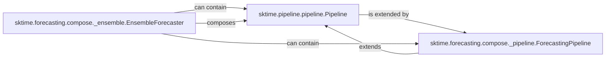

## Details

Abstract Components Overview

### sktime.pipeline.pipeline.Pipeline
The foundational component for constructing generic, multi-step machine learning workflows. It enables the sequential chaining of sktime transformers and estimators, managing the flow of data and execution of fit, transform, and predict methods across the defined steps. This component is architecturally important as it provides the core abstraction for composable ML workflows, embodying the 'Modular Architecture' and 'Component-Based Architecture' patterns.

**Related Classes/Methods**:

- <a href="https://github.com/sktime/sktime/blob/main/sktime/pipeline/pipeline.py#L25-L710" target="_blank" rel="noopener noreferrer">`sktime.pipeline.pipeline.Pipeline` (25:710)</a>

### sktime.forecasting.compose._pipeline.ForecastingPipeline
A specialized pipeline component designed specifically for time series forecasting workflows. It extends the generic Pipeline to handle the unique requirements of time series data, orchestrating transformations and a final forecaster to produce various types of time series predictions. Its architectural importance lies in demonstrating 'API Layering' and 'Task-Specific Modules' by providing a domain-specific extension of the general pipeline.

**Related Classes/Methods**:

- <a href="https://github.com/sktime/sktime/blob/main/sktime/forecasting/compose/_pipeline.py#L315-L738" target="_blank" rel="noopener noreferrer">`sktime.forecasting.compose._pipeline.ForecastingPipeline` (315:738)</a>

### sktime.forecasting.compose._ensemble.EnsembleForecaster
A component dedicated to combining predictions from multiple individual forecasters to improve robustness and accuracy. It manages the initialization, configuration, and aggregation of results from its constituent forecasters, forming a unified ensemble prediction. This component is architecturally important for enabling advanced model composition and demonstrating how complex models can be built from simpler, reusable components, aligning with the 'Component-Based Architecture'.

**Related Classes/Methods**:

- <a href="https://github.com/sktime/sktime/blob/main/sktime/forecasting/compose/_ensemble.py#L273-L444" target="_blank" rel="noopener noreferrer">`sktime.forecasting.compose._ensemble.EnsembleForecaster` (273:444)</a>

### [FAQ](https://github.com/CodeBoarding/GeneratedOnBoardings/tree/main?tab=readme-ov-file#faq)