```mermaid
graph LR
    Core_Abstractions["Core Abstractions"]
    Data_Management_Transformation["Data Management & Transformation"]
    Machine_Learning_Algorithms["Machine Learning Algorithms"]
    Workflow_Orchestration["Workflow Orchestration"]
    Performance_Evaluation["Performance Evaluation"]
    Core_Abstractions -- "defines interfaces for" --> Data_Management_Transformation
    Core_Abstractions -- "defines interfaces for" --> Machine_Learning_Algorithms
    Core_Abstractions -- "defines interfaces for" --> Workflow_Orchestration
    Data_Management_Transformation -- "adheres to" --> Core_Abstractions
    Data_Management_Transformation -- "provides data to" --> Machine_Learning_Algorithms
    Data_Management_Transformation -- "provides data to" --> Performance_Evaluation
    Machine_Learning_Algorithms -- "adheres to" --> Core_Abstractions
    Machine_Learning_Algorithms -- "consumes data from" --> Data_Management_Transformation
    Machine_Learning_Algorithms -- "outputs results to" --> Performance_Evaluation
    Workflow_Orchestration -- "adheres to" --> Core_Abstractions
    Workflow_Orchestration -- "composes" --> Data_Management_Transformation
    Workflow_Orchestration -- "composes" --> Machine_Learning_Algorithms
    Performance_Evaluation -- "receives data from" --> Data_Management_Transformation
    Performance_Evaluation -- "receives results from" --> Machine_Learning_Algorithms
    click Core_Abstractions href "https://github.com/CodeBoarding/GeneratedOnBoardings/blob/main/sktime/Core_Abstractions.md" "Details"
    click Data_Management_Transformation href "https://github.com/CodeBoarding/GeneratedOnBoardings/blob/main/sktime/Data_Management_Transformation.md" "Details"
    click Machine_Learning_Algorithms href "https://github.com/CodeBoarding/GeneratedOnBoardings/blob/main/sktime/Machine_Learning_Algorithms.md" "Details"
    click Workflow_Orchestration href "https://github.com/CodeBoarding/GeneratedOnBoardings/blob/main/sktime/Workflow_Orchestration.md" "Details"
    click Performance_Evaluation href "https://github.com/CodeBoarding/GeneratedOnBoardings/blob/main/sktime/Performance_Evaluation.md" "Details"
```

## Details

The `sktime` library is designed with a modular and extensible architecture, specifically tailored for time series machine learning tasks. At its foundation, the **Core Abstractions** component establishes the essential interfaces, abstract base classes, and standardized data structures, ensuring uniformity and interoperability across the entire library. Data processing typically initiates with the **Data Management & Transformation** component, responsible for loading, splitting, and applying various preprocessing and feature engineering techniques to time series datasets. The prepared data then flows into the **Machine Learning Algorithms** component, which houses a diverse collection of native `sktime` models for forecasting, classification, regression, clustering, and change point detection, seamlessly integrating with external time series libraries and leveraging internal algorithmic utilities. For constructing complex, multi-step workflows, the **Workflow Orchestration** component enables users to chain transformers and estimators into robust pipelines. The final stage involves the **Performance Evaluation** component, which provides comprehensive tools for benchmarking and assessing the performance of models and pipelines through various metrics, thereby completing the end-to-end machine learning lifecycle within `sktime`.

### Core Abstractions [[Expand]](./Core_Abstractions.md)
Defines the foundational interfaces, abstract base classes (e.g., `BaseObject`, `BaseForecaster`, `BaseClassifier`, `BaseTransformer`, `BaseDatatype`), and standardized data structures that all `sktime` estimators and data types adhere to. This layer ensures consistency, interoperability, and extensibility across the entire library.

**Related Classes/Methods**:

- <a href="https://github.com/sktime/sktime/blob/main/sktime/base/_base.py#L74-L348" target="_blank" rel="noopener noreferrer">`sktime.base._base.BaseObject` (74:348)</a>
- <a href="https://github.com/sktime/sktime/blob/main/sktime/forecasting/base/_base.py#L75-L2383" target="_blank" rel="noopener noreferrer">`sktime.forecasting.base._base.BaseForecaster` (75:2383)</a>
- <a href="https://github.com/sktime/sktime/blob/main/sktime/classification/base.py" target="_blank" rel="noopener noreferrer">`sktime.classification.base.BaseClassifier`</a>
- <a href="https://github.com/sktime/sktime/blob/main/sktime/transformations/base.py#L100-L1626" target="_blank" rel="noopener noreferrer">`sktime.transformations.base.BaseTransformer` (100:1626)</a>
- <a href="https://github.com/sktime/sktime/blob/main/sktime/datatypes/_base/_base.py#L11-L297" target="_blank" rel="noopener noreferrer">`sktime.datatypes._base._base.BaseDatatype` (11:297)</a>

### Data Management & Transformation [[Expand]](./Data_Management_Transformation.md)
Manages the loading, handling, splitting, preprocessing, and feature engineering of time series datasets. This component provides standardized dataset interfaces, various strategies for dividing time series data, and a rich collection of transformers for data manipulation.

**Related Classes/Methods**:

- <a href="https://github.com/sktime/sktime/blob/main/sktime/datasets/base/_base.py#L26-L132" target="_blank" rel="noopener noreferrer">`sktime.datasets.base._base.BaseDataset` (26:132)</a>
- <a href="https://github.com/sktime/sktime/blob/main/sktime/split/base/_base_splitter.py#L28-L477" target="_blank" rel="noopener noreferrer">`sktime.split.base._base_splitter.BaseSplitter` (28:477)</a>
- <a href="https://github.com/sktime/sktime/blob/main/sktime/transformations/base.py#L100-L1626" target="_blank" rel="noopener noreferrer">`sktime.transformations.base.BaseTransformer` (100:1626)</a>
- <a href="https://github.com/sktime/sktime/blob/main/sktime/transformations/series/impute.py#L16-L410" target="_blank" rel="noopener noreferrer">`sktime.transformations.series.impute.Imputer` (16:410)</a>
- <a href="https://github.com/sktime/sktime/blob/main/sktime/transformations/panel/rocket/_multirocket.py#L13-L233" target="_blank" rel="noopener noreferrer">`sktime.transformations.panel.rocket._multirocket.MultiRocket` (13:233)</a>

### Machine Learning Algorithms [[Expand]](./Machine_Learning_Algorithms.md)
Implements and integrates a wide array of time series models for various tasks including forecasting, classification, regression, clustering, and change point detection. This component leverages internal algorithmic support (e.g., deep learning networks, distance functions) and provides wrappers for seamless integration with external time series libraries.

**Related Classes/Methods**:

- <a href="https://github.com/sktime/sktime/blob/main/sktime/forecasting/base/_base.py#L75-L2383" target="_blank" rel="noopener noreferrer">`sktime.forecasting.base._base.BaseForecaster` (75:2383)</a>
- <a href="https://github.com/sktime/sktime/blob/main/sktime/classification/base.py" target="_blank" rel="noopener noreferrer">`sktime.classification.base.BaseClassifier`</a>
- <a href="https://github.com/sktime/sktime/blob/main/sktime/regression/base.py#L33-L398" target="_blank" rel="noopener noreferrer">`sktime.regression.base.BaseRegressor` (33:398)</a>
- <a href="https://github.com/sktime/sktime/blob/main/sktime/clustering/base.py#L17-L503" target="_blank" rel="noopener noreferrer">`sktime.clustering.base.BaseClusterer` (17:503)</a>
- <a href="https://github.com/sktime/sktime/blob/main/sktime/detection/base/_base.py#L33-L1139" target="_blank" rel="noopener noreferrer">`sktime.detection.base._base.BaseDetector` (33:1139)</a>
- <a href="https://github.com/sktime/sktime/blob/main/sktime/networks/inceptiontime.py#L8-L157" target="_blank" rel="noopener noreferrer">`sktime.networks.inceptiontime.InceptionTimeNetwork` (8:157)</a>
- <a href="https://github.com/sktime/sktime/blob/main/sktime/libs/chronos/chronos.py" target="_blank" rel="noopener noreferrer">`sktime.libs.chronos.chronos.ChronosPipeline`</a>

### Workflow Orchestration [[Expand]](./Workflow_Orchestration.md)
Facilitates the creation of complex, multi-step machine learning workflows by allowing users to chain transformers and estimators. This component supports the composition of various `sktime` components into cohesive pipelines and also enables ensemble methods and multiplexing for combining multiple models.

**Related Classes/Methods**:

- <a href="https://github.com/sktime/sktime/blob/main/sktime/pipeline/pipeline.py#L25-L710" target="_blank" rel="noopener noreferrer">`sktime.pipeline.pipeline.Pipeline` (25:710)</a>
- <a href="https://github.com/sktime/sktime/blob/main/sktime/forecasting/compose/_pipeline.py#L315-L738" target="_blank" rel="noopener noreferrer">`sktime.forecasting.compose._pipeline.ForecastingPipeline` (315:738)</a>
- <a href="https://github.com/sktime/sktime/blob/main/sktime/forecasting/compose/_ensemble.py#L273-L444" target="_blank" rel="noopener noreferrer">`sktime.forecasting.compose._ensemble.EnsembleForecaster` (273:444)</a>

### Performance Evaluation [[Expand]](./Performance_Evaluation.md)
Provides a framework for systematically evaluating the performance of time series models. It includes tools for setting up benchmarks, running experiments, and calculating various performance metrics (e.g., forecasting errors, detection metrics) to assess model effectiveness.

**Related Classes/Methods**:

- <a href="https://github.com/sktime/sktime/blob/main/sktime/benchmarking/benchmarks.py#L65-L128" target="_blank" rel="noopener noreferrer">`sktime.benchmarking.benchmarks.BaseBenchmark` (65:128)</a>
- <a href="https://github.com/sktime/sktime/blob/main/sktime/benchmarking/evaluation.py#L17-L830" target="_blank" rel="noopener noreferrer">`sktime.benchmarking.evaluation.Evaluator` (17:830)</a>
- <a href="https://github.com/sktime/sktime/blob/main/sktime/performance_metrics/forecasting/_base.py#L51-L784" target="_blank" rel="noopener noreferrer">`sktime.performance_metrics.forecasting._base.BaseForecastingErrorMetric` (51:784)</a>

### [FAQ](https://github.com/CodeBoarding/GeneratedOnBoardings/tree/main?tab=readme-ov-file#faq)