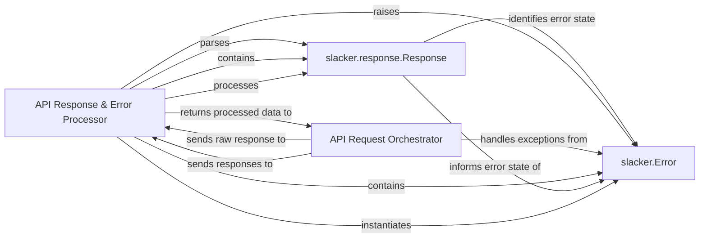

## Details

The `API Response & Error Processor` subsystem is crucial for robust interaction with external APIs, specifically the Slack API in this context. It acts as an intermediary, transforming raw API responses into structured data or clearly defined error states. This subsystem ensures that the `API Request Orchestrator`, which initiates API calls, receives a consistent and actionable outcome, abstracting away the complexities of low-level response parsing and error identification. The core components, `Response` and `Error` (within the `slacker` context), are central to this transformation, providing a clear contract for handling API interactions.

### API Response & Error Processor [[Expand]](./API_Response_Error_Processor.md)
This is the overarching logical component responsible for orchestrating the entire post-request processing flow. It acts as a facade, abstracting the complexities of raw response parsing and error identification. It ensures that the `API Request Orchestrator` receives a clear, structured outcome (either parsed data or a specific error).

**Related Classes/Methods**: _None_

### slacker.response.Response
This class is directly responsible for parsing the raw HTTP response body, which is expected to be JSON. It extracts key fields like `ok` (to determine success) and `error` (if an error occurred), transforming the raw data into an accessible Python object.

**Related Classes/Methods**: _None_

### slacker.Error
This is a custom exception class specifically designed to represent errors returned by the Slack API. It provides a structured, programmatic way to signal and handle API-specific failures, allowing the calling code to react appropriately to different error conditions.

**Related Classes/Methods**: _None_

### API Request Orchestrator
While not strictly *within* the `API Response & Error Processor` subsystem, this component is the primary consumer and initiator of the processes handled by this subsystem. It is responsible for making the initial API request and then passing the raw response to the `API Response & Error Processor` for subsequent handling. It also handles any `slacker.Error` exceptions raised.

**Related Classes/Methods**: _None_

### [FAQ](https://github.com/CodeBoarding/GeneratedOnBoardings/tree/main?tab=readme-ov-file#faq)