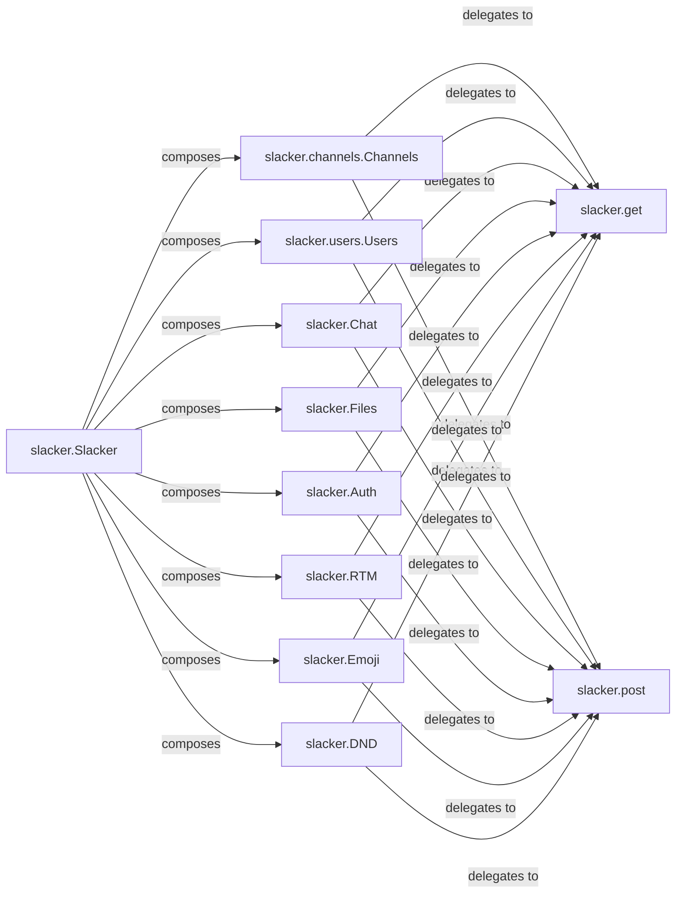

## Details

The `slacker` subsystem provides a Python client for interacting with the Slack API. Its core design revolves around a facade pattern, with the `slacker.Slacker` component acting as the primary entry point. This `Slacker` facade composes various specialized API resource modules, such as `slacker.channels.Channels`, `slacker.users.Users`, `slacker.Chat`, `slacker.Files`, `slacker.Auth`, `slacker.RTM`, `slacker.Emoji`, and `slacker.DND`. Each of these resource modules encapsulates the logic for a specific Slack API domain. All these specialized modules, in turn, delegate their HTTP GET and POST requests to the central `slacker.get` and `slacker.post` functions, which handle the underlying network communication with the Slack API. This architecture ensures a clear separation of concerns, with API-specific logic residing in dedicated modules and common request handling centralized.

### slacker.channels.Channels
Manages interactions with the Slack Channels API, providing methods for channel-related operations (e.g., joining, leaving, listing channels).

**Related Classes/Methods**:

- <a href="https://github.com/os/slacker/blob/master/slacker/__init__.py" target="_blank" rel="noopener noreferrer">`slacker.get`</a>
- <a href="https://github.com/os/slacker/blob/master/slacker/__init__.py" target="_blank" rel="noopener noreferrer">`slacker.post`</a>

### slacker.users.Users
Handles operations related to the Slack Users API, offering methods for user information retrieval and management.

**Related Classes/Methods**:

- <a href="https://github.com/os/slacker/blob/master/slacker/__init__.py" target="_blank" rel="noopener noreferrer">`slacker.get`</a>
- <a href="https://github.com/os/slacker/blob/master/slacker/__init__.py" target="_blank" rel="noopener noreferrer">`slacker.post`</a>

### slacker.Chat
Provides methods for interacting with the Slack Chat API, primarily for sending and managing messages.

**Related Classes/Methods**:

- <a href="https://github.com/os/slacker/blob/master/slacker/__init__.py" target="_blank" rel="noopener noreferrer">`slacker.get`</a>
- <a href="https://github.com/os/slacker/blob/master/slacker/__init__.py" target="_blank" rel="noopener noreferrer">`slacker.post`</a>

### slacker.Files
Manages operations related to the Slack Files API, including uploading, sharing, and retrieving files.

**Related Classes/Methods**:

- <a href="https://github.com/os/slacker/blob/master/slacker/__init__.py" target="_blank" rel="noopener noreferrer">`slacker.get`</a>
- <a href="https://github.com/os/slacker/blob/master/slacker/__init__.py" target="_blank" rel="noopener noreferrer">`slacker.post`</a>

### slacker.Auth
Encapsulates logic for the Slack Auth API, used for verifying authentication tokens and retrieving basic team information.

**Related Classes/Methods**:

- <a href="https://github.com/os/slacker/blob/master/slacker/__init__.py" target="_blank" rel="noopener noreferrer">`slacker.get`</a>
- <a href="https://github.com/os/slacker/blob/master/slacker/__init__.py" target="_blank" rel="noopener noreferrer">`slacker.post`</a>

### slacker.RTM
Provides methods for interacting with the Slack Real Time Messaging (RTM) API, typically for establishing WebSocket connections.

**Related Classes/Methods**:

- <a href="https://github.com/os/slacker/blob/master/slacker/__init__.py" target="_blank" rel="noopener noreferrer">`slacker.get`</a>
- <a href="https://github.com/os/slacker/blob/master/slacker/__init__.py" target="_blank" rel="noopener noreferrer">`slacker.post`</a>

### slacker.Emoji
Manages operations related to the Slack Emoji API, primarily for listing custom emojis.

**Related Classes/Methods**:

- <a href="https://github.com/os/slacker/blob/master/slacker/__init__.py" target="_blank" rel="noopener noreferrer">`slacker.get`</a>
- <a href="https://github.com/os/slacker/blob/master/slacker/__init__.py" target="_blank" rel="noopener noreferrer">`slacker.post`</a>

### slacker.DND
Encapsulates logic for the Slack Do Not Disturb (DND) API, allowing users to manage their DND settings.

**Related Classes/Methods**:

- <a href="https://github.com/os/slacker/blob/master/slacker/__init__.py" target="_blank" rel="noopener noreferrer">`slacker.get`</a>
- <a href="https://github.com/os/slacker/blob/master/slacker/__init__.py" target="_blank" rel="noopener noreferrer">`slacker.post`</a>

### slacker.Slacker
A facade client that composes instances of Slack API resource modules.

**Related Classes/Methods**:

- <a href="https://github.com/os/slacker/blob/master/slacker/__init__.py" target="_blank" rel="noopener noreferrer">`slacker.channels.Channels`</a>
- <a href="https://github.com/os/slacker/blob/master/slacker/__init__.py" target="_blank" rel="noopener noreferrer">`slacker.users.Users`</a>
- <a href="https://github.com/os/slacker/blob/master/slacker/__init__.py" target="_blank" rel="noopener noreferrer">`slacker.Chat`</a>
- <a href="https://github.com/os/slacker/blob/master/slacker/__init__.py" target="_blank" rel="noopener noreferrer">`slacker.Files`</a>
- <a href="https://github.com/os/slacker/blob/master/slacker/__init__.py" target="_blank" rel="noopener noreferrer">`slacker.Auth`</a>
- <a href="https://github.com/os/slacker/blob/master/slacker/__init__.py" target="_blank" rel="noopener noreferrer">`slacker.RTM`</a>
- <a href="https://github.com/os/slacker/blob/master/slacker/__init__.py" target="_blank" rel="noopener noreferrer">`slacker.Emoji`</a>
- <a href="https://github.com/os/slacker/blob/master/slacker/__init__.py" target="_blank" rel="noopener noreferrer">`slacker.DND`</a>

### slacker.get
Handles generic HTTP GET requests for the Slack API.

**Related Classes/Methods**:

- <a href="https://github.com/os/slacker/blob/master/slacker/__init__.py" target="_blank" rel="noopener noreferrer">`slacker.get`</a>

### slacker.post
Handles generic HTTP POST requests for the Slack API.

**Related Classes/Methods**:

- <a href="https://github.com/os/slacker/blob/master/slacker/__init__.py" target="_blank" rel="noopener noreferrer">`slacker.post`</a>

### [FAQ](https://github.com/CodeBoarding/GeneratedOnBoardings/tree/main?tab=readme-ov-file#faq)