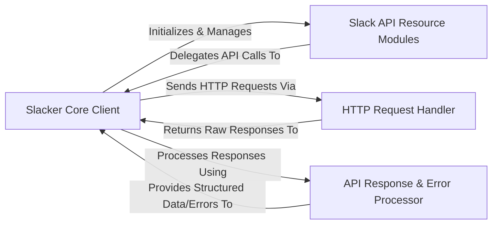

## Details

The `slacker` library provides a Pythonic interface for interacting with the Slack API. At its core, the **Slacker Core Client** acts as the central orchestrator, managing API tokens, session details, and directing all API interactions. It serves as the primary facade, exposing high-level methods for various Slack API resources. These resources are encapsulated within **Slack API Resource Modules**, each dedicated to a specific Slack API domain like chat, users, or files. When an API call is initiated, the **Slacker Core Client** delegates the actual network communication to the **HTTP Request Handler**, which leverages the external `requests` library to send and receive raw HTTP data. Upon receiving a response, the **API Response & Error Processor** takes over, parsing the raw data into structured formats and handling any API-specific errors, before returning the processed information back to the **Slacker Core Client** for further application logic.

### Slacker Core Client
The central component managing API token, session, and orchestrating all API interactions. It acts as the primary facade for the library.

**Related Classes/Methods**:

- <a href="https://github.com/os/slacker/blob/master/slacker/__init__.py#L1186-L1236" target="_blank" rel="noopener noreferrer">`Slacker`:1186-1236</a>
- <a href="https://github.com/os/slacker/blob/master/slacker/__init__.py" target="_blank" rel="noopener noreferrer">`Slacker:_request`</a>
- <a href="https://github.com/os/slacker/blob/master/slacker/__init__.py" target="_blank" rel="noopener noreferrer">`Slacker:get`</a>
- <a href="https://github.com/os/slacker/blob/master/slacker/__init__.py" target="_blank" rel="noopener noreferrer">`Slacker:post`</a>

### Slack API Resource Modules [[Expand]](./Slack_API_Resource_Modules.md)
A collection of specialized modules/classes, each representing a distinct Slack API resource (e.g., chat, users, files). They provide high-level methods mapping directly to Slack API endpoints.

**Related Classes/Methods**:

- <a href="https://github.com/os/slacker/blob/master/slacker/channels.py" target="_blank" rel="noopener noreferrer">`slacker.channels.Channels`</a>
- <a href="https://github.com/os/slacker/blob/master/slacker/users.py" target="_blank" rel="noopener noreferrer">`slacker.users.Users`</a>
- <a href="https://github.com/os/slacker/blob/master/slacker/__init__.py" target="_blank" rel="noopener noreferrer">`Chat`</a>
- <a href="https://github.com/os/slacker/blob/master/slacker/__init__.py" target="_blank" rel="noopener noreferrer">`Files`</a>
- <a href="https://github.com/os/slacker/blob/master/slacker/__init__.py" target="_blank" rel="noopener noreferrer">`Auth`</a>
- <a href="https://github.com/os/slacker/blob/master/slacker/__init__.py" target="_blank" rel="noopener noreferrer">`RTM`</a>
- <a href="https://github.com/os/slacker/blob/master/slacker/__init__.py" target="_blank" rel="noopener noreferrer">`Emoji`</a>

### HTTP Request Handler
The underlying mechanism responsible for performing actual network communication (sending HTTP requests and receiving responses) with the Slack API. This is primarily handled by the external `requests` library.

**Related Classes/Methods**:

### API Response & Error Processor [[Expand]](./API_Response_Error_Processor.md)
Responsible for parsing raw HTTP responses from the Slack API, converting them into structured data, and handling API-specific errors.

**Related Classes/Methods**:

- <a href="https://github.com/os/slacker/blob/master/slacker/response.py" target="_blank" rel="noopener noreferrer">`slacker.response.Response`</a>
- <a href="https://github.com/os/slacker/blob/master/slacker/__init__.py" target="_blank" rel="noopener noreferrer">`Error`</a>

### [FAQ](https://github.com/CodeBoarding/GeneratedOnBoardings/tree/main?tab=readme-ov-file#faq)