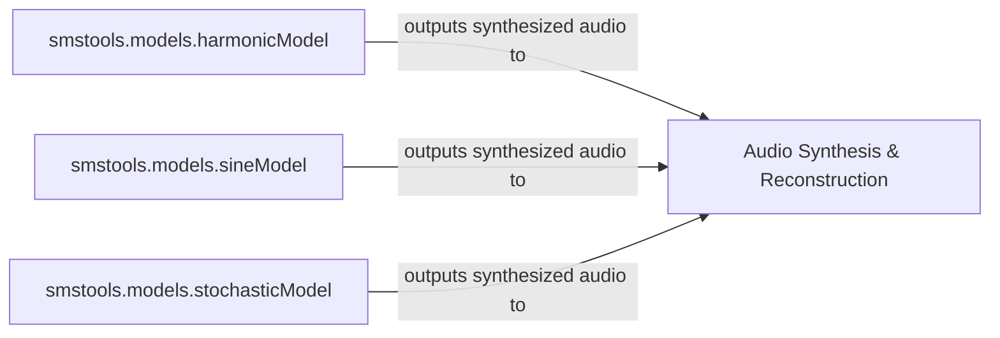

## Details

The audio synthesis subsystem of `smstools` is structured around a modular approach, where distinct models handle the generation of specific audio components. The `harmonicModel`, `sineModel`, and `stochasticModel` each independently synthesize their respective parts of the audio signal. These specialized outputs are then channeled to the `Audio Synthesis & Reconstruction` component, which acts as the central orchestrator. Its primary responsibility is to integrate and combine these individual synthesized audio streams, reconstructing the final, complete audio output. This design promotes clear separation of concerns for synthesis while centralizing the final audio assembly.

### smstools.models.harmonicModel
Responsible for synthesizing the harmonic (pitched) components of the audio signal based on processed data.

**Related Classes/Methods**:

- <a href="https://github.com/MTG/sms-tools/blob/master/smstools/models/harmonicModel.py" target="_blank" rel="noopener noreferrer">`smstools.models.harmonicModel`</a>

### smstools.models.sineModel
Handles the synthesis of individual sinusoidal components within the audio signal from their processed representations.

**Related Classes/Methods**:

- <a href="https://github.com/MTG/sms-tools/blob/master/smstools/models/sineModel.py" target="_blank" rel="noopener noreferrer">`smstools.models.sineModel`</a>

### smstools.models.stochasticModel
Manages the synthesis of the stochastic (noise-like) part of the audio signal, specifically through its `stochasticModelSynth` functionality.

**Related Classes/Methods**:

- <a href="https://github.com/MTG/sms-tools/blob/master/smstools/models/stochasticModel.py" target="_blank" rel="noopener noreferrer">`smstools.models.stochasticModel`</a>

### Audio Synthesis & Reconstruction [[Expand]](./Audio_Synthesis_Reconstruction.md)
This conceptual component orchestrates the combination of synthesized outputs from the harmonic, sinusoidal, and stochastic models to reconstruct the final, complete audio signal. It acts as the aggregation point for the individual synthesis streams.

**Related Classes/Methods**:

- <a href="https://github.com/MTG/sms-tools/blob/master/smstools/models/harmonicModel.py" target="_blank" rel="noopener noreferrer">`smstools.models.harmonicModel`</a>
- <a href="https://github.com/MTG/sms-tools/blob/master/smstools/models/sineModel.py" target="_blank" rel="noopener noreferrer">`smstools.models.sineModel`</a>
- <a href="https://github.com/MTG/sms-tools/blob/master/smstools/models/stochasticModel.py" target="_blank" rel="noopener noreferrer">`smstools.models.stochasticModel`</a>

### [FAQ](https://github.com/CodeBoarding/GeneratedOnBoardings/tree/main?tab=readme-ov-file#faq)