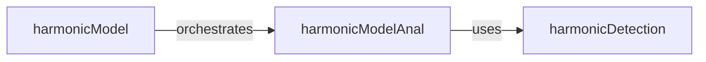

## Details

The smstools.models.harmonic subsystem provides a comprehensive framework for harmonic analysis and synthesis of audio signals. At its core, the harmonicModel serves as the central orchestrator, managing the entire workflow from input audio to processed output. The analysis phase is primarily handled by harmonicModelAnal, which specializes in extracting detailed harmonic information. Both harmonicModel and harmonicModelAnal rely on the foundational harmonicDetection utility to precisely identify harmonic components within the audio spectrum. This modular design ensures a clear separation of concerns, with harmonicDetection providing a reusable low-level capability that underpins the higher-level harmonic analysis and synthesis processes.

### harmonicModel
Orchestrates the complete harmonic analysis and synthesis process.

**Related Classes/Methods**:

- <a href="https://github.com/MTG/sms-tools/blob/master/smstools/models/harmonicModel.py" target="_blank" rel="noopener noreferrer">`smstools.models.harmonicModel:harmonicModel`</a>

### harmonicModelAnal
Specializes in the analysis phase, extracting detailed harmonic information from audio.

**Related Classes/Methods**:

- <a href="https://github.com/MTG/sms-tools/blob/master/smstools/models/harmonicModel.py" target="_blank" rel="noopener noreferrer">`smstools.models.harmonicModel:harmonicModelAnal`</a>

### harmonicDetection
Identifies and detects individual harmonic components within spectral peaks.

**Related Classes/Methods**:

- <a href="https://github.com/MTG/sms-tools/blob/master/smstools/models/harmonicModel.py" target="_blank" rel="noopener noreferrer">`smstools.models.harmonicModel:harmonicDetection`</a>

### [FAQ](https://github.com/CodeBoarding/GeneratedOnBoardings/tree/main?tab=readme-ov-file#faq)